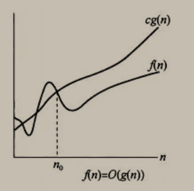

算法（Algorithm）是指用来操作数据、解决程序问题的一组方法。对于同一个问题，使用不同的算法，也许最终得到的结果是一样的，但在过程中消耗的资源和时间却会有很大的区别。

那么我们应该如何去衡量不同算法之间的优劣呢？

主要还是从算法所占用的「时间」和「空间」两个维度去考量。

- 时间维度：是指执行当前算法所消耗的时间，我们通常用「时间复杂度」来描述。
- 空间维度：是指执行当前算法需要占用多少内存空间，我们通常用「空间复杂度」来描述。

因此，评价一个算法的效率主要是看它的时间复杂度和空间复杂度情况。然而，有的时候时间和空间却又是「鱼和熊掌」，不可兼得的，那么我们就需要从中去取一个平衡点。

下面我来分别介绍一下「时间复杂度」和「空间复杂度」的计算方式。

## 时间复杂度

### 消耗时间度量

我们想要知道一个算法的「时间复杂度」，很多人首先想到的的方法就是把这个算法程序运行一遍，那么它所消耗的时间就自然而然知道了。
这种方式可以吗？当然可以，不过它也有很多弊端。这种方式非常容易受运行环境的影响，在性能高的机器上跑出来的结果与在性能低的机器上跑的结果相差会很大。而且对测试时使用的数据规模也有很大关系。而且这种方法属于事后统计法，也就是说只有代码写出来之后才能进行复杂度计算。

### 执行次数度量

所以想能不能把算法里面每一条语句的执行时间进行抽离出来记做 unit_time ，如下算法一共执行了 1+n+n+n = 3n+1 条语句，所以执行时间是（3n+1）\* unit_time

```js
for (var i = 1; i <= n; ++i) {
  console.log(i);
}
```

f(n) = 3n+1,f(n) 表示每行代码执行次数之和，所以此时时间复杂度分析可以把 unit_time 抛开，只看算法的执行次数。但是问题又来了，如果两个算法是 f(n) = 3n+1 和 f(n) = n^2+1,那有如何比较呢？
因此，另一种更为通用的方法就出来了：「 大 O 符号表示法 」

### 大 O 表示法

> 大 O 符号（英语：Big O notation），又称为渐进符号，是用于描述函数渐近行为的数学符号。更确切地说，它是用另一个（通常更简单的）函数来描述一个函数数量级的**渐近上界**。
> 函数 f(n) = O(g(n)): 当且仅当存在正常数 c, n0, 使得 n>=n0 时, 有 f(n) <= c\*g(n)



1. 例子： `f(n) = 2n+3` , 求它的渐近上界 O。
   首先代入定义中的不等式, 即 `2n+3 <= cg(n)`
   你可以代入数字一个一个去试, 但是比较简单的方法是把左边的低阶项提高然后放到右边
   即: `2n + 3 <= 2n+3n`==> `2n + 3 <= 5n`
   其中`c=5, g(n)=n`，存在正常数`c=5`, 当 `n>=(n0=1)`时, 使得不等式 `2n + 3 <= 5n` 恒成立, 满足 O 定义，所以: `f(n)=O(n)`;
   在这里可以看出, 对于不等式 `2n+3 <= cg(n)` 来说, 右边的 `cg(n)`不止只有 `5n`才满足定义
   `g(n)`可以是 `3n(c=3, n0=3), 100n(c=100, n0=1)` 都是成立的。

2. 例子 `f(n) = 10*n^2 + 4n + 2`的大 O 表示。
   对于 `n≥5，f(n) = 10*n^2 + 4n + 2 ≤ 11*n^2`， 所以 `f(n) = O(n2)`。

从上面的例子, 我们直观感觉到, 通过**去掉低阶项并忽略高阶项的系数**就能满足大 O 表示，再回到上面的问题，如果两个算法是 f(n) = 3n+1 和 f(n) = n^2+1 通过执行次数不好度量，通过大 O 一个是 O(n)一个 O(n^2)很清楚能判断是第一个算法好。

常见的时间复杂度量级有：

- 常数阶 O(1)
- 对数阶 O(logN)
- 线性阶 O(n)
- 线性对数阶 O(nlogN)
- 平方阶 O(n²)
- 立方阶 O(n³)
- K 次方阶 O(n^k)
- 指数阶(2^n)

上面从上至下依次的时间复杂度越来越大，执行的效率越来越低。

下面选取一些较为常用的来讲解一下（没有严格按照顺序）：

### 常数阶 O(1)

无论代码执行了多少行，只要是没有循环等复杂结构，那这个代码的时间复杂度就都是 O(1)，如：

```text
int i = 1;
int j = 2;
++i;
j++;
int m = i + j;
```

上述代码在执行的时候，它消耗的时候并不随着某个变量的增长而增长，那么无论这类代码有多长，即使有几万几十万行，都可以用 O(1)来表示它的时间复杂度。

### 线性阶 O(n)

这个在最开始的代码示例中就讲解过了，如：

```text
for(i=1; i<=n; ++i)
{
   j = i;
   j++;
}
```

这段代码，for 循环里面的代码会执行 n 遍，因此它消耗的时间是随着 n 的变化而变化的，因此这类代码都可以用 O(n)来表示它的时间复杂度。

### 对数阶 O(logN)

还是先来看代码：

```text
int i = 1;
while(i<n)
{
    i = i * 2;
}
```

我们就看循环体里面的代码运行了多少次，假设是 x 次，然后找规律如下
| 次数 | 结果 | 规律 |
| ---- | ----- | ----- |
| 1 | i=2 | i=2^1 |
| 2 | i=4 | i=2^2 |
| 3 | i=8 | i=2^3 |
| x | i=2^x | i=2^x |

当`i=2^x>=n`的时候退出循环，所以`2^x>=n` 所以 `x>=log2n`

也就是说当循环 log2^n 次以后，这个代码就结束了。因此这个代码的时间复杂度为：O(logn)
再看一下二分法。二分法就是把一个数据规模为 N 的先分为 N/2，然后再分为 N/4,N/8,N/16…一直等分到 N/y =1 的时候就不分了，现在我们来考虑下，到底分多少次才能把规模为 N 的数据分到结果为 1，这里假设为 x 次，这个 x 就是次数，也是我们用大 O 表示法表示的时间复杂度，我们只需要把 x 取到就可以了。

这里按我们的数学思维把规律列举一下。

| 次数 | 结果 | 规律  |
| ---- | ---- | ----- |
| 1    | N/2  | N/2^1 |
| 2    | N/4  | N/2^2 |
| 3    | N/6  | N/2^3 |
| 4    | N/16 | N/2^4 |

我们很明显一眼就可以看出，假如 x 次后结果为 1，那么

```text
N/2^x = 1
2^x = N
x=logN
```

因此二分法的时间复杂度就是 O(logN),是不是超级简单的。

### 线性对数阶 O(nlogN)

线性对数阶 O(nlogN) 其实非常容易理解，将时间复杂度为 O(logn)的代码循环 N 遍的话，那么它的时间复杂度就是 n \* O(logN)，也就是了 O(nlogN)。

就拿上面的代码加一点修改来举例：

```text
for(m=1; m<n; m++)
{
    i = 1;
    while(i<n)
    {
        i = i * 2;
    }
}
```

### 平方阶 O(n²)

平方阶 O(n²) 就更容易理解了，如果把 O(n) 的代码再嵌套循环一遍，它的时间复杂度就是 O(n²) 了。
举例：

```text
for(x=1; i<=n; x++)
{
   for(i=1; i<=n; i++)
    {
       j = i;
       j++;
    }
}
```

这段代码其实就是嵌套了 2 层 n 循环，它的时间复杂度就是 O(n\*n)，即 O(n²)
如果将其中一层循环的 n 改成 m，即：

```text
for(x=1; i<=m; x++)
{
   for(i=1; i<=n; i++)
    {
       j = i;
       j++;
    }
}
```

那它的时间复杂度就变成了 O(m\*n)

### 立方阶 O(n³)、K 次方阶 O(n^k)

参考上面的 O(n²) 去理解就好了，O(n³)相当于三层 n 循环，其它的类似。

除此之外，其实还有 平均时间复杂度、均摊时间复杂度、最坏时间复杂度、最好时间复杂度 的分析方法，有点复杂，这里就不展开了。

## 空间复杂度

既然时间复杂度不是用来计算程序具体耗时的，那么我也应该明白，空间复杂度也不是用来计算程序实际占用的空间的。

空间复杂度是对一个算法在运行过程中临时占用存储空间大小的一个量度，同样反映的是一个趋势，我们用 S(n) 来定义。

空间复杂度比较常用的有：O(1)、O(n)、O(n²)，我们下面来看看：

### 空间复杂度 O(1)

如果算法执行所需要的临时空间不随着某个变量 n 的大小而变化，即此算法空间复杂度为一个常量，可表示为 O(1)
举例：

```text
int i = 1;
int j = 2;
++i;
j++;
int m = i + j;
```

代码中的 i、j、m 所分配的空间都不随着处理数据量变化，因此它的空间复杂度 S(n) = O(1)

### 空间复杂度 O(n)

我们先看一个代码：

```text
int[] m = new int[n]
for(i=1; i<=n; ++i)
{
   j = i;
   j++;
}
```

这段代码中，第一行 new 了一个数组出来，这个数据占用的大小为 n，这段代码的 2-6 行，虽然有循环，但没有再分配新的空间，因此，这段代码的空间复杂度主要看第一行即可，即 S(n) = O(n)

## 递归的复杂度分析

接下来分析一波递归算法的时间和空间复杂度，细心看完，会刷新对递归的认知！

### 递归求斐波那契数列的性能分析

先来看一下求斐波那契数的递归写法。

```text
int fibonacci(int i) {
       if(i <= 0) return 0;
       if(i == 1) return 1;
       return fibonacci(i-1) + fibonacci(i-2);
}
```

对于递归算法来说，代码一般都比较简短，从算法逻辑上看，所用的存储空间也非常少，但运行时需要内存可不见得会少。

### 时间复杂度分析

来看看这个求斐波那契的递归算法的时间复杂度是多少呢？

在讲解递归时间复杂度的时候，我们提到了递归算法的时间复杂度本质上是要看: **递归的次数 \* 每次递归的时间复杂度**。

可以看出上面的代码每次递归都是 O(1)的操作。再来看递归了多少次，这里将 i 为 5 作为输入的递归过程 抽象成一颗递归树，如图：


从图中，可以看出 f(5)是由 f(4)和 f(3)相加而来，那么 f(4)是由 f(3)和 f(2)相加而来 以此类推。

在这颗二叉树中每一个节点都是一次递归，那么这棵树有多少个节点呢？

我们之前也有说到，一棵深度（按根节点深度为 1）为 k 的二叉树最多可以有 2^k - 1 个节点。

所以该递归算法的时间复杂度为 O(2^n) ，这个复杂度是非常大的，随着 n 的增大，耗时是指数上升的。

所以这种求斐波那契数的算法看似简洁，其实时间复杂度非常高，一般不推荐这样来实现斐波那契。

其实罪魁祸首就是这里的两次递归，导致了时间复杂度以指数上升。

```text
return fibonacci(i-1) + fibonacci(i-2);
```

可不可以优化一下这个递归算法呢。 主要是减少递归的调用次数。

来看一下如下代码：

```text
// 版本二
int fibonacci(int first, int second, int n) {
    if (n <= 0) {
        return 0;
    }
    if (n < 3) {
        return 1;
    }
    else if (n == 3) {
        return first + second;
    }
    else {
        return fibonacci(second, first + second, n - 1);
    }
}
```

这里相当于用 first 和 second 来记录当前相加的两个数值，此时就不用两次递归了。

因为每次递归的时候 n 减 1，即只是递归了 n 次，所以时间复杂度是 O(n)。

同理递归的深度依然是 n，每次递归所需的空间也是常数，所以空间复杂度依然是 O(n)。

代码（版本二）的复杂度如下：

- 时间复杂度： O(n)
- 空间复杂度： O(n)

### 空间复杂度分析

说完了这段递归代码的时间复杂度，再看看如何求其空间复杂度呢，这里给大家提供一个公式：**递归算法的空间复杂度 = 每次递归的空间复杂度 \* 递归深度**

为什么要求递归的深度呢？

因为每次递归所需的空间都被压到调用栈里（这是内存管理里面的数据结构，和算法里的栈原理是一样的），一次递归结束，这个栈就是就是把本次递归的数据弹出去。所以这个栈最大的长度就是递归的深度。

此时可以分析这段递归的空间复杂度，从代码中可以看出每次递归所需要的空间大小都是一样的，所以每次递归中需要的空间是一个常量，并不会随着 n 的变化而变化，每次递归的空间复杂度就是 O(1)。

在看递归的深度是多少呢？如图所示：


递归第 n 个斐波那契数的话，递归调用栈的深度就是 n。

那么每次递归的空间复杂度是 O(1)， 调用栈深度为 n，所以这段递归代码的空间复杂度就是 O(n)。

```text
int fibonacci(int i) {
       if(i <= 0) return 0;
       if(i == 1) return 1;
       return fibonacci(i-1) + fibonacci(i-2);
}
```

求斐波那契数的时候，使用递归算法并不一定是在性能上是最优的，但递归确实简化的代码层面的复杂度。

### 二分法（递归实现）的性能分析

带大家再分析一段二分查找的递归实现。

```text
int binary_search( int arr[], int l, int r, int x) {
    if (r >= l) {
        int mid = l + (r - l) / 2;
        if (arr[mid] == x)
            return mid;
        if (arr[mid] > x)
            return binary_search(arr, l, mid - 1, x);
        return binary_search(arr, mid + 1, r, x);
    }
    return -1;
}
```

都知道二分查找的时间复杂度是 O(logn)，那么递归二分查找的空间复杂度是多少呢？

我们依然看 **每次递归的空间复杂度和递归的深度**

首先我们先明确这里的空间复杂度里面的 n 是什么？ 二分查找的时候 n 就是指查找数组的长度，也就是代码中的 arr 数组。

每次递归的空间复杂度可以看出主要就是参数里传入的这个 arr 数组，但需要注意的是在 C/C++中函数传递数组参数，不是整个数组拷贝一份传入函数而是传入的数组首元素地址。

**也就是说每一层递归都是公用一块数组地址空间的**，所以 每次递归的时间复杂度是常数即：O(1)。

再来看递归的深度，二分查找的递归深度是 logn ，递归深度就是调用栈的长度，那么这段代码的空间复杂度为 1 \* logn = O(logn)。

大家要注意自己所用的语言在传递函数参数的时，是拷贝整个数值还是拷贝地址，如果是拷贝整个数值那么该二分法的空间复杂度就是 O(nlogn)。
