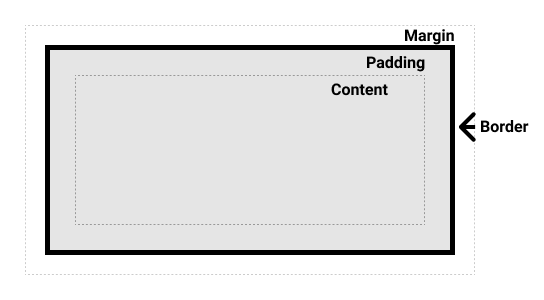

## 1. 前言

很多人都知道对于绝对定位（`absolute`）的元素是根据最近的非`static`的父级块元素定位。 那`html`根元素呢？事实上，不管元素是绝对定位、相对定位或者`static`定位，都是根据包含块来定位（只不过不同类型元素的包含块不同）。许多开发者认为一个元素的包含块就是他的父元素的内容区。这个说法也是有些片面。

  
一个元素的尺寸和位置经常受其包含块(`containing block`)的影响。大多数情况下，包含块就是这个元素最近的祖先块元素的内容区。如图，`Content`区域就是一个元素的内容区。

## 2. 包含块

### 2.1. 根元素

`html`的包含块是一个矩形,叫做初始化包含块(`initial containing block`)。给`html`设置`margin`可以看到`html`外面还有空间，这个包含`html`的块就被称为初始包含块。初始包含块就是初识视口大小的一个矩形，但是不是视口（不会随着滚动条而动）。

### 2.2. 非根元素

大多数情况下（包括浮动元素），包含块就是这个元素**最近的祖先块元素的内容区**，但也不是总是这样，下面就来学习如何确定这些元素的包含块。

1. 如果`position`属性是`static`或`relative`的话，包含块就是由它的最近的祖先块元素（比如说`block、inline-block、table 、flex、grid、list-item`等元素的**内容区**组成的。ps：相对定位设置偏移值是 px 的时候是元素相对于元素本身原来的位置进行偏移，那么我们在设置 left 和 top 值为百分比的时候，又是相对于什么元素的百分比呢？其实就是相对定位元素的包含块。
2. 如果`position`属性是`absolute`的话，包含块就是由它的**最近的**
   - `position`的值不是`static`（`fixed, absolute, relative, or sticky`）
   - `transform`或`perspective`的值不是`none`
   - `will-change`的值是`transform`或 `perspective`
   - `filter`的值不是`none`或`will-change`的值是`filter`(只在 Firefox 下生效).
   - `contain`的值是`paint`
     的**祖先元素的内边距区**(`padding范围`)的组成的。**找不到包含块就是初始包含块。**
3. 如果`position`属性是`fixed`的话，包含块就是由它的**最近的**
   - `transform`或`perspective`的值不是`none`
   - `will-change`的值是`transform`或 `perspective`
   - `filter`的值不是`none`或`will-change`的值是`filter`(只在 Firefox 下生效).
   - `contain`的值是`paint`
     的**祖先元素的内边距区**(`padding范围`)的组成的。**找不到包含块就是视口(`viewport`),如果页面滚动，视口也会变。** 所以如果禁止了系统滚动条，绝对定位和固定定位的表现是一样的，因为视口一直就是初始包含块的位置。禁止系统滚动条就是
     ```css
     html,
     body {
       overflow: hidden;
       height: 100%;
     }
     //页面的主容器，让最外层滚动条出现在它身上
     #container {
       overflow: auto;
     }
     ```

## 3. 包含块的作用

如上所述，如果某些属性被赋予一个百分值的话，它的计算值是由这个元素的包含块计算而来的。这些属性包括盒模型属性和偏移属性：

1. 要计算`height top 及 bottom`中的百分值，是通过包含块的高度来计算。。
2. 要计算`width, left, right, padding, margin`这些属性由包含块的宽度计算。
3. 对`div`来说`width、height、left、top、right、bottom`默认值是`auto`。`padding、margin`默认值是 0。
4. 文档流普通盒子
   水平方向上： `width + padding + border + margin = 包含块**内容区**的长度`
   垂直方向没有相应规则
   假设一个盒子 100px，padding、border、margin 都默认为 0，包含块内容区剩下的宽度会分配给 margin-right。
   `margin:auto;`块级盒子水平居中的原理就是包含块内容区剩下的宽度默认分配给左右 margin 了。
5. 绝对定位盒子的特性，绝对定位之后`margin:auto;`指的是上下左右全`auto`,而文档流中的`margin:auto;`会转化为`margin:0 auto;`
   水平方向上： `left + right + width + padding + border + margin = 包含块**内边距**的长度`
   垂直方向上： `top + bottom + height + padding + border + margin = 包含块**内边距**的高度`

   接下来举几个例子，html 结构如下

```html
<div class="container">
  <div class="inner"></div>
</div>
```

### 3.1. 例子 1

```css
.container {
  width: 200px;
  height: 100px;
  margin: 50px;
  padding: 40px;
  background: lightgray;
}
.inner {
  width: 50%; /* == 200px * .5 = 100px */
  height: 50%; /* == 100px * .5 = 50px */
  margin: 50%; /* == 200px * .5 = 100px */
  padding: 50%; /* == 200px * .5 = 100px */
  background: pink;
}
```

### 3.2. 例子 2

```css
.container {
  width: 200px;
  height: 100px;
  margin: 50px;
  padding: 40px;
  background: lightgray;
  box-sizing: border-box; /*这里的盒子模型变了，width和height指定的是border-box的宽度，所以对应的内容区要减掉相应的padding和border*/
}
.inner {
  width: 50%; /* == (200-40*2)px * .5 = 60px */
  height: 50%; /* == (100-40*2)px * .5 = 10px */
  margin: 50%; /* ==(200-40*2)px * .5 = 60px */
  padding: 50%; /* == (200-40*2)px * .5 = 60px */
  background: pink;
}
```

### 3.3. 例子 3

```css
.container {
  width: 200px;
  height: 100px;
  margin: 50px;
  padding: 40px;
  background: lightgray;
  position: absolute;
}
.inner {
  position: absolute; /*这里对应的上面非根元素的规则2，inner元素的包含块是container元素的内边距区*/
  width: 50%; /* == (200+40*2)px * .5 = 140px */
  height: 50%; /* == (100+40*2)px * .5 = 90px */
  margin: 50%; /* ==(200+40*2)px * .5 = 140px */
  padding: 50%; /* == (200+40*2)px * .5 = 140px */
  background: pink;
}
```

### 3.4. 例子 4

```css
.container {
  width: 200px;
  height: 100px;
  margin: 50px;
  padding: 40px;
  background: lightgray;
  position: absolute;
  box-sizing: border-box;
}
.inner {
  position: absolute; /*例子3和例子4规则相同，只不过container元素的内边距区是200px*100px*/
  width: 50%; /* == (200)px * .5 = 100px */
  height: 50%; /* == (100)px * .5 = 50px */
  margin: 50%; /* ==(200)px * .5 = 100px */
  padding: 50%; /* == (200)px * .5 = 100px */
  background: pink;
}
```

### 3.5. 例子 5

```css
.container {
  width: 200px;
  height: 100px;
  margin: 50px;
  padding: 40px;
  background: lightgray;
  transform: rotate(0deg);
}
.inner {
  position: absolute; /*这里对应非根元素的规则4，虽然container元素是static定位，但是它transfrom不为none，所以inner的包含块是container的内边距区*/
  width: 50%; /* == (200+40*2)px * .5 = 140px */
  height: 50%; /* == (100+40*2)px * .5 = 90px */
  margin: 50%; /* ==(200+40*2)px * .5 = 140px */
  padding: 50%; /* == (200+40*2)px * .5 = 140px */
  background: pink;
}
```

## 4. 参考

[布局和包含块](https://developer.mozilla.org/zh-CN/docs/Web/CSS/Containing_block)
