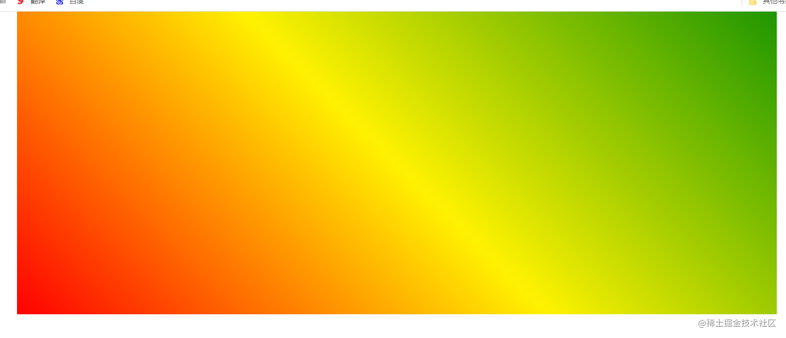
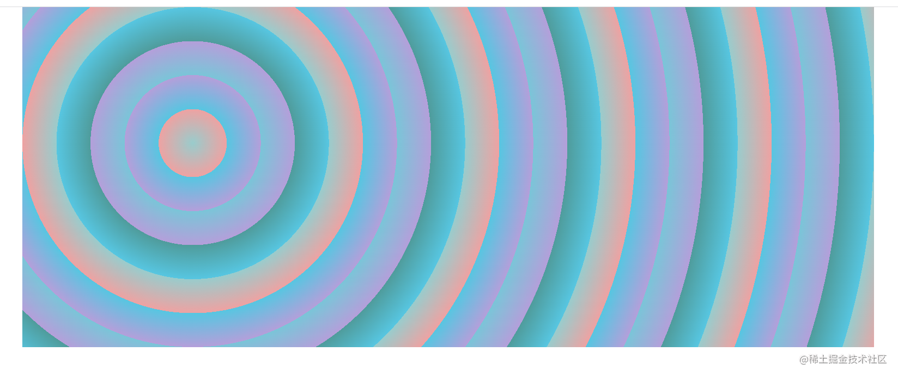

## 字体


CSS Fonts (字体)属性用于定义字体系列、大小、粗细、和文字样式（如斜体）。

### font-family
CSS 使用 font-family 属性定义文本的字体系列。

```html
p { font-family:"微软雅黑";} 
div {font-family: Arial,"Microsoft Yahei", "微软雅黑";}
```

各种字体之间必须使用英文状态下的逗号隔开
一般情况下,如果有空格隔开的多个单词组成的字体,加引号.
尽量使用系统默认自带字体，保证在任何用户的浏览器中都能正确显示
最常见的几个字体：body {font-family: 'Microsoft YaHei', tahoma, arial, 'Hiragino Sans GB'; }
浏览器会优先显示写着前面的字体，如果没有再去找后面的，如果全都没有，则会使用浏览器默认字体显示

### font-size
CSS 使用 font-size 属性定义字体大小。

```css
p { 
 	font-size: 20px; 
}
```

px（像素）大小是我们网页的最常用的单位
谷歌浏览器默认的文字大小为16px
不同浏览器可能默认显示的字号大小不一致，我们尽量给一个明确值大小，不要默认大小
可以给 body 指定整个页面文字的大小

### font-weight
CSS 使用 font-weight 属性设置文本字体的粗细

```css
p { 
 	font-weight: bold;
}
```


### font-style
CSS 使用 font-style 属性设置文本的风格。

注意：

平时我们很少给文字加斜体，反而要给斜体标签（em，i）改为不倾斜字体。

```css
p { 
 	font-style: normal;
}
```


### font
字体属性可以把以上文字样式综合来写, 这样可以更节约代码

```css
body { 
 	font: font-style font-weight font-size/line-height font-family;
}
```

要求：以 font-size 为界

- 前面放 font-style font-variant font-weight(可以随意调换顺序，也可以省略)
- 后面放 font-family(不可以调换顺序，不可以省略)
- /line-height 可以省略，如果不省略，必须跟在 font-size 后面

## Web字体

### CSS @font-face 规则

Web 字体允许 Web 设计人员使用用户计算机上未安装的字体。

当您找到/购买了想要使用的字体后，只需将字体文件包含在您的 Web 服务器上，它将在需要时自动下载给用户。

您的“自有”字体在 CSS `@font-face` 规则中进行定义。

### 不同的字体格式

- TrueType 字体 (TTF)

TrueType 是 1980 年代后期由 Apple 和 Microsoft 开发的字体标准。 TrueType 是 Mac OS 和 Microsoft Windows 操作系统最常用的字体格式。

- OpenType 字体 (OTF)

OpenType 是可缩放计算机字体的格式。它基于 TrueType 构建，并且是 Microsoft 的注册商标。今天，OpenType 字体在主要计算机平台上得到普遍使用。

- Web 开放字体格式 (WOFF)

WOFF 是用于网页的字体格式。它于 2009 年开发，现已成为 W3C 的推荐标准。 WOFF 本质上是具有压缩和其他元数据的 OpenType 或 TrueType。目标是支持在有带宽限制的网络上从服务器到客户端进行字体分发。

- Web 开放字体格式 (WOFF 2.0)

TrueType/OpenType 字体比 WOFF 1.0 提供更好的压缩。

- SVG 字体/形状

SVG 字体允许在显示文本时将 SVG 用作字形。 SVG 1.1 规范定义了一个字体模块，该模块允许在 SVG 文档中创建字体。您还可以将 CSS 应用于 SVG 文档，同时 @font-face 规则可以应用于 SVG 文档中的文本。

- 嵌入式 OpenType 字体 (EOT)

EOT 字体是 Microsoft 设计的 OpenType 字体的紧凑形式，用作网页上的嵌入式字体。
### 使用您需要的字体
在 @font-face 规则中：首先定义字体的名称（例如 myFirstFont），然后指向该字体文件。

提示：字体 URL 始终使用小写字母。大写字母可能会在 IE 中产生意外结果。

如需将字体用于 HTML 元素，请通过 font-family 属性引用字体名称（myFirstFont）：

```css
@font-face {
  font-family: myFirstFont;
  src: url(sansation_light.woff);
}

div {
  font-family: myFirstFont;
}
```


## 字体图标

图片是有诸多优点的，但是缺点很明显，比如图片不但增加了总文件的大小，还增加了很多额外的"http请求"，这都会大大降低网页的性能的。更重要的是图片不能很好的进行“缩放”，因为图片放大和缩小会失真。 我们后面会学习移动端响应式，很多情况下希望我们的图标是可以缩放的。此时，一个非常重要的技术出现了，额不是出现了，是以前就有，是被从新"宠幸"啦 。因为经常一些web字体可以做的很美观，甚至像一张图片。所以设计者再想能不能通过web字体来展示图标，这就是字体图标（iconfont)。

### 图标库

**阿里icon font字库**
推荐网站：[ http://www.iconfont.cn/](http://www.iconfont.cn/)这个是阿里妈妈M2UX的一个icon font字体图标字库，包含了淘宝图标库和阿里妈妈图标库。可以使用AI制作图标上传生成。 一个字，免费，免费！！具体怎么使用非常简单。下载好你需要的文件后，里面有样例，照着写就行。

## 文本

CSS Text（文本）属性可定义文本的外观，比如文本的颜色、对齐文本、装饰文本、文本缩进、行间距等

### color
color 属性用于定义文本的颜色。

```css
div { 
 	color: red;
}

```
开发中最常用的是十六进制.


### text-align
text-align 属性用于设置元素内文本内容的水平对齐方式。

```css
div { 
 	text-align: center;
}
```


###  text-decoration
text-decoration 属性规定添加到文本的修饰。可以给文本添加下划线、删除线、上划线等。

```css
div { 
 	text-decoration：underline；
}

```


### text-indent
text-indent 属性用来指定文本的第一行的缩进，通常是将段落的首行缩进。

```css
div { 
 	text-indent: 10px;
}
```


通过设置该属性，所有元素的第一行都可以缩进一个给定的长度，甚至该长度可以是负值。

```css
p { 
 	text-indent: 2em;
}
```

> em 是一个相对单位，就是当前元素（font-size) 1 个文字的大小, 如果当前元素没有设置大小，则会按照父元素的 1 个文字大小。所以这个设置相当于首行缩进两格

### white-space

white-space用于设置空白处理和换行规则 

​	normal：合并所有连续的空白，允许单词超屏时自动换行 

​	nowrap：合并所有连续的空白，不允许单词超屏时自动换行

​	pre：阻止合并所有连续的空白，不允许单词超屏时自动换行 

​	pre-wrap：阻止合并所有连续的空白，允许单词超屏时自动换行

​	pre-line：合并所有连续的空白（但保留换行），允许单词超屏时自动换行


###  line-height

line-height 属性用于设置行间的距离（行高）。可以控制文字行与行之间的距离.

```css
p { 
 	line-height: 26px;
}
```


## 背景

### background-image

**background-image: url();**

- 图片地址必须放在 url() 中，图片地址可以是本地地址也可以是网络地址
- 默认情况下如果背景图片小于所在 div 的大小，那么将在 x y 方向上重复图片
- 同一个标签可以同时设置背景图片及背景颜色，如果同时设置，那**背景图片会把背景颜色覆盖**
- 如果设置了多张图片，设置的第一张图片将显示在最上面，其他图片按顺序层叠在下面

**注意：**如果设置了背景图片后，元素没有具体的宽高，背景图片是不会显示出来的,背景默认显示区域是border-box。

### background-repeat

**background-repeat常见设置值：**

- repeat 默认情况下是此，x, y 都重复
- no-repeat 不重复
- repeat-x x 方向上重复
- repeat-y y 方向上重复

作用：通过平铺来减小图片的大小，从而加快网页的访问速度

### background-size

background-size用于设置背景图片的大小

- auto：默认值, 以背景图本身大小显示
- 宽度px 高度px;
- 数% 数%；宽高也可以以百分比的形式设置，表示背景宽高是当前元素的宽高的百分之几
- 宽度或高度其中一个设置为 auto，则会根据另一个进行等比拉伸
- cover：表示宽高都要进行等比拉伸，直到两个都把当前元素填满
- contain：表示宽高都要进行等比拉伸，直到其中一个都把当前所在元素对应的那个填满填满

### background-position

用于设置背景图片在水平、垂直方向上的具体位置

**background-position: 水平方向 垂直方向**

- 可以设置具体的数值 比如 20px 30px;
- 水平方向还可以设值：left、center、right
- 垂直方向还可以设值：top、center、bottom
- 如果只设置了1个方向，另一个方向默认是center


应用场景：当一张背景图片较大时，如果想让背景图片比较重要的部分在尽管网页缩放时也放在网页中间，那么就要用到该定位。（如下案例）

### background-attachment

默认情况下背景图片会随着滚动条的滚动而滚动，如果不希望背景图片随着滚动条滚动，那么我们就可以设置背景图片和滚动条的关联方式

**background-attachment**

- scroll：此关键属性值表示背景相对于元素本身固定， 而不是随着它的内容滚动
- local：此关键属性值表示背景相对于元素的内容固定。如果一个元素拥有滚动机制，背景将会随着元素的内容滚动.
- fixed：此关键属性值表示背景相对于视口固定。即使一个元素拥有滚动机制，背景也不会随着元素的内容滚动

### background

**background：背景颜色 背景图片 平铺方式 关联方式 定位方式**

- **任何一个属性都可以省略**

所以有时你看到 background: #f00; 这种也不必大惊小怪，因为它是用的这个，其它属性省略没写而已。

### background-image和img对比


总结

- img：作为网页内容的重要组成部分，比如广告图片、LOGO图片、文章配图、产品图片
- background-image：可有可无。有，能让网页更加美观。无，也不影响用户获取完整的网页内容信息


## 渐变

CSS 渐变使可以显示两种或多种指定颜色之间的平滑过渡。让我们来玩一玩，看能玩出什么花来。

CSS 定义了两种渐变类型：

## 线性渐变

我们通过属性 linear-gradient来这样定义一个线性渐变。

```css
background-image: linear-gradient( 方向/角度 , 颜色1，颜色2，颜色3....);

```

**方向：** **在关键字 to 后面加上 top、bottom、right、left 中的某一个关键字或多个关键字。**

### 从上到下（默认）

例如：

```css
background-image: linear-gradient(#FF0000,#FFF200, #1E9600);

```


### 从下到上

例如：

```css
background-image: linear-gradient(to top, #FF0000,#FFF200, #1E9600);

```


### 从左到右

```css
background-image: linear-gradient(to right, #FF0000,#FFF200, #1E9600);

```

### 从右到左

```css
background-image: linear-gradient(to left, #FF0000,#FFF200, #1E9600);

```

### 从左上到右下

当然我们可以使用多个关键字，例如 to bottom right ，表示从左上到右下结束。

```css
background-image: linear-gradient(to right bottom , #FF0000,#FFF200, #1E9600);

```


### 很多方向不举例了

### 使用角度来定义方向

除了使用关键字to +方向名词外，我们还可以使用角度去任意的规定。

我们都知道在一个平面上角度只有360度，就是一个圆。

使用角度来取代预定义的方向（向下、向上、向右、向左、向右下等等）。值 0deg 等于向上（to top）。值 90deg 等于向右（to right）。值 180deg 等于向下（to bottom）。

我们填的是终点的的角度，起点为对角线的角度

 例如：

```css
background-image: linear-gradient(45deg, #FF0000,#FFF200, #1E9600);
```

表示从起点从225度到45度结束的渐变。



### 平铺的线性渐变

当然颜色还可以使用rgb模式，这样就可以使用透明度了。 例如：

```css
background-image: linear-gradient(to right, rgba(255,0,0,0), rgba(255,0,0,1));

```


**repeating-linear-gradient()** 函数用于重复线性渐变 例如： 从左下角开始绘制渐变，前20像素是橙色，此后直至30像素的位置过渡到红色，然后直至40像素的位置再过渡到紫色。绘制完这个渐变后，浏览器会像平铺图像那样把这个渐变铺满整个背景。

```css
background-image: repeating-linear-gradient(45deg, #F27121 20px, #E94057 30px, #8A2387 40px);

```


## 径向渐变（由其中心定义）

径向渐变就是沿着圆周或者椭圆周向外扩散的渐变。有一种水波扩散的感觉。

我们通过 radial-gradient();来定义一个径向的渐变。

```css
background-image: radial-gradient(shape size at position, start-color, ..., last-color);
```

shape 为椭圆形，size 为最远角，position 为中心。

**shape** 参数定义形状。它可接受 circle 或 ellipse 值。默认值为 ellipse（椭圆）。

**size** 参数定义渐变的大小。它可接受四个值：

closest-side ：从中心点向外扩展渐变，到离中心点最近的一边结束。 farthest-side ：以离渐变中心点最远的那一边计算圆的半径 closest-corner ：以离渐变中心点最近的元素顶角计算渐变的范围。 farthest-corner ：以离渐变中心点最远的顶角计算圆的半径。


### 均匀间隔的色标（默认）

例如：

```css
 background-image: radial-gradient(#d63c21, #e0d865);
```


当我改变为圆形，并换上合适的颜色

```css
background-image: radial-gradient(circle, red, yellow, green);
```


### 设置径向渐变的中心点

用关键字 at 后面加上 position 属性支持的定位关键字和数值，指定渐变中心的位置。

调整大小和颜色百分比后 例如：

```css
    .item1 {
        height: 150px;
        width: 150px;
        margin-left: 20%;
        background-image: radial-gradient(farthest-corner at 60% 55%, red, yellow, black);
    }
```


这么好看的太阳你以后还会用照片吗？上面的例子是把中心点设置在元素的距离左上角（60% 55%）。并以 以离渐变中心点最远的顶角计算圆的半径。

### 平铺的径向渐变

例如：

```css
background-image: repeating-radial-gradient(circle at 20% 40%,#eea2a2 20px, #57c6e1 20px, #b49fda 40px, #7ac5d8 40px, #b49fda 60px, #4F9C9C 60px, #57c6e1 80px, #99CCCC 80px, #eea2a2 100px);
```



