## 盒模型的概念(外扩)

## 认识盒模型

> 认识盒模型

所有 HTML 标签都可以看成矩形盒子，由`width`、`height`、`padding`、`border`构成，称为"盒模型"。

其中`width`与`height`都是表示的是盒子模型中的内容宽度与高度。

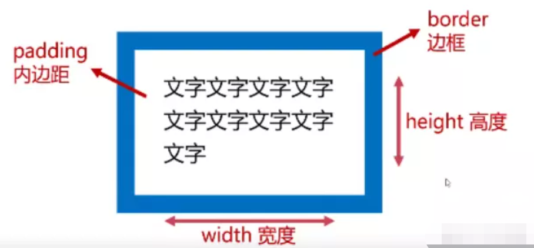

**盒子的总宽度 = width + 左右 padding + 左右 border**。

> 示例

```
<style>
    .box1 {
        /* 定义了width、height、border、padding */
        width: 200px;
        height: 200px;
        background-color: gold;
        border: 10px solid red;
        padding: 10px;
    }
</style>

<body>
    <div class="box1">
        长路林儿长路林儿长路林儿长路林儿长路林儿长路林儿长路林儿长路林儿长路林儿长路林儿
        长路林儿长路林儿长路林儿长路林儿长路林儿长路林儿长路林儿长路林儿长路林儿长路林儿
        长路林儿长路林儿长路林儿长路林儿长路林儿长路林儿长路林儿长路林儿长路林儿长路林儿
    </div>
</body>
```

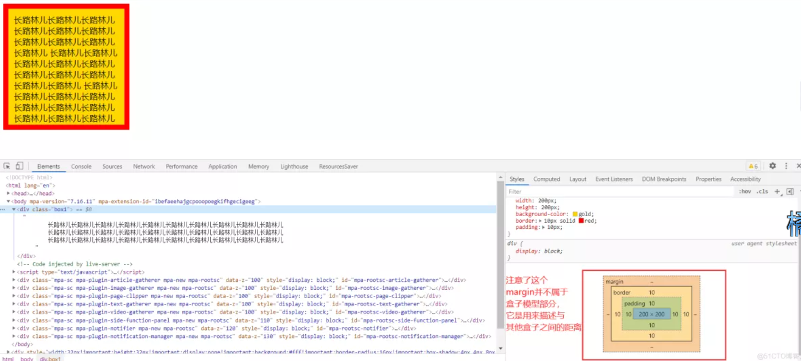

---

## 认识 width 与 height 属性

> width 属性

`width`属性：表示盒子内容的宽度。其单位通常是 px，移动端开发会涉及到百分数、rem 等单位。

**当块级元素(div、h 系列、li 等)没有设置 width 属性时**(仅设置 height 时)：它将**自动撑满**，默认值是 auto，但这并不意味着 width 可以继承。

- 注意：行内元素只设置 hegiht 时不会撑满。

**示例**：对于块级元素仅设置高度时，宽度会自动撑满

> height 属性

`height`属性表示盒子内容的高度。属性单位通常是 px，移动端开发也会涉及百分数，rem 等单位。

若是盒子的 height 属性没有设置，默认值是 auto，自动的被其内容给撑开。

---

## 认识 padding

`padding`是盒子的内边距，即盒子边框内壁到文字的举例。

包含四个方向：`padding-top`、`padding-right`、`padding-bottom`、`padding-top`

`padding`属性的写法：若是某个方向没有像素，则设置为 0 即可

- padding 四数值写法：`padding 20px 10px 30px 40px`，表示上、右、下、左。
- padding 三数值写法：`padding 10px 20px 30px`，表示上、左右、下。
- padding 两数值写法：`padding 10px 20px`，表示上下、左右。
- padding 一个数值写法：`padding 10px`，表示上右下左都是 10px。

**建议**：设置 padding 值要灵活的使用上面四种写法，还有一种写法如下：

---

## 认识 border

CSS 边框具有 style、color、width、radius 属性，分别代表边框的种类、颜色、宽度、圆角半径。border 没有设置颜色的情况下取的是 color 颜色

边框的样式有很多, 我们可以了解如下的几个:

- groove：凹槽, 沟槽, 边框看上去好象是雕刻在画布之内
- ridge：山脊, 和 grove 相反，边框看上去好象是从画布中凸出来

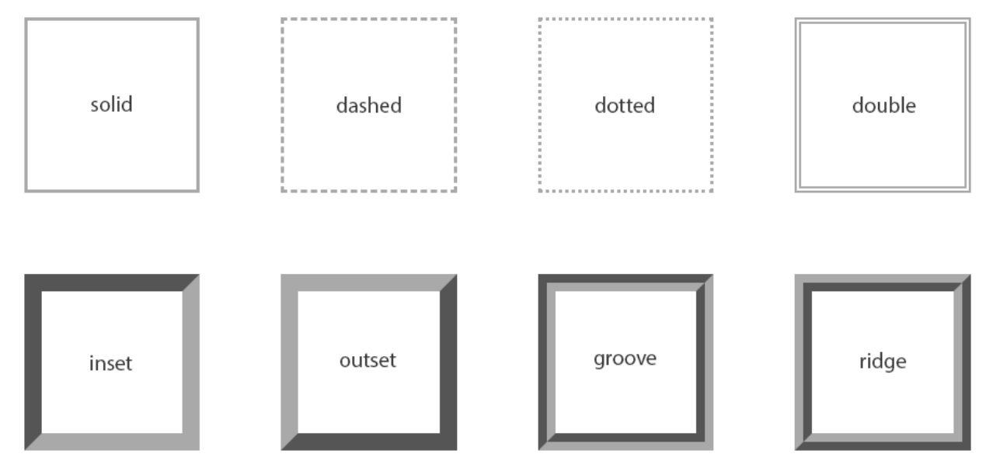

border-radius 用于设置盒子的圆角。除像素外，也可以使用百分比来指定 border-radius 的值，百分比相对于元素的宽高。

---

## 认识 margin(外边距)

margin 是盒子的外边距，即盒子与其他盒子之间的距离。

margin 也包含四个方向：`margin-top`、`margin-right`、`margin-bottom`、`margin-right`。

### margin 合并(只有上下合并，没有左右合并)

如下是示意图：

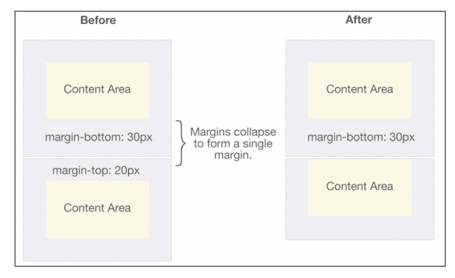

小的 margin 会塌陷到大的 margin 中，从而 margin 合并，只以大值为准。

> 父子合并

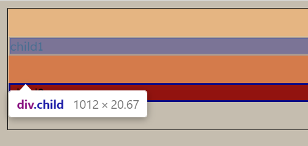

上图黄色是 child1 的外边界 30px，下图黄色是 parent 的外边界 15px，可以看到子元素的外边界合并了父元素的，所以顶开了 body。

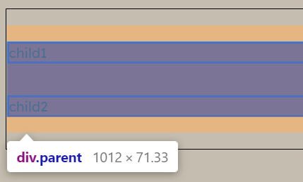

> 兄弟合并

child1 的下边界和 child2 的上边界也合并了，如果不合并他们之间应该是 60px

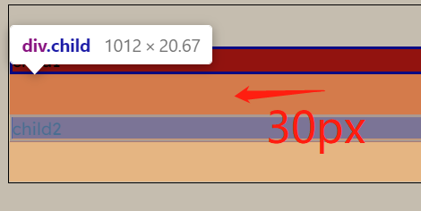

```html
<!DOCTYPE html>
<html lang="en">
  <head>
    <meta charset="UTF-8" />
    <title>Document</title>
    <style>
      body {
        border: 1px solid #000;
      }
      .parent {
        margin: 15px 0;
        background: red;
      }
      .child {
        border: 2px solid blue;
        margin: 30px 0;
      }
    </style>
  </head>
  <body>
    <div class="parent">
      <div class="child">child1</div>
      <div class="child">child2</div>
    </div>
  </body>
</html>
```

> 阻止外边距合并折叠

要想阻止合并，首先要明白原理：属于同一个`BFC`的两个相邻`Box`的垂直`margin`会发生折叠，不同`BFC`不会发生折叠。所以不让`margin`重叠可以

- 让盒子处在不同`BFC`中(比如说父子元素 margin 重叠，可以让父元素开启`BFC`，这样父元素归它外面开启`BFC`的元素管，而子元素处于父元素的`BFC`中)
- 让盒子不相邻(父元素设置 padding 或者 border 隔开子元素，这样子元素和父元素的 margin 就不相邻了)
- 子元素之间解决合并可以设置子元素为 inline-block，因为 BFC 限制的是块级盒子

---

### 盒子的水平居中

> 在一些需求中，需要元素在父元素中水平居中显示（父元素一般都是块级元素、inline-block）

- 行内级元素(包括 inline-block 元素)

  水平居中：在父元素中设置 text-align: center

- 块级元素

  水平居中：margin: 0 auto

**注意点**：文本居中(`text-align: center`)与盒子水平居中是两个概念。

---

## 认识 outline

outline 表示元素的外轮廓

- 不占用空间
- 默认显示在 border 的外面

outline 相关属性有

- outline-width: 外轮廓的宽度
- outline-style：取值跟 border 的样式一样，比如 solid、dotted 等
- outline-color: 外轮廓的颜色
- outline：outline-width、outline-style、outline-color 的简写属性，跟 border 用法类似

应用实例

- 去除 a 元素、input 元素的 focus 轮廓效果

---

## 认识 background

---

## 认识 box-shadow

### `**box-shadow**` **属性可以设置一个或多个下拉阴影的框**

> 可以在同一个元素上设置多个阴影效果，并用逗号将他们分隔开。该属性可设置的值包括阴影的X轴偏移量、Y轴偏移量、模糊半径、扩散半径和颜色。

**语法：**

```
box-shadow: h-shadow v-shadow blur spread color inset;
div.box{
    /* x偏移量 | y偏移量 | 阴影模糊半径 | 阴影扩散半径 | 阴影颜色 */
    box-shadow: 2px 2px 2px 1px rgba(0, 0, 0, 0.2);
}
```

| 值         | 描述                                                         |
| ---------- | ------------------------------------------------------------ |
| *h-shadow* | 必需的。水平阴影的位置。允许负值                             |
| *v-shadow* | 必需的。垂直阴影的位置。允许负值                             |
| *blur*     | 可选。模糊距离                                               |
| *spread*   | 可选。阴影的大小                                             |
| *color*    | 可选。阴影的颜色。在[CSS颜色值](https://www.runoob.com/cssref/css_colors_legal.aspx)寻找颜色值的完整列表 |
| inset      | 可选。从外层的阴影（开始时）改变阴影内侧阴影                 |

**注意：**这里 `inset` 参数只能设置在第一或者最后，其他位置无效！

（1）*h-shadow* 和 *v-shadow* 两个值表示阴影的偏移量

```css

        div{
            margin: 20px;
            display: inline-block;
            width: 100px;
            height: 100px;
            background-color: red;
        }
        .box1{
            box-shadow: 10px 10px blue;
        }
        .box2{
            
            box-shadow: -10px -10px blue;
        }
        .box3{
            box-shadow: -10px 10px blue;
        }
        .box4{
            box-shadow: 10px -10px blue;
        }


```


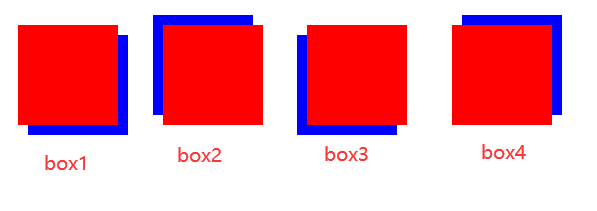

**结论：**从上面结果可以看出，两个属性值可以取正值也可以取负值，并且方向为坐标系取值方向相同（x轴正值向右负值向左，y轴正值向下负值向上）

（2）*blur* 属性值表示阴影的模糊渐变距离/半径（可选）

```

        div{
            margin: 20px;
            display: inline-block;
            width: 100px;
            height: 100px;
            background-color: red;
        }
        .box1{
            /* 模糊距离为5 */
            box-shadow: 10px 10px 5px blue;
        }
        .box2{
            /* blur值为0等同于没设置模糊距离，没有模糊效果 */
            box-shadow: -10px -10px 0px blue;
        }
        .box3{
            /* blur值不能为负数，为负数则阴影失效 */
            box-shadow: -10px 10px -5px blue;
        }
        .box4{
            /* blur值越大越模糊 */
            box-shadow: -10px 10px 20px blue;
        }

```

 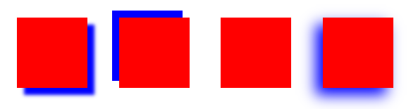

 **结论：**如果不写该参数或者该参数为0则阴影完全实心，没有模糊效果，并且该**值越大阴影越模糊**

（3） *spread* 属性值表示设置的阴影大小（可选）

> 如何理解：假设有个圆的半径是50px，spread-radius为5px，blur-radius为5px。如果没有blur-radius，那么阴影部分就是宽度为5px的一个圆环，外径55px，内径50px。再加上blur-radius的话，那么阴影部分就是从外径也就是spread-radius的边缘为基准朝里2.5px和朝外2.5公里 加起来正好是blur-radius大小，这一块是模糊的区域设置成渐变，由设置的颜色渐变到透明
>
> **阴影尺寸=原盒子大小+阴影扩展半径区域大小**
>
> **阴影大小（包括模糊）=阴影尺寸+模糊距离区域/2**
>
> 模糊距离区域则是在阴影尺寸的基础上进行模糊，可以理解为继续扩大阴影面积，只不过这部分的面积会呈现渐变。

```

        div{
            margin: 20px;
            display: inline-block;
            width: 100px;
            height: 100px;
            background-color: red;
        }
        .box1{
            /* spread为0（默认值） */
            box-shadow: 0px 0px 10px 0px blue;
        }
        .box2{
            /* spread为5(正值会在元素的四个方向延伸阴影) */
            box-shadow: 0px 0px 10px 5px blue;
        }
        .box3{
            /* spread为-1(负值会使阴影变得比元素本身尺寸还要小) */
            box-shadow: 0px 0px 10px -1px blue;
        }
```

 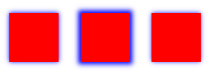

**结论：**

- 默认值“0”会让阴影变得得和元素的大小一样（无设置）
- 正值会在元素的四个方向延伸阴影，如果设置阴影是inset，设置正直是往里面缩
- 负值会使阴影变得比元素本身尺寸还要小

（4） *color* 属性值指定阴影的颜色

（5）*inset* 设置阴影为内侧

> 其实阴影是盖在元素上面的，默认渲染外侧就把内部交集和去掉，渲染内侧则把超出盒子的部分给去掉。

```css

        div{
            margin: 20px;
            display: inline-block;
            width: 100px;
            height: 100px;
            background-color: red;
        }
        .box1{
            box-shadow: 0px 0px 10px 5px blue;
        }
        .box2{
             /* inset设置阴影为内侧阴影 */
            box-shadow: 0px 0px 10px 5px blue inset;
        }

```


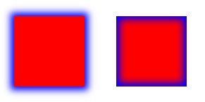

---

## 盒子模型(内缩，使用 box-sizing)

> box-sizing 概念

**1. W3C 盒子模型（标准盒模型）**

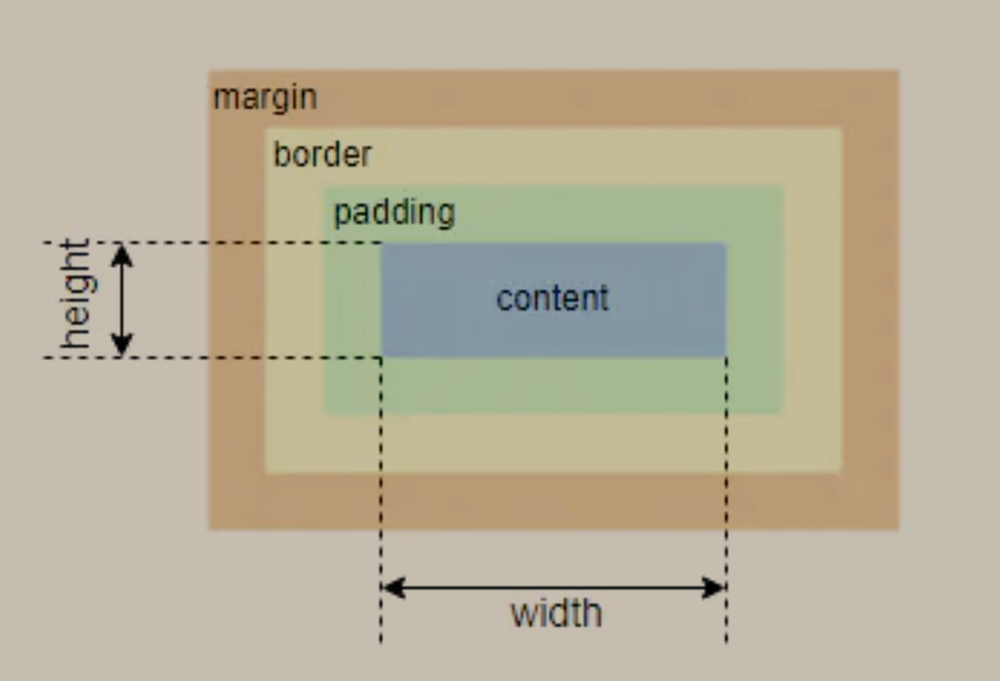

width=content 的宽，height = content 的高

**2. IE 盒模型(怪异盒模型)**

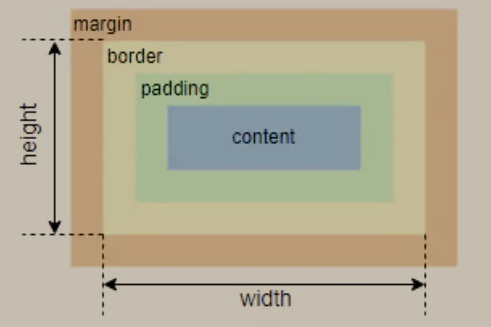

width = **content** + **padding** + **border**

height = **content** + **padding** + **border**
