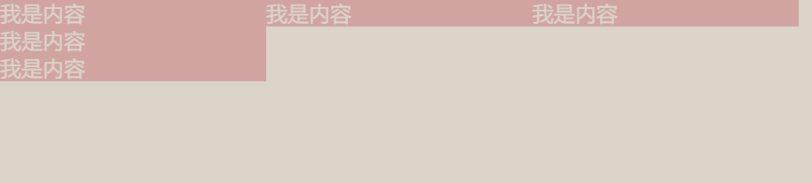

## 1. 前言

作为了一个现代的前端开发工程师我们可能经常在聊组件化。可是当我们拿到 ui 的设计稿时，如果连布局都不清不楚，谈何组件化呢。所以，我们需要在分清楚组件之前，先来分清楚布局。本文总结了一些常见的布局。

## 2. 两列布局

### 2.1. 左列定宽，右列自适应

#### 2.1.1. float + margin

html:

```html
<body>
  <div id="left">左列定宽</div>
  <div id="right">右列自适应</div>
</body>
```

css：

```css
#left {
  float: left;
  width: 100px;
  height: 100px;
  background-color: red;
}
#right {
  margin-left: 100px;
  height: 100px;
  background-color: green;
}
```

#### 2.1.2. float + overflow

html

```html
<body>
  <div id="left">左列定宽</div>
  <div id="right">右列自适应</div>
</body>
```

css

```css
#left {
  float: left;
  width: 100px;
  height: 100px;
  background-color: red;
}
#right {
  overflow: hidden;
  height: 100px;
  background-color: green;
}
```

#### 2.1.3. 绝对定位

html：

```html
<body>
  <div id="container">
    <div id="left">左列定宽</div>
    <div id="right">右列自适应</div>
  </div>
</body>
```

css：

```css
#container {
  position: relative;
}
#left {
  position: absolute;
  top: 0;
  left: 0;
  width: 100px;
  height: 100px;
  background-color: red;
}
#right {
  position: absolute;
  top: 0;
  left: 100px;
  right: 0;
  height: 100px;
  background-color: green;
}
```

#### 2.1.4. table

html：

```html
<body>
  <div id="container">
    <div id="left">左列定宽</div>
    <div id="right">右列自适应</div>
  </div>
</body>
```

css：

```css
#container {
  width: 100%;
  height: 100px;
  display: table;
}
#left,
#right {
  display: table-cell;
}
#left {
  width: 100px;
  background-color: red;
}
#right {
  background-color: green;
}
```

#### 2.1.5. flex 布局

html：

```html
<body>
  <div id="container">
    <div id="left">左列定宽</div>
    <div id="right">右列自适应</div>
  </div>
</body>
```

css：

```css
#container {
  width: 100%;
  height: 100px;
  display: flex;
}
#left {
  width: 200px;
  background-color: red;
}
#right {
  flex: 1;
  background-color: green;
}
```

#### 2.1.6. grid 网格

html：

```html
<body>
  <div id="container">
    <div id="left">左列定宽</div>
    <div id="right">右列自适应</div>
  </div>
</body>
```

css：

```css
#container {
  width: 100%;
  height: 100px;
  display: grid;
  grid-template-columns: 200px auto;
}
#left {
  background-color: red;
}
#right {
  background-color: green;
}
```

### 2.2. 左列不定宽，右列自适应

#### 2.2.1. float + overflow

html：

```html
<body>
  <div id="left">左列不定宽</div>
  <div id="right">右列自适应</div>
</body>
```

css：

```css
#left {
  float: left;
  height: 100px;
  background-color: red;
}
#right {
  overflow: hidden;
  height: 100px;
  background-color: green;
}
```

#### 2.2.2. flex 布局

html：

```html
<body>
  <div id="container">
    <div id="left">左列不定宽</div>
    <div id="right">右列自适应</div>
  </div>
</body>
```

css：

```css
#container {
  display: flex;
  height: 100px;
}
#left {
  background-color: red;
}
#right {
  flex: 1;
  background-color: green;
}
```

#### 2.2.3. grid 布局

html：

```html
<body>
  <div id="container">
    <div id="left">左列不定宽</div>
    <div id="right">右列自适应</div>
  </div>
</body>
```

css：

```css
#container {
  display: grid;
  grid-template-columns: auto 1fr;
  height: 100px;
}
#left {
  background-color: red;
}
#right {
  background-color: green;
}
```

## 3. 三列布局

要求： 1.两边固定 当中自适应 2.中间列要优先加载

### 3.1. 绝对定位

这可以算是最简单的一种了，关键点在于中间版块不给宽度，通过左右绝对定位 left 和 right 实现自适应。缺点是需要一个父容器设置相对定位或者绝对定位。

```html
<div class="container">
  <div class="left"></div>
  <div class="middle"></div>
  <div class="right"></div>
</div>
```

```css
.container {
  height: 800px;
  background-color: #eee;
  position: relative;

.left {
  position: absolute;
  left: 0;
  width: 200px;
  height: 800px;
  background-color: green;

.right {
  position: absolute;
  right: 0;
  width: 200px;
  height: 800px;
  background-color: blue;

.middle {
  position: absolute;
  left: 200px;
  right: 200px;
  height: 800px;
  background-color: red;
}
```

### 3.2. 两侧浮动

两侧浮动很简单，只需要左右元素往左右浮动。但是这样的前提是左右元素在`html`结构上要在`middle`上面。

```css
.left {
  width: 100px;
  height: 800px;
  background: green;
  float: left;

.right {
  width: 150px;
  height: 800px;
  background: blue;
  float: right;
}

```

```html
<div class="left"></div>
<div class="right"></div>
<div class="middle"></div>
```

至于中间元素可以用`overflow`或者`margin`定位

```css
.middle {
  overflow: hidden;
  height: 800px;
  background: pink;
}
```

或者

```css
.middle {
  margin: 0 100px;
  height: 800px;
  background: pink;
}
```

### 3.3. 圣杯和双飞翼布局

我们上面浮动的例子，中间部分因为是在 html 结构最下面，所以是最后加载。圣杯布局和双飞翼布局目的都是希望先加载的是中间的部分因为中间部分的内容应该是相对更重要。
这两种布局前期思路一致，都是通过三栏 float 和负 margin 达到三列并列效果。不同的地方在于处理中间板块被遮挡的方法。首先先写一个基本结构：

```css
* {
  padding: 0;
  margin: 0;

.left {
  width: 100px;
  height: 800px;
  background: green;
  margin-left: -100%; //包含块的内容区的宽度
  float: left;

.right {
  width: 100px;
  height: 800px;
  background: blue;
  margin-left: -100px;
  float: left;
}
.middle {
  width: 100%;
  height: 800px;
  background: red;
  float: left;
}
```

```html
<div class="middle">middle</div>
//中间元素放到前面优先加载
<div class="left">left</div>
<div class="right">right</div>
```


上图可以看出三列并列的效果已经实现，剩下就是怎么处理中间列的内容区域不被两列遮挡。
先来看一看圣杯布局： 给最外层 body 设置左右 padding 等于左右板块的宽度，再通过相对定位把左右板块往两边拉

```css
.body {
  padding: 0 100px;
}
.left {
  position: relative;
  left: -100px;
}
.right {
  position: relative;
  right: -100px;
}
```

而双飞翼布局则是通过多加一个内层元素 inner 加 margin 的方式，让内层元素刚好定位到露出部分

```html
<div class="middle">
  <div class="inner">middle</div>
</div>
<div class="left">left</div>
<div class="right">right</div>
```

```css
inner {
  margin: 0 100px;
}
```

事实上最简单的办法可以让 middle 不使用怪异盒模型，这样 width 设置的是 border-box 的宽度，只需要设置两侧 padding，内容区自然就往中间靠了

```css
.middle {
  box-sizing: border-box;
  padding: 0 100px;
}
```

### 3.4. flex 布局

```html
<div class="container">
  <div class="center">middle</div>
  <div class="left">left</div>
  <div class="right">right</div>
</div>
```

```css
.container {
  display: flex;
}

.left,
.right {
  width: 100px;
  height: 400px;
  background-color: lightblue;
}
.left {
  order: -1; //设置order让left元素到左侧去
}
.center {
  flex: 1;
  height: 400px;
  background-color: lightgrey;
}
```

## 4. 等高布局

### 4.1. 负 margin-bottom 和正 padding-bottom 对冲

更高布局的需求也比较常见，比如我有如下几个`item`，是根据内容撑高，那每个`item`的内容多少不同，高度就不同了。如何做到元素等高呢。

```html
<div class="container">
  <div class="item">
    <p>我是内容</p>
    <p>我是内容</p>
    <p>我是内容</p>
  </div>
  <div class="item">
    <p>我是内容</p>
  </div>
  <div class="item">
    <p>我是内容</p>
  </div>
</div>
```

```css
.container {
  overflow: hidden;
}
.container .item {
  float: left;
  width: 200px;
  color: #fff;
  background: pink;
}
```



只需要元素设置的`padding-bottom`尽可能大一些，并且需要设置一样大小的`margin-bottom`负值去抵消`padding-bottom`撑大的区域（收回边界），正负一抵消，对于页面布局不会有影响。另外的话还需要设置父元素`overflow：hidden`把子元素多出来的色块背景隐藏掉。

```css
.container .item {
  float: left;
  width: 200px;
  color: #fff;
  background: pink;
  margin: 0 10px -10000px 0;
  padding-bottom: 10000px;
}
```

### 4.2. flex 布局

flex 中的伸缩项目默认为拉伸为父元素的高度，同样可以实现等高效果

## 5. 黏连布局


### 5.1. margin-top 负值

三个组成部分：`wrap`容器,`content`内容,`footer`脚部
`wrap`包裹内容的最小高度是 100%，此时将`footer`的部分通过`margin-top`拉上去 50px，这样初始位置就固定在底部。但是拉上去 50px 会覆盖到`content`区域，所以给`content`设置`padding-bottom`

```html
<body>
  <div class="wrap">
    <div class="content"><br /><br /><br /><br /></div>
  </div>
  <footer class="footer"></footer>
</body>
```

```css
html,
body {
  height: 100%;
}
.wrap {
  min-height: 100%;
}
.content {
  padding-bottom: 50px;
}
.footer {
  height: 50px;
  margin-top: -50px;
  background-color: red;
}
```

### 5.2. calc 函数

两个组成部分：`content`内容,`footer`脚部

`body`撑满屏幕，然后`content`最小高度就是`body`高度减去`footer`高度

```css
html,
body {
  height: 100%;
}

.content {
  min-height: calc(100% - 50px);
}
.footer {
  height: 50px;
  background-color: red;
}
```

```html
<body>
  <div class="content"><br /><br /><br /><br /></div>
  <footer class="footer"></footer>
</body>
```

### 5.3. flex 布局

两个组成部分：`content`内容,`footer`脚部
`flex`可以把主轴设置成`colum`，这样`footer`就永远在底部。内容区域多了，`footer`只会往下挤。

```css
html {
  height: 100%;
}
body {
  min-height: 100%;
  display: flex;
  flex-direction: column;
}
.content {
  flex: 1;
}
.footer {
  height: 50px;
  background-color: red;
}
```

```html
<body>
  <div class="content">
    <br />
    <br />
    <br />
    <br />
    <br />
    <br />
    <br />
    <br />
    <br />
    <br />
  </div>
  <footer class="footer"></footer>
</body>
```

## 6. 总结

无论是什么布局方式，无外乎需要应用`float、table、absolute、flex、grid`这几种布局属性，然后再配合负`margin`、`calc()`函数、`bfc`、增加结构等来实现布局

自适应包括两种情况：一种是宽度由内容撑开，一种是宽度自动撑满父元素剩余宽度
可实现宽度由内容撑开的属性有： `float、inline、inline-block、table、table-cell、absolute、fixed、flex、grid`
可实现宽度自动撑满父元素剩余宽度的属性有： `overflow(配合float)、table、flex、grid`
