## 1. 坐标系

CSS3 中的 3D 坐标系如下：

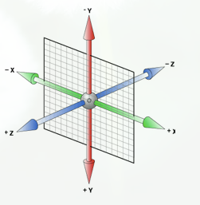

XYZ 轴的正方向分别是：右、下、屏幕外，让轴正向对着自己，顺时针方向就是该轴旋转的方向。
判断旋转角度通过左手法则：左手握住旋转轴，竖起拇指指向旋转轴正方向，正向就是其余手指卷曲的方向（顺时针方向）。

## 2. transform 函数

利用 CSS3 的函数变换，可以移动、比例化、反转、旋转和拉伸元素。

### 2.1. translate

`translate()` 方法，根据左 x 轴和顶部 y 轴位置给定的参数，从当前元素位置移动。

```css
div {
  transform: translate(50px, 100px);
}
```

`translate(50px, 100px)` 是指元素从左边移动 50 个像素，并从顶部移动 100 像素。

百分比：参照元素本身（ refer to the size of bounding box ）

### 2.2. rotate

`rotate()` 方法使元素在一个给定度数顺时针旋转。允许负值，这样就是逆时针旋转。

```css
div {
  transform: rotate(30deg);
}
```

### 2.3. scale

`scale()` 方法使元素缩放，大小取决于宽度 x 轴和高度 y 轴的参数：

```css
div {
  transform: scale(2, 4);
}
```

### 2.4. skew

包含两个参数值，分别表示 x 轴和 y 轴倾斜的角度。如果第二个参数为空，则默认为 0。参数为负表示向相反方向倾斜。

- `skewX()` 表示只在 x 轴（水平方向）倾斜；
- `skewY()` 表示只在 y 轴（垂直方向）倾斜。

```css
div {
  transform: skew(30deg, 20deg);
}
```

### 2.5. matrix

​		关于矩阵、方程和三角函数的基本理论不是本文的重点，有需要可以自行搜索。这里只简单提一下矩阵的概念和矩阵相乘的计算规则。在数学中，矩阵（Matrix）是一个按照长方阵列排列的复数或实数集合，最早来自于方程组的系数及常数所构成的方阵。（概念摘自百度百科）矩阵与列向量/其他矩阵相乘的计算规则：左侧矩阵的每一行的每个值分别与右侧矩阵的每一列的每个值相乘并求和，简单点就是“行×列”。比如：
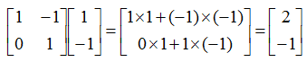

先看结论：matrix 参数顺序 `scaleX,skewY,skewX,scaleY,translateX,translateY` ，分别对应各自的单一类型（缩放、旋转、斜拉、平移）、单一维度变换方法。**传入的顺序是按照列来的**。

1. translate(offsetX, offsetY): 平移，可以在X轴或者Y轴上平移，平移前后的坐标变换关系是(newX, newY) = (oldX + offsetX, oldY+offsetY), 其期望的矩阵应该是这种类型的：

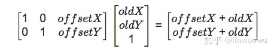

2. scale(scaleX, scaleY): 缩放，可以在X轴或者Y轴上缩放，缩放前后的坐标变换关系是 (newX, newY) = (oldX *scaleX, oldY* scaleY)，其期望的矩阵应该是这种类型：

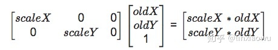

3. rotate(\theta*θ*): 旋转，围绕着transform-origin配置的中心点旋转，旋转前后的坐标变换关系是(newX, newY) = (oldX *cos\thetacosθ* *- oldY* sin\theta*sinθ*, oldX *sin\thetasinθ* *+ oldY* cos\theta*cosθ*)，其期望的矩阵应该是这种类型的：

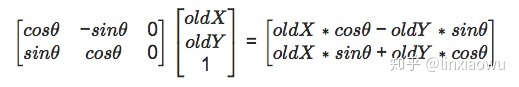

旋转的这个公式示意图会在后续的更新中添加上，我将使用SVG来描述这种转换关系，让大家知其所以然

4. skew不常用不用管

   

   ​		前面我们在说明transform的四大属性的时候，一直在强调可以使用相关的矩阵来表示，**从数学上来说，所有的变化都可以使用下列`3*3`的变换矩阵来表示**：

   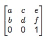

   ​		因此之前提到的相关矩阵都可以算成是该通用矩阵的子集，但机智的童鞋们肯定会问到：**为什么刚才明明使用2 X 3的矩阵就可以计算出来，为什么通用矩阵就变成了3 X 3的呢？这不是多此一举呢？如果是3 X 3的矩阵，为什么第三行就必须是[ 0 0 1]呢？**

   这个问题我们先不马上说原因，大家往后继续阅读文章自然会找到答案

   看到该通用矩阵后我们知道只用了6个值，对应到CSS3的matrix属性便是:`transform: matrix(a, b, c, d, e, f)`。然后再结合上一小节的各种变换公式，我们是不是可以总结出什么？

   如下表：

   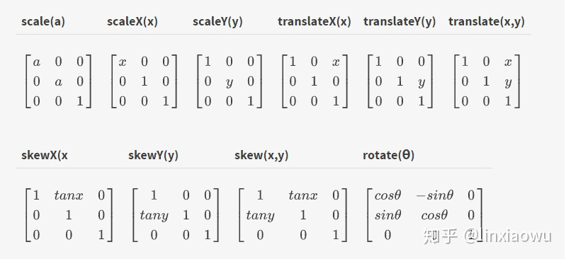

   通过这张表你可以清晰地看出四大属性与matrix属性之间的关联，那么问题来了，如果我是多种变换组合在一起呢？那么这个时候就可以使用矩阵连续相乘得到结果，于是乎，在这个点上我们就可以回答刚才的问题了，因为根据矩阵的乘法计算规则，两个矩阵相乘必须满足**只有在第一个矩阵的列数（column）和第二个矩阵的行数（row）相同时才有定义**，所以你不可能将一个2 X 3的矩阵乘以一个2 X 3的矩阵，因此我们需要扩展成3 X 3的矩阵，然后为了保证第三行的数值不会影响到我们的结果，其值只能是`[0 0 1]`

   举个栗子：

   ```text
   .demo{
      transform-origin: 0px 0px;
      transform: rotate(45deg) translate(100px, 0) scale(2);
   }
   ```

   那么其矩阵的表达式应该是：

   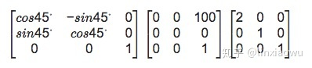

   然后再乘以对应的点，我们只需要提供上述矩阵相乘得到的结果赋值给matrix属性，其他的点积计算交由浏览器来执行，所以其等效的配置是：

   ```text
   .demo{
      transform-origin: 0px 0px;
      transform: matrix(1.41421, 1.41421, -1.41421, 1.41421, 70.7107, 70.7107);
   }
   ```

学习了2D的矩阵变换，那么3D的变换也就不在话下了，其语法是：

```
matrix3d(a1, b1, c1, d1, a2, b2, c2, d2, a3, b3, c3, d3, a4, b4, c4, d4)
```

这里就不再细说3D的矩阵变换了。

## 3. transform 相关的属性

CSS3 允许使用 3D 变换来对元素进行格式化。

### 3.1. CSS 变换属性

|         属性          |              描述              |
| :-------------------: | :----------------------------: |
|      `transform`      |    向元素应用 2D 或 3D 变换    |
|  `transform-origin`   |     改变被变换的元素的位置     |
|   `transform-style`   | 被嵌套元素如何在 3D 空间中显示 |
|     `perspective`     |       3D 元素的透视效果        |
| `perspective-origin`  |       3D 元素的底部位置        |
| `backface-visibility` |   元素在不面对屏幕时是否可见   |

### 3.2. transform-origin

transform-origin 可以改变元素的原点位置,默认情况，变形的原点在元素的中心点，或者是元素 X 轴和 Y 轴的 50%处，如下图所示：
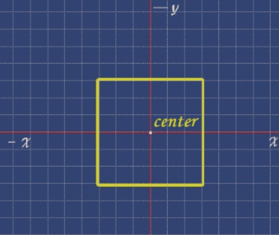  
CSS 变形进行的旋转、移位、缩放等操作都是以元素自己中心（变形原点）位置进行变形的。但很多时候需要在不同的位置对元素进行变形操作，我们就可以使用 transform-origin 来对元素进行原点位置改变，使元素原点不在元素的中心位置，以达到需要的原点位置。 如果我们把元素变换原点（transform-origin）设置 0（x） 0（y），这个时候元素的变换原点转换到元素的左顶角处，如下图所示：
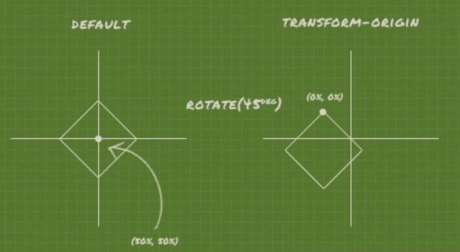  
transform-origin 属性值可以是百分比、em、px 等具体的值，也可以是 top、right、bottom、left 和 center 这样的关键词。 2D 的变形中的 transform-origin 属性可以是一个参数值，也可以是两个参数值。如果是两个参数值时，第一值设置水平方向 X 轴的位置，第二个值是用来设置垂直方向Ｙ轴的位置。 3D 的变形中的 transform-origin 属性还包括了 z 轴的第三个值。

- top = top center = center top = 50% 0

- right = right center = center right = 100%或(100% 50%)

- bottom = bottom center = center bottom = 50% 100%

- left = left center = center left = 0 或(0 50%)

- center = center center = 50%或（50% 50%）

- top left = left top = 0 0

- right top = top right = 100% 0

- bottom right = right bottom = 100% 100%

- bottom left = left bottom = 0 100%
  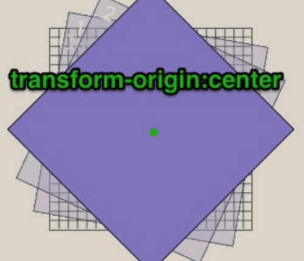  
  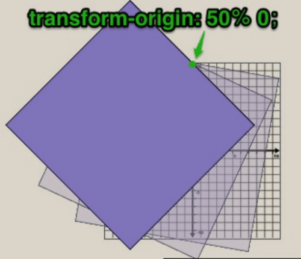  
  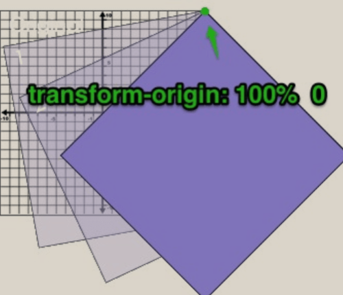
  
  transfrom和transfrom-origin可以用一个 transfrom表示。如下 ` transform: rotate(60deg);transform-origin: top left;`等价于`transform: translate(-50px, -50px) rotate(60deg) translate(50px, 50px);`
  
  ```html
  <!DOCTYPE html>
  <html>
    <head>
      <meta charset="UTF-8" />
      <title></title>
      <style type="text/css">
        .wrap {
          border: 1px solid #000;
        }
        .box {
          width: 100px;
          height: 100px;
          background-color: aqua;
          margin: 10px auto;
        }
        .box1 {
          transform: rotate(60deg);
          transform-origin: top left;
        }
        .box2 {
          transform: translate(-50px, -50px) rotate(60deg) translate(50px, 50px);
        }
      </style>
    </head>
    <body>
      <div class="wrap">
        <div class="box box1"></div>
      </div>
      <div class="wrap">
        <div class="box box2"></div>
      </div>
    </body>
  </html>
  
  ```
  
  计ox/oy为transform-origin的锚点，CSS中计算一个元素的变换矩阵为：
  
  
  
  中间这个矩阵是translate/rotate/scale计算出来的假设结果，因为不涉及perspective，因此最下面一行的值固定。由于有矩阵乘法结合律，因此多个transform可以先算内容形成中间这个矩阵，也可以后算。
  
  在实现中，一般是先算transform形成中间这个变换矩阵，简称为T1，然后再左乘、右乘transform-origin，形成最终的T2。

### 3.3. perspective

规定 3D 元素的透视效果，可以理解为眼睛距离屏幕的距离。可以取值为 none 或不设置，这种情况下说明没有透视效果。perspective 的意义在于设置远近点大小的比例，让它产生 3D 感。下图中 d 就代表 perspective 的距离，而 z 代表元素在 z 轴上的位移，元素在 z 轴上越远，相对于观察者看起来越小，而它越接近，它看起来就越大。这就是透视在三维空间中的效果。
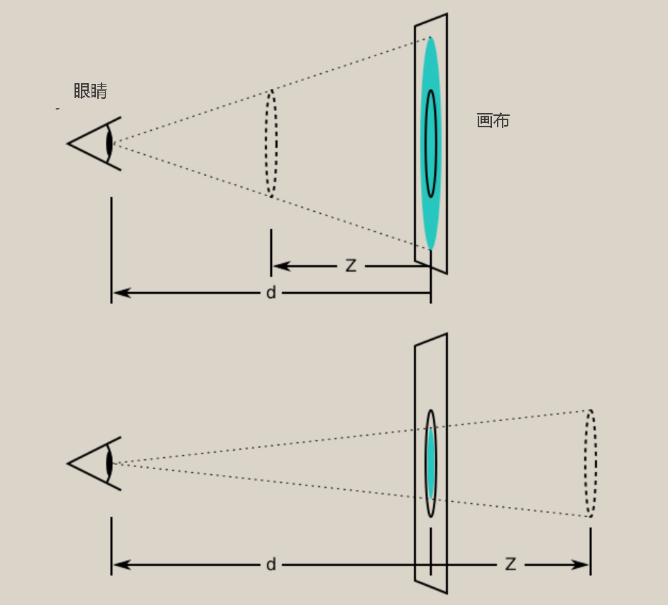

css中的透视矩阵比webgl简略了很多，如下就是css的透视投影矩阵

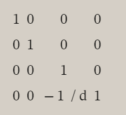

perspective 有两种写法

- 作为一个属性，设置给父元素，**影响的是它的直接子元素**

```css
.class {
  perspective: 800px;
}
```

- 作为 transform 属性的一个值，影响的是它的直接子元素

```css
.class {
  transform: prespective(800px);
}
```

举个例子：

```html
<!DOCTYPE html>
<html>
  <head>
    <meta charset="UTF-8" />
    <title></title>
    <style type="text/css">
      .wrap {
        border: 1px solid #000;
      }
      .box {
        width: 100px;
        height: 100px;
        background-color: aqua;
        margin: 50px auto;
      }
      .box1 {
        transform: translateZ(10px);
      }
      .box2 {
        transform: matrix3d(1, 0, 0, 0, 0, 1, 0, 0, 0, 0, 1, -0.02, 0, 0, 0, 1)
          translateZ(10px);
      }
    </style>
  </head>
  <body>
    <div class="wrap" style="perspective: 50px">
      <div class="box box1"></div>
    </div>
    <div class="wrap">
      <div class="box box2"></div>
    </div>
  </body>
</html>
```

在wrap元素设置perspective相当于box1元素在做transfrom矩阵变换之前都会左乘一个透视矩阵，经过验证box1和box2显示效果相同

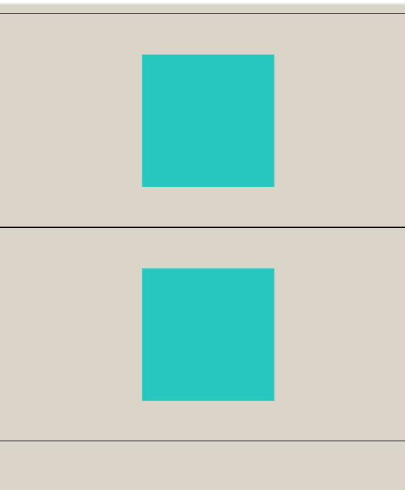

而且perspective是会叠加的，因为子元素的矩阵变换是在父元素变换的基础上进行变换的

```html
<!DOCTYPE html>
<html>
  <head>
    <meta charset="UTF-8" />
    <title></title>
    <style type="text/css">
      .wrap {
        border: 1px solid #000;
      }
      .box {
        width: 100px;
        height: 100px;
        background-color: aqua;
        margin: 50px auto;
        position: relative;
      }

      .page {
        position: absolute;
        width: 100%;
        height: 100%;
        border: 1px solid #000;
      }
    </style>
  </head>
  <body>
    <div class="wrap" style="perspective: 100px">
      <div class="box" style="perspective: 100px; transform: translateZ(10px)">
        <div class="page" style="transform: rotateY(60deg)"></div>
      </div>
    </div>
    <div class="wrap">
      <div
        class="box"
        style="
          transform: matrix3d(1,0,0,0,0,1,0,0,0,0,1,-0.01,0,0,0,1) translateZ(10px);"
      >
        <div
          class="page"
          style="
            transform: matrix3d(1,0,0,0,0,1,0,0,0,0,1,-0.01,0,0,0,1) rotateY(60deg);"
        ></div>
      </div>
    </div>
  </body>
</html>
```

可以看到wrap上设置了perspective，所以box左乘一个透视矩阵就等价了，然后box上也设置了perspective，所以page也左乘一个透视矩阵，而且page的变换是在box的基础上进行的，也就是说box在z方向上前进了10px，然后page在此基础上旋转。如下看效果是一致的。

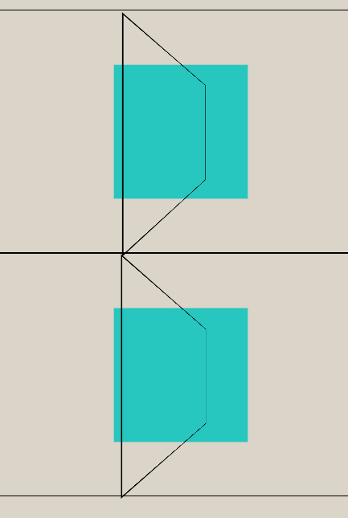

### 3.4. perspective-origin

默认值是 center center，也就是居中。这两个参数呢，是根据自身来定位的， 0px 0px 代表着元素的左上角，center center 代表着元素的中间点。可以设置像素 50px 也可设置百分比 50%，还可以设置 top right left bottom center 等。
这个属性是相当于人 的眼睛看哪里。你没有设置，也就是默认看元素中间的地方。


### 3.5. transform-style

transform-style 属性是 3D 空间一个重要属性，指定嵌套元素如何在 3D 空间中呈现。他主要有两个属性值：flat 和 preserve-3d。
其中 flat 值为默认值，表示所有子元素在 2D 平面呈现。preserve-3d 表示所有子元素在 3D 空间中呈现。

也就是说，如果对一个元素设置了 transform-style 的值为 flat，则该元素的所有子元素都将被平展到该元素的 2D 平面中进行呈现。沿着 X 轴或 Y 轴方向旋转该元素将导致位于正或负 Z 轴位置的子元素显示在该元素的平面上，而不是它的前面或者后面。如果对一个元素设置了 transform-style 的值为 preserve-3d，它表示不执行平展操作，他的所有子元素位于 3D 空间中。

### 3.6. backface-visibility

定义元素在不面对屏幕时是否可见,默认是 visible，可以改成 hidden。下图盒子的面开始时被设置为 backface-visibility:hidden;，只能看见朝着我们的面。当 backface-visibility: visible 时，盒子的 6 个面都处于可见状态。
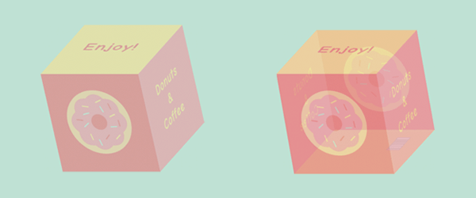

### 3.7. 3D 变换方法

|                            函数                            |               描述               |
| :--------------------------------------------------------: | :------------------------------: |
| `matrix3d(n, n, n, n, n, n, n, n, n, n, n, n, n, n, n, n)` | 3D 变换，使用 16 个值的 4×4 矩阵 |
|                   `translate3d(x, y, z)`                   |             3D 变换              |
|                      `translateX(x)`                       |   3D 变换，仅使用用于 x 轴的值   |
|                      `translateY(y)`                       |   3D 变换，仅使用用于 y 轴的值   |
|                      `translateZ(z)`                       |   3D 变换，仅使用用于 z 轴的值   |
|                     `scale3d(x, y, z)`                     |         定义 3D 缩放变换         |
|                        `scaleX(x)`                         |  3D 缩放变换，给定一个 x 轴的值  |
|                        `scaleY(y)`                         |  3D 缩放变换，给定一个 y 轴的值  |
|                        `scaleZ(z)`                         |  3D 缩放变换，给定一个 z 轴的值  |
|                 `rotate3d(x, y, z, angle)`                 |             3D 旋转              |
|                      `rotateX(angle)`                      |        沿 x 轴的 3D 旋转         |
|                      `rotateY(angle)`                      |        沿 y 轴的 3D 旋转         |
|                      `rotateZ(angle)`                      |        沿 z 轴的 3D 旋转         |
|                      `perspective(n)`                      |      3D 变换元素的透视视图       |

### 3.8. 3D 示例

如何实现 3d 效果,需要以下三个步骤。

1. 先设置 HTML 结构。

```html
<div class="scene">
  <div class="cube">
    <div class="cube__face cube__face--front">front</div>
    <div class="cube__face cube__face--back">back</div>
    <div class="cube__face cube__face--right">right</div>
    <div class="cube__face cube__face--left">left</div>
    <div class="cube__face cube__face--top">top</div>
    <div class="cube__face cube__face--bottom">bottom</div>
  </div>
</div>
```

牢记一个套路，需要三层嵌套的 HTML 结构，场景(.scene)、3D 元素(.cube)、3D 元素的多个部件(.cube\_\_face)。

2. 第二步，在场景上设置视角(perspective)，3D 元素上设置 transform-style: preserve-3d。

```css
.scene {
  width: 200px;
  height: 200px;
  perspective: 600px;
}

.cube {
  width: 100%;
  height: 100%;
  position: relative;
  transform-style: preserve-3d;
}
```

3. 3D 部件上设置绝对定位后设置各个方向的偏移

```css
.cube.show-front {
  transform: translateZ(-100px) rotateY(0deg);
}
.cube.show-right {
  transform: translateZ(-100px) rotateY(-90deg);
}
.cube.show-back {
  transform: translateZ(-100px) rotateY(-180deg);
}
.cube.show-left {
  transform: translateZ(-100px) rotateY(90deg);
}
.cube.show-top {
  transform: translateZ(-100px) rotateX(-90deg);
}
.cube.show-bottom {
  transform: translateZ(-100px) rotateX(90deg);
}

.cube__face {
  position: absolute;
  width: 200px;
  height: 200px;
}
```

以上再精简成一句话便于记忆：爷爷设置 perspective、父亲设置 transform-style: preserve-3d、孩子们设置绝对定位和 3D 偏移。

## 4. 过渡

CSS 过渡允许在给定的持续时间内平滑地（从一个值到另一个值）更改属性值。

CSS3 过渡是元素从一种样式逐渐改变为另一种的效果。

要实现这一点，必须规定两项内容：

- 指定要添加效果的 CSS 属性
- 指定效果的持续时间

```css
div {
  width: 100px;
  height: 100px;
  background: red;
  transition: width 2s;
}
```

如果未指定持续时间，将没有过渡效果，因为默认值是 0。

指定的 CSS 属性的值更改时效果会发生变化。一个典型 CSS 属性的变化是用户鼠标放在一个元素上时：

```css
div:hover {
  width: 300px;
}
```

当鼠标光标移动到该元素时，它将逐渐改变样式。

### 4.1. 多项改变

要添加多个样式的变换效果，添加的属性由逗号分隔：

```css
div {
  transition: width 2s, height 2s, transform 2s;
}
```

不是所有的属性都支持过渡的，比如`display`。而且对于`transform`来说，他的属性值中变换函数的位置，个数不相同也不会触发过渡

### 4.2. CSS 过渡属性

|             属性             |                    描述                    |
| :--------------------------: | :----------------------------------------: |
|         `transition`         | 简写属性，用于在一个属性中设置四个过渡属性 |
|    `transition-property`     |       规定应用过渡的 CSS 属性的名称        |
|    `transition-duration`     |        过渡效果花费的时间。默认是 0        |
| `transition-timing-function` |     过渡效果的时间曲线。默认是 `ease`      |
|      `transition-delay`      |         过渡效果何时开始。默认是 0         |

`transition-timing-function`影响的不是整个动画周期，而是动画周期中每两帧之间的变化，里面有个steps函数 有兴趣可以关注 [**帧动画函数steps()的解析**](https://www.5axxw.com/wiki/content/me06ep)，简单来说`steps(1, end)`看不到最后一帧，`steps(1, start)`看不到第一帧，下图也可以看出`steps(1, start)`中看横线部分一直在最后一帧，`steps(1, end)`中看横线部分一直在第一帧

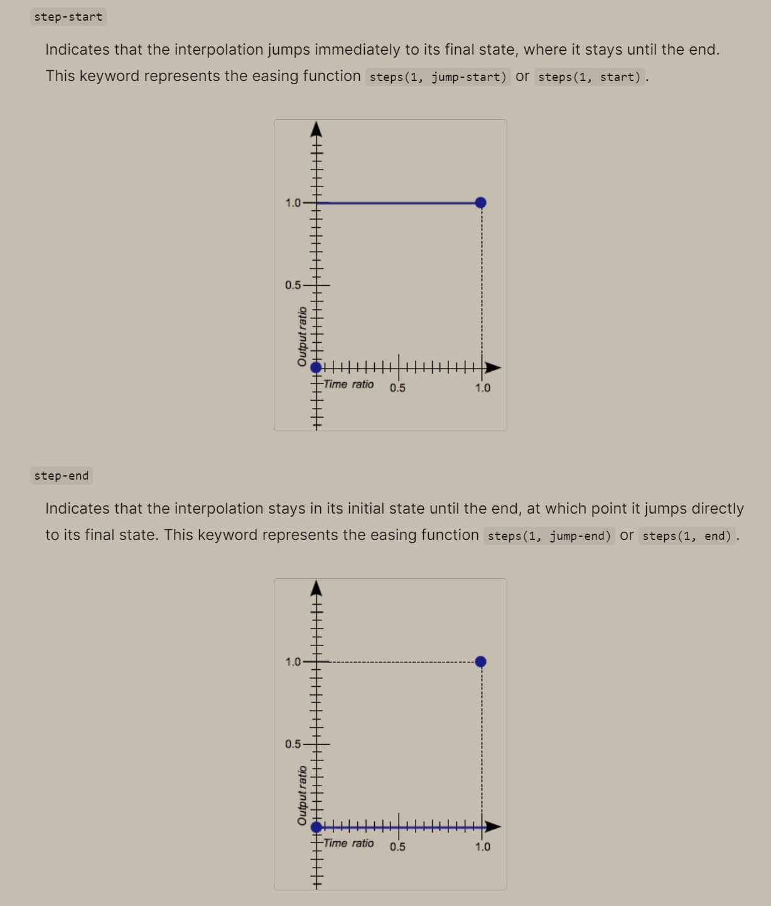

其他例子可以看下图，下图，定义的是两步，两步其实对应的就是三帧，第一帧看不到。steps(4,end)定义的是四步，四步其实对应的就是五帧，最后一帧看不到

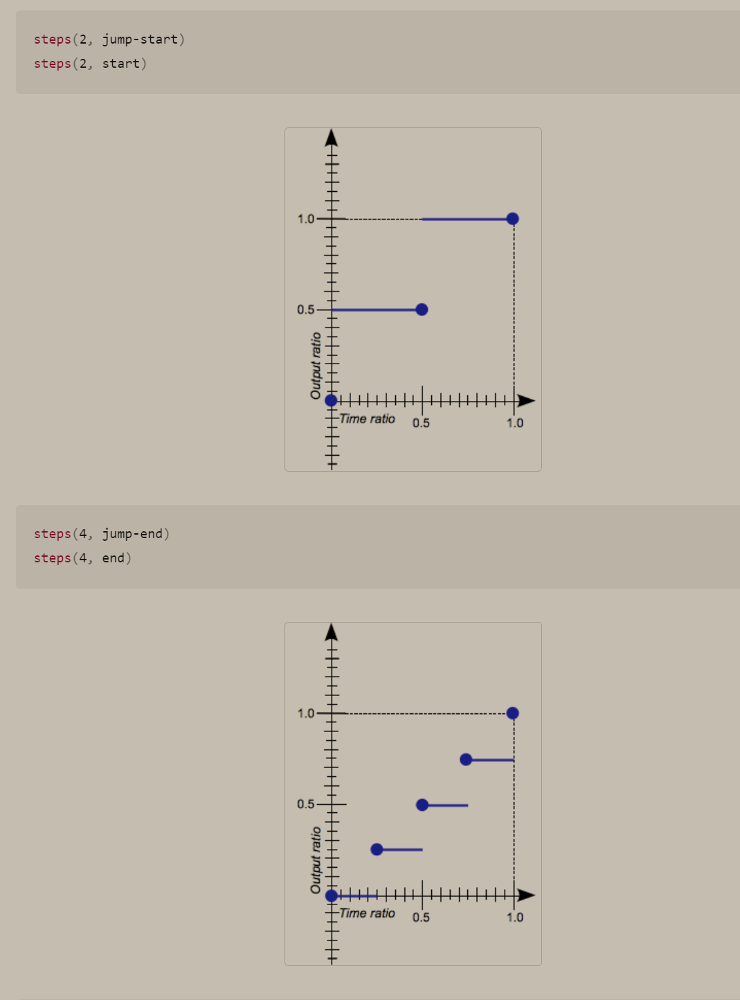

### 4.3过渡事件

  transtionend事件，在每个属性完成过渡时都会触发这个事件

## 5. 动画

CSS 动画允许大多数 HTML 元素的动画，而无需使用 JavaScript 和 Flash。
之前我们学习了 transition 来进行过渡动画，但是过渡动画只能控制首尾两个值，从关键帧动画的角度相当于只是定义了两帧的状态：第一帧和最后一帧。如果我们希望可以有更多状态的变化，可以直接使用关键帧动画。

关键帧动画使用@keyframes 来定义多个变化状态，并且使用 animation-name 来声明匹配：

1. 使用 @keyframes 创建一个规则
2. @keyframes 中使用百分比定义各个阶段的样式
3. 通过 animation 将动画添加到属性上

另外，也可以使用 from 和 to 关键字：

- from 相当于 0%
- to 相当于 100%

### 5.1. @keyframes 规则

要使用 CSS 动画，必须首先为动画指定一些关键帧。关键帧保持元素在特定时间具有的样式。

`@keyframes` 规则内指定一个 CSS 样式和动画将逐步从目前的样式更改为新的样式。

```css
@keyframes myfirst {
  from {
    background: red;
  }

  to {
    background: yellow;
  }
}
```

### 5.2. 创建动画

当在 `@keyframe` 创建动画时，需要把它绑定到选择器，否则动画不会有任何效果。

指定至少这两个 CSS3 的动画属性绑定向一个选择器：

- 规定动画的名称
- 规定动画的时长

```css
div {
  animation: myfirst 5s;
}
```

### 5.3. 动画是什么

CSS 动画是使元素从一种样式逐渐变化为另一种样式的效果。

可以改变任意多的样式、任意多的次数。

用百分比来规定变化发生的时间，或用关键词 `from` 和 `to`，等同于 0% 和 100%。0% 是动画的开始，100% 是动画的完成。为了得到最佳的浏览器支持，应当始终定义 0% 和 100% 选择器。

```css
@keyframes myfirst {
  0% {
    background: red;
    left: 0px;
    top: 0px;
  }

  25% {
    background: yellow;
    left: 200px;
    top: 0px;
  }

  50% {
    background: blue;
    left: 200px;
    top: 200px;
  }

  75% {
    background: green;
    left: 0px;
    top: 200px;
  }

  100% {
    background: red;
    left: 0px;
    top: 0px;
  }
}
```

### 5.4. CSS 动画属性

|            属性             |                          描述                          |
| :-------------------------: | :----------------------------------------------------: |
|        `@keyframes`         |                       动画的代码                       |
|         `animation`         |                   动画属性的简写属性                   |
|      `animation-name`       |                `@keyframes` 动画的名称                 |
|    `animation-duration`     |       动画完成一个周期所花费的秒或毫秒。默认是 0       |
| `animation-timing-function` |             动画的速度曲线。默认是 `ease`              |
|      `animation-delay`      |                 动画何时开始。默认是 0                 |
| `animation-iteration-count` |               动画被播放的次数。默认是 1               |
|    `animation-direction`    |     动画是否在下一周期逆向地播放。默认是 `normal`      |
|   `animation-play-state`    |        动画是否正在运行或暂停。默认是 `running`        |
|    `animation-fill-mode`    | 动画未播放时（在开始之前、结束之后或两者都有）时的样式 |
