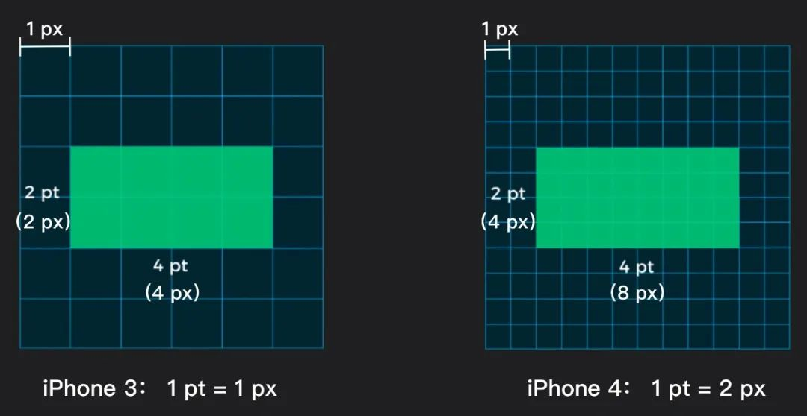

说起CSS单位，我们最熟悉的可能就是像素单位（px），它是一个绝对单位，也就是说一个10px的文字，放在哪里都是一样大的。单位可以影响颜色、距离、尺寸等一系列的属性。CSS中单位的形式有很多种，下面就分别来看看这些单位。 

### 1. 绝对单位

在 CSS 中，绝对单位包括： px 、pt 、pc、 cm 、 mm 、in 等。绝对单位是一个固定的值，它反应了一个真实的物理尺寸。它不会受屏幕大小或者字体的影响。它们的大小取决于值以及屏幕的分辨率（DPI，每英寸的点数）。px就是我们最常用的绝对单位之一。这些绝对单位的换算关系如下：

```css
1in = 25.4mm = 2.54cm = 72pt = 96px(96ppi的屏幕)
```

#### px

px 全称为 Pixels，表示像素，这位大兄弟是不是很眼熟，不管是在设计还是摄影中，都能看到它的身影，那么它究竟是什么呢？说白了，它就是一个点，一个像素点，是屏幕上显示数据的最基本的点，单个像素没有具体的尺寸概念。相同尺寸的显示器下，像素越多，单个像素的尺寸就越小，屏幕越清晰；像素越少，单个像素的尺寸就越大，屏幕越模糊。例如都是14寸的1080P和4K的笔记本电脑屏幕对比，（1080P是全高清 `1920*1080`；4K是`3840*2160` 是1080P的4倍）明显是4K屏幕更清晰，更细腻。也就是在屏幕尺寸一定的情况下，密度越大，像素数量越多。这时候，显示效果就会越清晰。

1px到底多大？相同物理尺寸相同的两块屏幕，前者可以存放1440*2560px,后者可以存放1080*1920px,很明显前者的1px要比后者的1px要小得多；所以，不同ppi的屏幕中，1个px代表的绝对面积是不同的。

> PS：ppi，它是一个密度单位，指每英寸所包含的像素数目（Pixels per inch）。铁铁们，发现木有，密度单位它不能实质地衡量一个物体，它必须和其他的单位结合才能描绘出一个物体的大小。这里的ppi也一样，刚才我们已经说过，像素不是固定大小的，它是随着密度变化而变化的，ppi越大，像素越多，图片显示越清晰。再看一遍公式像素量px=像素密度ppi*屏幕尺寸in。ppi和面积结合才能描绘像素的多少。

#### pt

pt 作为单位，有两个含义，这两个含义之间没有关联，就是单纯的「重名」： 

**1. 印刷行业的常用单位**(可以直接给css设置)

**1）**pt 是 point 的简写形式，是专用的印刷单位，我们用 photoshop 做海报时的字体单位就是 pt。

**2）**pt 是一个自然界标准的长度单位，可以被丈量，是一种「绝对长度」（1pt 的大小为 **1 / 72 英寸**，1 英寸 = 2.54 厘米，所以 1pt 约为 0.35 毫米）。做过海报的同学们都知道，我们在 A4 纸上画出的 30pt 的文字效果如下左图，而在 A3 纸上如果想要达到同样的效果，就需要使用 72pt 大小的文字：


> 现在来计算一下，什么情况下1px=1pt呢？
> 根据公式，像素量px=像素密度ppi*屏幕尺寸in，1英寸有72个pt，当分辨率ppi为72时，1英寸也有72个px，此时，1px=1pt。也很容易算出，当分辨率为144ppi时，1pt=2px。


**2. 苹果的 iOS 系统的设计单位**(是给设计师用的，css不能直接设置)

**1）**pt 在 iOS 开发中就是代表分辨率的最小单位。和 px 一样，也是一种「相对长度」。

**2）**pt 这个单位的缘由是苹果的 Retina 屏的分辨率较高，为了更好的定义和展现自己的产品，苹果就自己定义了一个设计单位 pt，用来给 iOS 系统的设计师做基础设计，并可以根据公式变换成 px 以适应不同 PPI 的手机。

**3）**pt 与 px 的转换方式是：pt = ppi / 163 px 。ppi 不能被 163 整除时，可以进行四舍五入。比如如果 ppi 是 350，那么 pt = 350 / 163 = 2.14px，就是说 1pt 约等于 2px。

**4）**以上公式中 163 这个数字的来源是：iPhone3 的 3.5 英寸屏幕的分辨率是 320*480px，它的 ppi 按照我们上文提到过的 ppi 计算公式，等于 163。苹果规定：ppi = 163 时，1pt = 1px。

而到了 iPhone4 时，3.5 英寸的手机屏幕分辨率变成了 640*960px，ppi = 329，这时 1pt = 2px。

下图中，你可以看到同样一个矩形，在 iPhone3 和 iPhone4 之间所占 px 数量的区别。而对于苹果来说，用 pt 这个单位统一了设备更新迭代后带来的设计尺寸数量上的变化。2pt 在任何 iOS 设备上的大小都应该是一样的，但是代表几个 px 却是不固定的，由屏幕的 ppi 来决定：



#### cm

cm 全称为 Centimeters，表示厘米。它和 px 的换算关系如下：

```css
1cm = 37.8px
```

#### mm

mm 全称为 Millimeters，表示毫米。它和 px 的换算关系如下：

```css
1mm = 3.78px
```

#### in

in 全称为 Inches，表示英寸。它和 px 的换算关系如下：

```css
1in = 96px
```

### 2. 相对单位

相对单位就是相对于另一个长度的长度。CSS中的相对单位主要分为两大类：

- 字体相对单位，他们都是根据font-size来进行计算的。常见的字体相对单位有：em、rem、ex、ch；
- 视窗相对单位，他们都是根据视窗大小来决定的。常见的视窗相对单位有vw、vh、vmax、vmin。

下面就来看看这些常见的CSS单位。

#### em 和 rem

em是最常见的相对长度单位，适合基于特定的字号进行排版。根据CSS的规定，1em 等于元素的font-size属性的值。

em等于当前元素字体大小的计算值。如果当前对行内文本的字体尺寸未进行显示设置，则相对于浏览器的默认字体尺寸。当DOM元素嵌套加深时，并且同时给很多层级显式的设置了font-size的值的单位是em，那么就需要层层计算，复杂度会很高。

em单位除了可以作用于 font-size之外，还可以运用于其他使用长度的属性，比如border-width、width、height、margin、padding、text-shadow等。

所以，em的使用还是比较复杂的，它可能会继承任意一级父元素的字体大小。需要谨慎使用。

rem相对于em就简单了很多，它是根据页面的根元素（根元素）的字体大小来计算的。来对上面的例子进行修改：

```css
.child {
  font-size: 30px;
  border: 1rem solid ;
}

html {
	font-size: 25px;
}

```

效果如下，可以看到，边框的长度变成了25px，它是根据根元素html的字体大小计算的：


如果没有对根元素设定字号的话，font-size: 1rem的作用与font-size: initial相同。

使用 em 和 rem 可以让我们灵活的够控制元素整体的放大和缩小，而不是固定大小。那何时应使用 em，何时应使用 rem 呢？可以根据两者的差异来进行选择：

- 两者在客户端中计算出来的样式都会以px的形式显示；
- rem是相对于根元素html的font-size计算，em 相对于元素的font-size计算；
- 当需要根据浏览器的font-size设置缩放时，应该使用 rem；
- 使用 em 应该根据组件的font-size来定，而不是根元素的font-size来定；
- rem 可以从浏览器字体设置中继承 font-size 值， em 可能受任何继承过来的父元素 font-size 的影响。

#### ex 和 ch

ex 和 ch 都是排版用的单位，它们的大小取决于元素的font-size 和 font-family属性。

- ex 指的是所用字体中小写字母 x 的高度。因此，如果两个字体不一样，那么 ex 的值是不一样的。因为每种字体的小写 x 的高度是不一样的。
- ch 和 ex 类似，不过它是基于数字 0 的宽度计算的。会随着字体的变化而变化。而0 的宽度通常是对字体的平均字符宽度，它是一个估计值。由于 ch 是一个近似等宽的单元，所以在设置容器的宽度时很有用，比如一个容器想要显示指定个数的字符串时，就可以使用这个单位。

#### vw、vh、vmax 和 vmin

这四个单位都是视窗单位，所谓的视窗，在web端指的就是可视区域，移动端的视窗指的就是布局视窗。如果视窗大小发生了变化，那么这些值都会随之变化。这四个单位指的是：

- vw：视窗宽度的百分比；
- vh：视窗高度的百分比；
- vmax：较大的 vh 和 vw；
- vmin：较小的 vh 和 vw。

假如一个浏览器的高度是800px，那么1vh的值就是8px。vh和vw的大小总是和视窗的高度和宽度有关。 

vmin 和 vmax 与视窗宽度和高度的最大值和最小值有关。假如一个浏览器高度为500px，宽度为1200px，那么1vmin就是5px，1vmax就是12px。 

这些单位都是长度单位，所以可以在任何允许使用长度单位的地方使用。这些单位比较适合用于创建全视区界面，例如移动设备的界面，因为元素是根据视区的尺寸而变化的，与文档树中的任何元素都没有关系。

### 3. 频率单位

CSS中的频率单位有两个：赫兹（Hz）和千赫兹（kHz）。它们的换算关系如下：

```css
1kHz = 1000Hz

```

通常情况下，频率单位使用在听或说级联样式表中。频率可以被用来改变一个语音阅读文本的音调。低频率就是低音，高频率就是高音。

```css
.low { 
  pitch: 105Hz; 
} 

.squeal { 
  pitch: 135Hz; 
}

```

需要注意，当数值为0时，单位对值没有影响，但是单位是不能省略的。也就是说0、0Hz、0kHz是不一样的。所以，在使用频率单位时，不要直接写0。另外，这两个单位是不区分大小写的。

### 4. 时间单位

CSS中的时间单位有两个：秒（s）和毫秒（ms）。这两个时间单位都是CSS新增的单位。这两个单位的换算关系如下：

```css
1s = 1000ms

```

时间单位主要用于**过度和动画**中，用于定义持续时间或延迟时间。下面两种定义是等效的：

```css
a[href] {
	transition-duration: 2.5s;
}

a[href] {
	transition-duration: 2500s;
}

```

### 5. 分辨率单位

CSS中的分辨率单位有三个：dpi、dpcm、dppx。这三个单位都是CSS3中新增的单位。他们都是正值，不允许为负值。这三个单位的换算关系如下：

```css
1dppx = 96dpi
1dpi ≈ 0.39dpcm
1dpcm ≈ 2.54dpi

```

分辨率单位主要用于**媒体查询**等操作。

#### dpi

dpi 全称为 dots per inch，表示每英寸包含的点的数量。普通屏幕通常包含 72或96个点，大于 192dpi 的屏幕被称为高分屏。

```css
@media screen and (min-resolution: 96dpi) { ... }
@media print and (min-resolution: 300dpi) { ... }

```

#### dpcm

dpcm 全称为 dots per centimeter，表示每厘米包含的点的数量。

```css
@media screen and (min-resolution: 28dpcm) { ... }
@media print and (min-resolution: 118dpcm) { ... }

```

#### dppx

dppx 全称为 dots per pixel，表示每像素（px）包含点的数量。由于CSS px的固定比率为1:96，因此1dppx相当于96dpi。它对应于由图像分辨率定义的CSS中显示的图像的默认分辨率。

```css
@media screen and (min-resolution: 2dppx) { ... }
@media screen and (min-resolution: 1dppx) and (max-resolution: 1.9dppx) { ... }

```

### 6. 角度单位

CSS中的角度单位有四个：deg、grad、rad、turn。这些角度单位都是CSS3中新增的单位。它们的换算关系如下：

```css
90deg = 100grad = 0.25turn ≈ 1.570796326794897rad

```

一般这些角度单位用于元素的**旋转操作，**包括2D旋转、3D旋转等。

- 当旋转值为正值时，元素会顺时针旋转；
- 当旋转值为负值时，元素会逆时针旋转。


通常情况下，一个完整的旋转就是360度。所以，所有的角度都在0-360度之间。但是，超出这个范围的值也是允许的，只不过都会归到0-360度之间。比如，顺时针旋转420度（450deg）、逆时针旋转270度（-270deg）、顺时针旋转90度（90deg）都是一样的效果，都会归为90deg。但是当使用动画时，这些角度值就非常重要了。 

CSS的旋转主要依赖于 transform 属性中的 rotate() 、rotate3d、 skew() 等方法。只需给它们传递旋转的角度即可。 

除了旋转会使用角度之外，线性渐变也会经常使用角度值：

```css
background: linear-gradient(45deg, #000, #fff);

```

#### deg

deg 全称为 Degress，表示度，一个圆总共360度。

```css
transform: rotate(2deg);

```

#### grad

grad 全称为 Gradians，表示梯度，一个圆总共400梯度。

```css
transform: rotate(2grad);

```

#### rad

rad 全称为 Radians，表示弧度，一个圆总共2π弧度。

```css
transform: rotate(2rad);

```

#### turn

turn 全称为 Turns，表示圈（转），一个圆总共一圈（转）。

```css
transform:rotate(.5turn);

```

