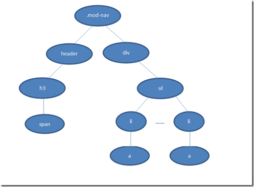

## css 声明的优先级

### 选择器的权重

选择器的权重值表述为 4 个部分，如 0,0,0,0。一个选择器的具体权重如下确定：

1. 对于选择器中给定的 ID 属性值，加 0,1,0,0
2. 对于选择器中给定的各个类属性，属性选择，或伪类，加 0,0,1,0
3. 对于选择器中的给定的各个元素和伪元素，加 0,0,0,1
4. 通配符选择器的权重为 0,0,0,0
5. 结合符对选择器权重没有一点贡献
6. 内联声明的权重都是 1,0,0,0
7. 继承没有权重，甚至连 0 权重都没有，0 权重要比无权重来的强

权重 1,0,0,0 大于所有以 0 开头的权重(不进位)，选择器的权重最终都会授予给其对应的声明，如果多个规则与同一个元素匹配，而且有些声明互相冲突时，权重越大的越占优势

### 重要声明

有时某个声明比较重要，超过了所有其他声明，css2.1 就称之为重要声明。并允许在这些声明的结束分号之前插入`!important`来标志
必须要准确的放置`!important`否则声明无效。实际上所有的重要声明会被浏览器分为一组，重要声明的冲突会在其内部解决。非重要声明也会被分为一组，非重要声明的冲突也会在其内部解决。如果一个重要声明与非重要声明冲突，胜出的总是重要声明。

### 来源

css 样式的来源大致有三种

- 创作人员
- 读者
- 用户代理 （浏览器）

他们的优先级按照从高到低为：

1. 读者的重要声明
2. 创作人员的重要声明
3. 创作人员的正常声明
4. 读者的正常声明
5. 用户代理的声明

### 计算 css 层叠样式

找出所有作用到该元素上的选择器，按照上来源分成五个梯队，如果样式有冲突，来源高的总能胜出来源低的。如果来源相同，则内部按照选择器的权重排序。如果选择器的权重也相同则按照顺序，在后面的覆盖前面的。

## css 选择器的解析顺序

下面这个栗子，CSS选择器它是如何工作的？

```
.mod-nav h3 span {font-size: 16px;}
```

如果不知道匹配规则，可能的理解是从左向右匹配:先找到.mod-nav，然后逐级匹配h3、span，在这个过程中如果遍历到叶子节点都没有匹配就需要回溯，继续寻找下一个分支。

但事实上，CSS选择器的读取顺序是**从右向左**。

还是上面的选择器，它的读取顺序变成：先找到所有的span，沿着span的父元素查找h3，中途找到了符合匹配规则的节点就加入结果集；如果直到根元素html都没有匹配，则不再遍历这条路径，从下一个span开始重复这个过程（如果有多个最右节点为span的话）。

在某条CSS规则下（比如.mod-nav h3 span），会形成一条符合规则的索引树，树由上至下的节点是规则中从右向左的一个个选择符匹配的节点。索引树遍历的具体过程可以看[寒冬大大的一段视频](http://v.youku.com/v_show/id_XMjMzMzU2NDc2.html)。

为什么从右向左的规则要比从左向右的高效？

[](https://images0.cnblogs.com/blog/551140/201309/26164118-3a12705d4e17440ba6624f4dcd862341.png)

 

假如DOM的结构如上图，匹配规则是.mod-nav h3 span。

若从左向右的匹配，过程是：从.mod-nav开始，遍历子节点header和子节点div，然后各自向子节点遍历。在右侧div的分支中，最后遍历到叶子节点a，发现不符合规则，需要回溯到ul节点，再遍历下一个li-a，假如有1000个li，则这1000次的遍历与回溯会损失很多性能。

再看看从右至左的匹配：先找到所有的最右节点span，对于每一个span，向上寻找节点h3，由h3再向上寻找class=mod-nav的节点，最后找到根元素html则结束这个分支的遍历。

很明显，两种匹配规则的性能差别很大。之所以会差别很大，是因为从右向左的匹配在第一步就筛选掉了大量的不符合条件的最右节点（叶子节点）；而从左向右的匹配规则的性能都浪费在了失败的查找上面。

当然这是比较明显情况，如果在叶子上存在多个不符合条件的span，从右向左的规则也会走一些弯路（这时就需要优化CSS选择器了）。但平均来说它还是更高效，因为大多时候，一个DOM树中，符合匹配条件的节点（如.mod-nav h3 span）远远远远少于不符合条件的节点。

jQuery从1.3版本开始使用的Sizzle引擎，它按照了CSS选择器的匹配规则（从右至左）进行DOM元素的查找与匹配（当然其中做了很多优化），性能得到了很大的提升。
