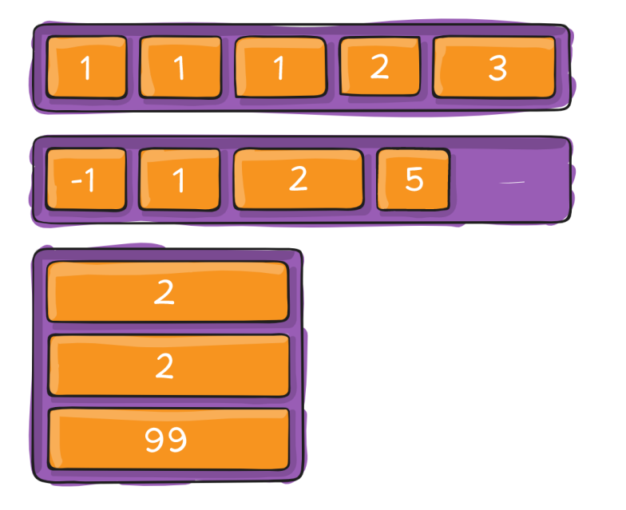
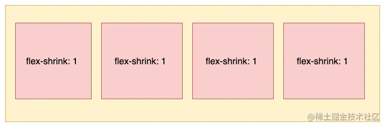

## Flexbox布局的概念

Flexbox布局也叫Flex布局，弹性盒子布局。它的**目标**是提供一个更有效地布局、对齐方式，并且能够使父元素在子元素的大小未知或动态变化情况下仍然能够分配好子元素之间的间隙。**主要思想**是使父元素能够调整子元素的宽度、高度、排列方式，从而更好的适应可用的布局空间。设定为flex布局的元素能够放大子元素使之尽可能填充可用空间，也可以收缩子元素使之不溢出。 

Flex布局更适合小规模的布局，可以简便、完整、响应式的实现各种页面布局。但是，设为Flex布局以后，其子元素的`float`、`clear`和`vertical-align`属性将失效。Flex弹性盒模型的优势在于只需声明布局应该具有的⾏为，⽽不需要给出具体的实现⽅式，浏览器负责完成实际布局，当布局涉及到不定宽度，分布对⻬的场景时，就要优先考虑弹性盒布局。

Flex布局是一个完整的模块，它包括了一套完整的属性。其中采用 Flex 布局的元素，称为 Flex 容器，简称"**容器**"。它的所有子元素就是容器成员，称为 Flex Item，简称"**item**"。


容器默认存在两个轴：**水平轴**（main axis）和**垂直轴**（cross axis），item默认沿主轴排列（水平轴）：


这里面涉及到了几个概念，下面来看一下：

- **main axis**: Flex 父元素的主轴是指子元素布局的主要方向轴，它由属性flex-direction来确定主轴是水平还是垂直的，默认为水平轴。
- **main-start & main-end**: 分别表示主轴的开始和结束，子元素在父元素中会沿着主轴从main-start到main-end排布。
- **main size**: 单个item占据主轴的长度大小。
- **cross axis**: 交叉轴也叫侧轴，与主轴垂直。
- **cross-start & cross-end**: 分别表示交叉轴的开始和结束。子元素在交叉轴的排布从cross-start开始到cross-end。
- **cross size**: 子元素在交叉轴方向上的大小。

## flex-container属性

开启了 flex 布局的元素叫 flex container

flex container 里面的直接子元素叫做 flex item

想要使用flex布局，首先需要给父元素指定为flex布局，这样容器内的元素才能实现flex布局：

```css
<div class="container"></div>

.container {
    display: flex | inline-flex;
}

```

这里有两种方式可以设置flex布局，使用`display: flex;`会生成一个块状的flex容器盒子，使用`display: inline-flex;`会生成一个行内的flex容器盒子。如果我们使用块状元素，比如div标签，就可以使用flex，如果使用行内元素，就可以使用inline-flex。多数情况下，我们会使用**display: flex;**。

父元素（容器）可以设置以下六个属性：

- flex-direction
- flex-wrap
- flex-flow
- justify-content
- align-items
- align-content

### 1. flex-direction

**flex-direction**：主轴方向，它决定了容器内元素排列方向，它有四个属性值：

```css
.container {
    flex-direction: row | row-reverse | column | column-reverse;
}

```

（1）`flex-direction: row`：默认值，沿水平主轴从左到右排列，起点在左沿


（2）`flex-direction: row-reverse`：沿水平主轴从右到左排列，起点在右沿


（3）`flex-direction: column`：沿垂直主轴从上到下排列，起点在上沿


（4）`flex-direction: column-reverse`：沿垂直主轴从下到上排列，起点在下沿


### 2. flex-wrap

**flex-wrap**：容器内元素是否可以换行，它有三个属性值：

```css
.container {
    flex-wrap: nowrap | wrap | wrap-reverse;
}

```

（1）`flex-wrap: nowrap`：默认值，不换行。当主轴的长度是固定并且空间不足时，item尺寸会随之进行调整，而不会换行。


（2）`flex-wrap: wrap`：多行


（3）`flex-wrap: wrap-reverse`：多行，（对比 wrap，cross start 与 cross end 相反）


### 3. flex-flow

`flex-flow` 是 `flex-direction` 属性和`flex-wrap`属性的简写，默认为:`flex-flow:row nowrap`，用处不大，最好还是分开来写。该属性的书写格式如下：

```css
.container {
    flex-flow: <flex-direction> <flex-wrap>;
}

```

其实flex-flow一写好就确定了主轴和侧轴的方向，如下绿色是主轴方向，红色是侧轴方向。


### 4. justify-content

**justify-content**：元素在主轴的对齐方式，它有五个属性值：

```css
.container {
    justify-content: flex-start | flex-end | center | space-between | space-around;
}

```

这里以水平方向为主轴进行举例，即**flex-direction: row。**

- flex-start（默认值）：与 main start 对齐 

  

- flex-end：与 main end 对齐 

  

- center：居中对齐 

  

- space-between：  flex items 之间的距离相等 ； 与 main start、main end两端对齐

  

- space-around：  flex items 之间的距离相等 ； flex items 与 main start、main end 之间的距离是 flex items 之间距离的一半 

  

- space-evenly：  flex items 之间的距离相等 ；flex items 与 main start、main end 之间的距离 等于 flex items 之间的距离

  

### 5. align-items

**align-item**：元素在交叉轴上的对齐方式，它有五个属性值：

```css
.container {
    align-items: flex-start | flex-end | center | baseline | stretch;
}

```

这里以水平方向为主轴进行举例，即**flex-direction: row。**

- normal：在弹性布局中，效果和stretch一样 

- stretch：当 flex items 在 cross axis 方向的 size 为 auto 时，会 自动拉伸至填充 flex container 

  

- flex-start：与 cross start 对齐

  

-  flex-end：与 cross end 对齐 

  

- center：居中对齐 

  

- baseline：与基准线对齐

  

### 6. align-content

**align-content**：多根轴线对齐方式。如果元素只有一根轴线，该属性不起作用。它有六个属性值：

```css
.container {
    align-content: flex-start | flex-end | center | space-between | space-around | stretch;
}

```

那这个轴线数怎么确定呢？实际上这主要是由flex-wrap属性决定的，当flex-wrap 设置为 nowrap 时，容器仅存在一根轴线，因为item不会换行，就不会产生多条轴线。当 flex-wrap 设置为 wrap 时，容器可能会出现多条轴线，这时就需要去设置多条轴线之间的对齐方式。

这里以水平方向为主轴时举例，即：flex-direction: row; flex-wrap: wrap;

- stretch（默认值）：与 align-items 的 stretch 类似 

  

- flex-start：与 cross start 对齐 

  

- flex-end：与 cross end 对齐 

  

- center：居中对齐 

  

- space-between：  flex items 之间的距离相等 ； 与 cross start、cross end两端对齐 

  

- space-around：  flex items 之间的距离相等； flex items 与 cross start、cross end 之间的距离是 flex items 之间距离的一半 

  

- space-evenly：  flex items 之间的距离相等 ； flex items 与 cross start、cross end 之间的距离 等于 flex items 之间的距离

## flex-item属性

定义：flex container 里面的**直接子元素**叫做 flex item

- flex item的布局将受flex container属性的设置来进行控制和布局; 

- flex item不再严格区分块级元素和行内级元素; 

- flex item默认情况下是包裹内容的, 但是可以设置宽度和高度;

子元素有以下六个属性：

- order
- flex-grow
- flex-shrink
- flex-basis
- flex
- align-self

### 1. order

`order`属性用来定义item的排列顺序。可以设置任意整数（正整数、负整数、0），值越小就越排在前面，默认为`0`。使用形式如下：

```css
.item {
    order: <integer>;
}

```



### 2. flex-basis

`flex-basis`属性定义了在分配多余空间之前，item占据的主轴空间，浏览器会根据这个属性来计算主轴是否有多余空间。它的默认值为auto，即item的本来大小。使用形式如下：

```css
.item {
    flex-basis: <length> | auto;
}

```

当主轴设置为水平时，当设置了 flex-basis，设置的item宽度值会失效，`flex-basis` 需要跟 `flex-grow` 和 `flex-shrink` 配合使用才能生效。有两种特殊的值：

- 当 `flex-basis` 值为 0 % 时，item尺寸会被认为是0，因此无论item尺寸设置多少都用；
- 当 `flex-basis` 值为 auto 时，则跟根据尺寸的设定值来设置大小。

### 3. flex-grow

`flex-grow`属性定义item的放大比例，默认为0，即如果存在剩余空间时也不放大。

当容器中所有的item都设置了flex-basis属性时，如果仍有是剩余的空间，设置的 `flex-grow` 属性才能生效。

- 如果所有item的flex-grow属性都设置为1，那么它们会均分剩余的空间，如下图所示：


- 如果其中一个item的flex-grow属性设置为2，其他均为1，那么它占据的剩余空间就是其他item的两倍，如下图所示：


> flex items 扩展后的最终 size 不能超过 max-width\max-height

### 3. flex-shrink

`flex-shrink`属性定义了item的缩小比例，默认为1，即如果空间不足，该item将缩小。不能设置负值，使用形式如下：

```css
.item {
    flex-shrink: <number>;
}

```

- 如果所有item的 flex-shrink 属性都为 1，当空间不足时，都将等比例缩小，如下图所示：



- 如果一个item的 flex-shrink 属性为 0，其他item都为 1，则空间不足时，前者不缩小，如下图所示：


> flex items 收缩后的最终 size 不能小于 min-width\min-height

### 5. flex

`flex`属性是`flex-grow`, `flex-shrink` 和 `flex-basis`的简写，后两个属性可选。默认值为：`flex:0 1 auto。`使用形式如下：

```css
.item{
    flex: none | [ <'flex-grow'> <'flex-shrink'>? || <'flex-basis'> ]
}

```

对于flex的取值有几种常用的特殊情况： （1）默认值：flex:0 1 auto，即在有剩余空间时，只放大不缩小

```css
.item {
  flex:0 1 auto;
}
.item {
  flex-grow: 0;
  flex-shrink: 1;
  flex-basis: auto;
}

```

（2）flex: none，即有剩余空间时，不放大也不缩小，最终尺寸通常表现为最大内容宽度。

```css
.item {
  flex:0 0 auto;
}
.item {
  flex-grow: 0;
  flex-shrink: 0;
  flex-basis: auto;
}

```

（3）flex: 0，即当有剩余空间时，item宽度为其内容的宽度，最终尺寸表现为最小内容宽度。

```css
.item {
  flex:0 1 0%;
}
.item {
  flex-grow: 0;
  flex-shrink: 1;
  flex-basis: 0%;
}

```

（4）flex: auto，即元素尺寸可以弹性增大，也可以弹性变小，具有十足的弹性，但在尺寸不足时会优先最大化内容尺寸。

```css
.item {
  flex:1 1 auto;
}
.item {
  flex-grow: 1;
  flex-shrink: 1;
  flex-basis: auto;
}

```

（5）flex: 1，即元素尺寸可以弹性增大，也可以弹性变小，具有十足的弹性，但是在尺寸不足时会优先最小化内容尺寸，

```css
.item {
  flex:1 1 0%;
}
.item {
  flex-grow: 1;
  flex-shrink: 1;
  flex-basis: 0%;
}

```

### 6. align-self

`align-self`属性允许单个item有与其他item不一样的对齐方式，可覆盖`align-items`属性。默认值为`auto`，表示继承父元素的`align-items`属性，如果没有父元素，则等同于`stretch`。

```css
.item {
     align-self: auto | flex-start | flex-end | center | baseline | stretch;
}

```

这个属性和align-items属性的效果是一样的，只不过这个属性只对单个item生效，而align-items是对容器中所有的item生效。

设置容器的align-items属性为flex-start，容器中第三个item的align-self属性为flex-end，效果如下：


## 思考1

如何解决以下布局，第二排由于数量不足，导致和第一排的排列不同，在真实开发过程中，这种情况很多件，有时候第二排只有一个或者两个元素，如何保证最后一排也很前面的一样排列呢？


其实只需要在所有flex-items后面添加 列数减-2 个span元素(div也行，flex-item不区分行内、块元素)，然后span设置和flex-item一样的宽度，不设置高度。可以先给span元素设置一个高度和背景色看一下，就知道什么原理了

```html
<!DOCTYPE html>
<html lang="en">
  <head>
    <style>
      .container {
        width: 500px;
        background-color: orange;

        display: flex;
        flex-wrap: wrap;
        justify-content: space-between;
      }

      .item {
        width: 110px;
        height: 140px;
      }

      .container > span{
        height: 20px;
        background-color: antiquewhite;
        width: 110px;
      }
    </style>
  </head>
  <body>
    <div class="container">
      <div class="item item1">1</div>
      <div class="item item2">2</div>
      <div class="item item3">3</div>
      <div class="item item1">1</div>
      <div class="item item2">2</div>
      <div class="item item3">3</div>
      <div class="item item1">1</div>
      <div class="item item2">2</div>
      <div class="item item3">3</div>
      <!-- 添加span的个数是列数减-2 -->
      <span></span><span></span>
    </div>


  </body>
</html>

```
可以看到箭头指向的就是新加的两个span元素，为了方便查看设置了高度，只要设置高度是0，就不会影响，甚至可以多加一些span元素也是可以的，只要是大于等于列数-2就行


## 思考2

类似设计稿左侧需要进行自适应，大家会进行flex布局，左侧自适应宽度。


```html
<style>
  .info{
    display: flex;
  }
  .avatar{
    width: 64px;
  }
  .text{
    flex: 1;
  }
  .desc{
    white-space: nowrap;
    overflow: hidden;
    text-overflow: ellipsis;
  }
</style>

<div class='info'>
  <div class='avatar'>
    
  </div>
  <div class='text'>
    <div class='name'>啊哈哈哈吧</div>
    <div class='desc'>黑海哈维和花时间家具家电等接口你到家那几你</div>
  </div>
</div>
```

简单写出html结构和css样式。以上就是简单实现样式，但是在浏览器中并不用实现溢出文本变成省略号。因为右侧flex布局实现自适应。而我们都知道需要实现省略号需要盒子被限制宽度，然后添加以下三个属性。

```text
white-space: nowrap; 
overflow: hidden; 
text-overflow: ellipsis;
```

缺一不可！但是右侧容器`text`的自适应无法给到准确的`width`值。而且当`desc`元素中内容不断增多，会让父容器`text`变得更宽，然后会去挤压`avatar`盒子。所以就是因为右侧容器text的宽度没有得到限制，所以省略号不起作用。我们只需要对右侧容器进行设置`overflow: hidden;`即可实现省略号，让右侧容器开启自己的`bfc`，不让自己被子元素撑宽就完美解决此问题

```html
<style>
  .text{
    flex: 1;
    overflow: hidden;
  }
</style>
```