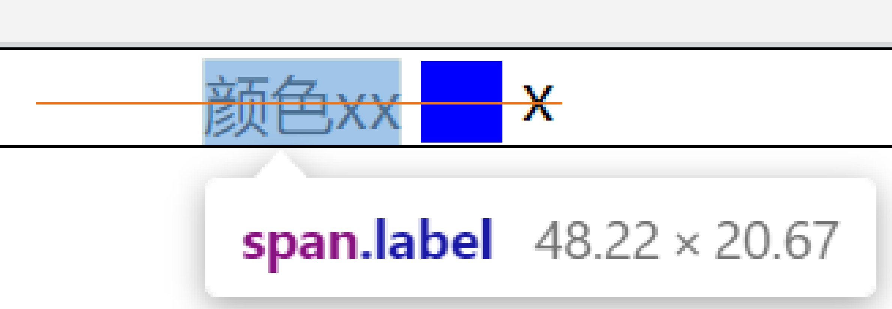

## line-height


先看上面这张图

我记得刚学英语的时候，英语作业本都是这种每行有4条线的格式，不过那时候老师并没有讲过这4条线代表什么。现在学CSS时候知道他们叫做顶线，中线，基线，底线。事实上浏览器渲染的时候顶线要比图上的高一点，底线要比图上的要低一点。如何验证？只要在审查元素里面选中这串文本，文本背景会变蓝，如下图红色框所示，就是文本的内容区。


另外这张图里有行高，行距，半行距，字号（font-size）等概念。你最熟悉的莫过于font-size了，就是字的大小。

**基线（base line）**一般是英文字母“x”的下端沿


**行高（line-height）** 属性用于设置文本行之间的间距，行高越大，行与行之间的垂直间距就越大。不仅如此，行高也可以用来实现文本垂直居中的效果

我们知道对于非替换的内联元素，例如span标签是没法直接设置高度和宽度以及上下外边距这些属性的，怎样让他们也有高度呢？ 答案是给他设置行高。

来看个例子

```
.main{
    background-color: #ccc;
    max-width: 1200px;
    margin: 100px auto;
}

<div class="main">
    <span>Python之禅</span>
</div>
```

父元素 div 在没有指定高度时，它的实际高度取决于它的子元素高度。所以在这里div的高度其实就是差不多就是子元素字体大小（行内框高度）。


```
span {
    line-height:100px;
}
```

现在给span设置行高，行内框的高度就变高了，与此同时父元素div的高度跟着变高，而且你会发现，行单文本在设置了行高后，文本在容器中是垂直居中的。（思考下为什么会居中？）


### 行距

行高数值上等于font-size与行距之和。行距指一行底线到下一行顶线的垂直距离。行距被 font-size 分隔成**上下两个等分的半行距**。所以现在明白设置行高后为什么单行文本会自动居中了吧，因为文本的上面和下面是两个高度相等的半行距，这也是单行文本居中常用的方式（如果容器设置了height属性，只需要将元素line-height值与height一样就可以居中）

### 行高（line-height） 与 font-size 的关系

font-size=line-height 时，行距为0。上下两行文字之间几乎没有间隔。

```
<div class="box">
    这是一段长的文字，这是一段长的文字，这是一段长的文字
</div>
.box {
    font-size: 16px;
    line-height: 16px;
}
```


line-height < font-size 时，行距就是负数，这时候，两行文字会有重叠。 注意 line-height 不可为负数。

```
line-height: 1px;
```


line-height > font-size 时，行距就大于0了，两行文本之间有了空白。一般我们都会将line-height的值设置为大于font-size，文字才有阅读体验效果。 实践中，line-height 通常设置为无单位的数值，例如 1.5， 1.5 其实就是font-size的1.5倍，16px*1.5 = 24px。 这时候，改变font-size 的值， line-height的实际值也会跟着缩放。

```
line-height: 24px;
```


line-height可选值

| 值      | 说明                                                         |
| ------- | ------------------------------------------------------------ |
| normal  | 默认,设置合理的行间距。                                      |
| number  | 设置数字，此数字会与当前的字体尺寸**相乘**来设置行间距。相当于倍数 |
| length  | 设置固定的行间距。                                           |
| %       | 基于当前字体尺寸的百分比行间距。                             |
| inherit | 规定应该从父元素继承 line-height 属性的值。                  |

貌似很简单，但感觉没什么用出的样子，那就让我们看看line-height的几个应用


 

### 元素对行高影响

行框高度大于等于行内最高的行内框高度，通过line-height调整，内容区行高与字体尺寸有关，padding不对行高造成影响。

```
<div style="border:dashed 1px #0e0;margin-bottom:30px;">
                <span style="font-size:14px;background-color:#999;">This is a test</span>
            </div>
            <div style="border:dashed 1px #0e0;">
                <span style="font-size:14px;padding:20px;background-color:#999;">This is a test</span>
            </div>
```

[](https://images0.cnblogs.com/blog/349217/201308/04191900-9d0f00f721da4ec7b4d397b231875e5b.png)

第二个span虽然因为padding原因内容区变大，当行高并未改变

### 行高的继承

行高是可继承的，但并不是简单的copy父元素行高，继承的是计算得来的值。

```
<div style="border:dashed 1px #0e0;line-height:150%;font-size:10px;">
                <p style="font-size:30px;">
                    1232<br/>
                    123
                </p>
            </div>
```


按一般理解既然line-height可以继承，那么p元素的行高也是150%了，可是事实是这样的

[](https://images0.cnblogs.com/blog/349217/201308/04191902-6280ba0ed4d34bb9a380ed1bd700327b.png)

非但没有变成150%，反而连100%都没有，重叠了！这就是继承计算的结果，如果父元素的line-height有单位（px、%）,那么继承的值则是换算后的一个具体的px级别的值；上例p得到的是10px*150%=15px的行高，而P的字体大小为30px，所以发生了重叠。

而如果属性值没有单位，则浏览器会直接继承这个“因子（数值）”，而非计算后的具体值，此时它的line-height会根据本身的font-size值重新计算得到新的line-height 值。

```
<div style="border:dashed 1px #0e0;line-height:1.5;font-size:10px;">
                <p style="font-size:30px;">
                    1232<br/>
                    123
                </p>
            </div>
```

[](https://images0.cnblogs.com/blog/349217/201308/04191905-de7f7864aaa241f591f8c21bca2a9595.png)

所以在使用line-height时，除非你刻意否则尽量使用倍数设值

## vertical-align

与vertical-align对应的是text-align，text-align设置元素里内容在水平方向上的对齐方式。而vertical-align属性，通常我们的理解是设置该元素里内容在竖直方向上的对齐方式，这种理解是错误的。为什么错误？请大家往下看。

接下来，我们先看几个demo，vertical-align在其中扮演了什么作用。(以下有些名词大家若是不懂，请直接跳过这一段)。

里面的子div都是inline-block

第一组: 父元素div内两个子div，子div内容为空，只是单纯的给定宽高，不改变vertical-align属性。

第二组: 父元素内两个子div，第二个子div内容有一个<span>right-span</span>，不改变vertical-align属性。

第三组: 父元素内两个子div，第二个子div内容有一个<span>right-span</span>，vertical-align属性设置为top。

第四组: 父元素内两个子div，两个子div里各有span标签，不改变vertical-align属性。

结果图如下：


现在简单的解释一下，为什么是这样的原因？（看不懂的请跳过这一段，读完这篇文章，估计就能理解了）**以下行盒子指的都是两个子div的父元素。**

第一组:行盒子(子div的父元素)里，是两个没有内容的div（display:inline-block）,这两个div（inline box）的基线（baseline）值都是盒子margin-bottom的边界。两者对齐方式以父元素的baseline对齐，父元素的baseline就是父元素字体x的下边缘，上图虽然父元素没有字体，但是可以看成有空的字符，所以可以看到父元素下面顶出几个像素，那个就是字体的基线到底线的距离。

第二组:行盒子里，第一个div没有内容，基线是盒子的margin-bottom边界。第二个div内里有line box，所以基线就是内容文字"right-span"的基线。默认对齐方式也是以baseline对齐（vertical-align默认值baseline）,所以会呈现上述样子。

第三组: 设置第二个div的vertical-align为top，两个div就会水平对齐。设置为top，就不再是按照baseline对齐了，设置vertical-align:top，会让该元素的顶部（盒子的顶部边界，如果有设置margin-top值，那么顶部边界也就包括margin-top）与行盒子(line box)的顶部对齐。

也可以设置两个div的vertical-align的值都为middle，那么原理是？设置vertical-align:middle，会让该元素盒子的垂直中点与父元素(行盒)的baseline值+x-height的一半（字母x高度的一半）位置对齐。现在只设置第一个div的vertical-align为middle，那么效果如下图左侧显示，该元素盒子的垂直中点与行盒子的baseline+x-height一半对齐（行盒子的baseline的定位请看下文解释）。

如果此时继续设置第二个div的vertical-align为middle，那么效果如下图右侧显示，两个div就水平对齐了，因为第二个div的垂直中点要继续和行盒子的baseline+x-height一半对齐（该线，接下来我将称其为对齐线），对齐线在设置第一个div vertical-align为middle时已经确定下来了，也就是下图长长的红线。因而两个div水平就对齐了。


第四组：两个div都有内容元素，vertical-align默认值是baseline，每个div的基线就是盒子里最后一个内容元素的baseline。两个div的基线对齐，因而两个div水平对齐。

接下来就给大家详细讲解下vertical-align是什么，干什么？

### [w3c](https://www.w3.org/TR/CSS21/visudet.html#propdef-vertical-align)中对vertical-align描述。

```text
'vertical-align'
Value:  	baseline | sub | super | top | text-top | middle | bottom | text-bottom | <percentage> | <length> | inherit
Initial:  	baseline
Applies to:  	inline-level and 'table-cell' elements
Inherited:  	no
Percentages:  	refer to the 'line-height' of the element itself
Media:  	visual
Computed value:  	for <percentage> and <length> the absolute length, otherwise as specified
This property affects the vertical positioning inside a line box of the boxes generated by an inline-level element.
```

最后一句介绍vertical-align这个属性影响由inline-level（行内级）元素生成的盒子，在行盒中竖直方向的对齐位置。

讲解一下两个名词：

1. inline-level element (行内级元素)。内联级元素包括 display属性计算值为

- inline 内联元素一般是用来包裹文本的元素，比如span、strong、em标签等
- inline-block 内联-块元素（内嵌的块元素）可以在一行中排列显示，以具有width，height（也有可能是通过其内容确定的）和padding，border及margin。比如img、input标签等
- line-table（本文不考虑）

2. line box（行盒子）：内联级元素（inline-level elements）在一行中一个挨一个地排列，一旦当前行放不下了，就在它下方创建一个新行，所有这些行都是所谓的行盒（line box），用来包住这一行的所有内容。不同大小的的内容意味着不等高的行盒。下图中行盒的上下边界用红线标出来了：


在每一个line box中，我们都可以使用vertical-align来对齐line box之中的元素。

### 什么是baseline 

字母x与baseline的关系：字母x的下边缘（线）就是基线。

下图是英文字母在四线格中，每条线的含义(常用的英文本就是四线格的)。


### 如何确定inline-level elements（行内级元素）盒子的baseline位置

display属性计算值为

- inline，内联元素的baseline，是里面文本（即使没有字母x，可以想象文本中有一个字母x）字母x的下边缘线
- inline-block，内联块元素baseline位置的确定规则又分为以下三种（baseline位置参照下图）：

（1） inline-block元素盒子里，**没有内容(流内内容)，是一个空的盒子时**，baseline位置就是该盒子margin-bottom的边界（没有margin-bottom值，就是盒子的边界值）。如下图左侧div

（2）inline-block元素盒子里，**有内容元素，并且overflow属性值为visible时(默认值)**，那么该盒子的baseline位置就是里面最后一个内容元素的baseline。如下图中间div

（3）inline-block元素盒子里，**有内容元素，并且overflow属性值为非visible时 (比如overflow:hidden)，**那么该盒子的baseline位置就是该盒子margin-bottom的边界。如下图右侧div


### 如何确定父元素（行盒子）的baseline位置

有人说是父元素里最后一个没有设置任何对齐方式的inline-level box（内联级盒子元素）的baseline。（[来源](https://www.cnblogs.com/starof/p/4512284.html)）

由于行盒子的baseline是不可见的，无法直观的确定，如果所有子元素都设置对齐方式了，可以通过在父元素内容最后添加一个字符‘x’来确定父元素的baseline。如果想直观的看下行盒子baseline的位置，可以通过在行盒子css类上添加一个after伪元素选择器，内容为‘x'字符，那么行盒子的baseline就是'x'字母的下边缘线。但是行盒子的baseline位置会受里面子元素影响而移动(相应字母x的位置也就变动了)

```text
.line-box::after {
    content: 'x';
}
```

### 元素vertical-align取不同的值，与行盒(父元素)baseline的对齐关系

这里先总结下，设置元素的vertical-align属性，并没有改变该元素的baseline位置（元素baseline位置确定看上上小节），改变的只是与父元素基线对齐的位置，所以父元素的基线位置是会移动的。

以下示例，html结构和css都是以此基础：

```text
css:
    .line-box {
        position: relative;
        padding-left: 100px;
        border: 1px solid black;
    }
    .child-box1, .child-box2 {
        display: inline-block;
        width: 100px;
        height: 100px;
        border: 1px solid red;
    }
    .line {
        position: absolute;
        top: 100px;
        height: 1px;
        width: 300px;
        background: black;
    }
html:
    <div class="line-box">
         <!-- 横线，测试用，用来比对两个子元素和父元素对齐的位置 -->
        <div class="line"></div>
        <div class="child-box1"></div>
        <div class="child-box2"></div>
    </div>
```

> ***默认情况，不设置任何值\***

效果图:


两个子元素(红色边框的盒子)内容都为空。因此两个子元素(红色边框的盒子)的基线(baseline)都为盒子的底部边界(若有margin-bootom，则为margin-bottom)

大家可能会有疑问，为什么红色边框盒子与行盒子之间会有条缝隙？大家先别着急，往下看大概就会明白了。

先给行盒子内容最后添加一个字母‘x'来直观的确定下行盒子的baseline位置。

[具体代码和效果](https://link.zhihu.com/?target=http%3A//en.jsrun.net/KKiKp/)

代码

```text
.line-box::after {
    content: 'x';
}
```

效果图


**用来测试的横线的位置就是上图那条虚线的位置，两个子元素以各自的基线和父元素的基线对齐。**

可以看到**两个子元素的baseline和行盒子的baseline对齐，其实字母'x’所占据的空间，在baseline的下方还会有一部分。字母x的整个空间大小如图上蓝色区域所示。所以就会有那么一条空白缝隙存在~.~。**

那么如何去掉这条缝隙呢？大家想一下，现在是子元素的baseline基于行盒子的baseline对齐，导致行盒子里的字母‘x’临近行盒子底部，字母‘x’baseline以下部分所占据的空间撑起这条缝隙。**所以我们可以让子元素以\*别的位置（vertical-align：除了baseline以外其他任何值）\*对齐行盒子的baseline，这样字母'x'就不会临近行盒子底部，也就不会有所谓的缝隙了。**

**即使父元素里没有字母'x'，只有两个子元素盒子，还会存在该缝隙。所以我们可以假想一下，父元素里面，内容最后总是存在一个没有没有任何对齐方式的内联元素。**

####  vertical-align: middle

让子元素盒子垂直中点与行盒子的baseline+字母‘x'高度的一半对齐

(w3c: Align the vertical midpoint of the box with the baseline of the parent box plus half the x-height of the parent.)

代码：

```text
css
.child-box1, .child-box2 {
   vertical-align: middle;
}
.line {
   top: 50px;
}
```

效果图


两个子元素以垂直中点和父元素的基线+字母'x'高度的一半对齐

#### vertical-align: text-top

子元素盒子的顶部(如果是行内替换元素就是盒子顶部，如果是非替换元素就是行高的顶部)和行盒子里内容区域的顶部对齐

(w3c: Align the top of the box with the top of the parent's content area)

```text
css
    .child-box1, .child-box2 {
        vertical-align: text-top;
    }
    .line {
        top: 0px;
    }
```

效果图


两个子元素以各自盒子的顶部和行盒子内容区域的顶部对齐

#### vertical-align: text-bottom

子元素盒子的底部((如果是行内替换元素就是盒子底部，如果是非替换元素就是行高的底部))和行盒子里内容区域的底部对齐

(w3c:Align the bottom of the box with the bottom of the parent's content area）

```text
css
.child-box1, .child-box2 {
   vertical-align: text-bottom
}
```

效果图：


两个子元素以各自盒子的底部和行盒子内容区域的底部对齐

再附上一个图片，如下文本字体是50px，但是行高只有20px，所以途中绿色框框就是span盒子的区域，text-top就是把绿色盒子的顶部与蓝色盒子（父元素内容区域的顶部对齐），text-bottom同理。


#### vertical-align: sub

降低子元素盒子的基线到父元素盒子下标的位置

(w3c:Lower the baseline of the box to the proper position for subscripts of the parent's box. (This value has no effect on the font size of the element's text.) )

这里首先需要理解一下，下标的概念。我们可以向父元素盒子里直接添加一个sub标签<sub> sub test </sub>，看下效果就明白了。

**子元素盒子未设置vertical-align: sub;**

代码：

```text
css:
    .line {
        top: 50px;
    }
html:
    <div class="line-box">
        <div class="line"></div>
        <div class="child-box1">
        </div>
        <div class="child-box2">
        </div>
        <sub>sub test</sub>
    </div>
```

效果：


**设置第一个子元素盒子的vertical-align: sub**

```text
.child-box1 {
   vertical-align: sub;
}
```

效果图:


可以看见，**设置vertical-align:sub的第一个元素盒子的基线和父元素盒子下标内容的基线对齐。第二个元素没有设置vertical-align属性（默认值baseline）基线和行盒子的基线对齐**

#### vertical-align: super

升高子元素盒子的基线到父元素盒子上标的位置

( w3c :Raise the baseline of the box to the proper position for superscripts of the parent's box. (This value has no effect on the font size of the element's text.) )

这里我们理解下上标的概念。我们可以向父元素盒子里直接添加一个上标sup标签<sup> sup test </sup>，看下效果就明白了。

第一个子元素盒子设置vertical-align: super

代码：

```text
css:
    .child-box1 {
        vertical-align: super;
    }
    .line {
        top: 101px;
    }
html: 
    <div class="line-box">
        <div class="line"></div>
        <div class="child-box1">
        </div>
        <div class="child-box2">
        </div>
        <sup>sup test</sup>
    </div>
```

效果图：


**第一个子元素(设置vertical-align:super)盒子的基线和行盒子上标内容基线位置对齐。第二个子元素未设置任何值，基线和行盒子基线对齐**

#### vertical-align: `<percentage>`

百分比的值是相对该元素的line-height数值的（元素有默认行高的），具体的升高/降低数值由由该元素的line-height的值乘以百分比计算得出。相对自己baseline，升高或较低该元素一定距离。

0%位置就是默认的baseline

(w3c : Raise (positive value) or lower (negative value) the box by this distance (a percentage of the ['line-height'](https://link.zhihu.com/?target=https%3A//www.w3.org/TR/CSS21/visudet.html%23propdef-line-height) value). The value '0%' means the same as 'baseline'. )

代码：

```text
.child-box1 {
   line-height: 100px;
   vertical-align: 10%;
}
.line {
  // 子元素盒子高度100px + 2px上下两边框 + 相对自己baseline位置向上移动10px
  top: 112px;
}
```

为了明显看出效果，设置第一个元素盒子的line-height：100px;（不使用默认值），设置第一个元素盒子的vertical-align: 10%; 因此该元素相对baseline移动(向上)的距离为100px * 10% = 10px。


#### vertical-align: length

该值为一定的像素数值，与vertical-align:percentage效果类似，除了移动的距离是被计算出来的。

***接下来两个值是子元素盒子的边界相对于行盒子的边界进行对齐\***

#### vertical-align: top

子元素盒子的顶部(包含行高)相对行盒子的顶部对齐

(w3c: Align the top of the aligned subtree with the top of the line box.)

代码：

> ***第一个元素盒子未设置vertical-align:top\***

```text
css
    .child-box1 {
        margin-top: 20px;
    }
html
    <div class="line-box">
        <div class="child-box1">
        </div>
        <div class="child-box2">
        </div>
    </div>
```

设置第一个子元素盒子的margin-top为20px，效果图如下


虽然一个子元素盒子，设置margin-top值，但是该子元素盒子的基线没有改变（任何时候都不会改变），最终基线对齐行盒子基线。

而第二个子元素盒子虽然没设置margin-top值，但是最终也是以底部基线对齐行盒子基线，所以效果图如上。

> ***第一个子元素盒子设置vertical-align:top，也设置margin-top:20px\***

效果图如下：


第一个子元素设置vertical-align: top，以盒子顶部和行盒子顶部对齐，所以该元素也就不是基于基线对齐了。那么第二个子元素和字母x位置就变动了(整体上移)

> ***这时候大家想一下，如果字母x也以vertical-align:top对齐行盒子顶部，效果会怎么样？第二个子元素盒子如何对齐？\***

***代码：\***

```text
css
    .line-box::after {
        content: 'x';
        vertical-align: top;
    }
    .child-box1 {
        margin-top: 20px;
        vertical-align: top;
    }
html
    <div class="line-box">
        <div class="child-box1">
        </div>
        <div class="child-box2">
        </div>
        <span>xxx</span>
    </div>
```

效果图：


行盒子基线，并没有因为最后一个字母x设置vertical-align:top顶部对齐而改变。

其实行盒子的基线，是最后一个没有设置任何对齐方式的内联级元素的基线

#### vertical-align: bottom

子元素盒子的底部(包含行高)和行盒子的底部对齐

(w3c:Align the bottom of the aligned subtree with the bottom of the line box.)

效果图


### 使用vertical-align常见的案例

**1. 左侧是一个文字，右侧是一个图标，进行水平对齐.**

> 初始情况，未设置任何值

代码：

```text
html
    <div class="line-box">
        <span class="label">颜色xx</span>
        <span class="icon"></span>
    </div>
css
    .line-box {
        padding-left: 100px;
        border: 1px solid black;
    }
    .icon {
        display: inline-block;
        width: 20px;
        height: 20px;
        background: blue;
    }
    .label {
    }
```

效果图:


可以看见，是文字的baseline(字母x的下边缘)和蓝色盒子的底部边界值(baseline)对齐

> 接下来，让我们设置文字和图标的vertical-align：middle

```text
css
.icon, .label {
   vertical-align: middle;
}
```

效果


现在文字和图标已经水平对齐了。

大家发现了没，文字(span标签)的**上方(注意是上方)**与行盒子（父元素）之间有条缝隙。接下来说下为什么会存在这条缝隙。现在理论上(实际上)文字和图标的垂直中点已经和行盒子的基线+字母x高度的一半对齐。我们给行盒子加个伪元素看下行盒子基线的位置

```text
.line-box::after {
  content: 'x'
}
```


下图经过放大，行盒的中线就是橙线，而第一个span元素的inline-level box高度就是蓝色背景，蓝色背景一半的位置正好也是橙线的位置




其实行盒子最后，会存在一个我们看不见的文本盒（w3c称作struct），这里我们通过添加一个伪元素，添加一个字母‘x’,直观的模拟下，该文本盒也会有默认大小(除非font-size设为0)的。**所以该缝隙，就是由于文本盒本身空间所占据的。**

> 这里我们试一下将图标高度变大

```text
.icon {
    height: 100px
}
```


可以看见，图标高度变大，图标撑高行盒子，缝隙就不存在了。

> 我们也可以设置行盒子的font-size:0，文字和图标的字体大小单独设置，也会把缝隙消除。

```text
.line-box {
   font-size: 0;
}
.label {
   font-size: 14px;
}
```


如果文字的font-size设置的比较大，也会把行盒子撑开

```text
.label {
  font-size: 20px;
}
```


*参考文献*

1. [深入理解css中vertical-align属性](https://link.zhihu.com/?target=http%3A//www.cnblogs.com/starof/p/4512284.html)
2. [w3c vertical-align](https://link.zhihu.com/?target=https%3A//www.w3.org/TR/CSS21/visudet.html%23propdef-vertical-align)
3. [vertical-align刨根问底](https://link.zhihu.com/?target=http%3A//www.ayqy.net/blog/vertical-align%E5%88%A8%E6%A0%B9%E9%97%AE%E5%BA%95/)
4. [关于vertical-align属性](https://link.zhihu.com/?target=http%3A//www.cnblogs.com/hykun/p/3937852.html)
5. [关于VERTICAL-ALIGN，你需要知道的一些事儿](https://link.zhihu.com/?target=http%3A//janily.github.io/life/2014/12/02/vertical-align/)
6. [Vertical-Align: All You Need To Know](https://link.zhihu.com/?target=http%3A//christopheraue.net/2014/03/05/vertical-align/)