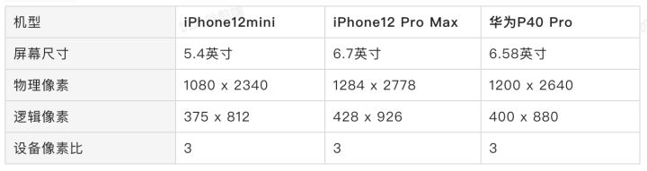
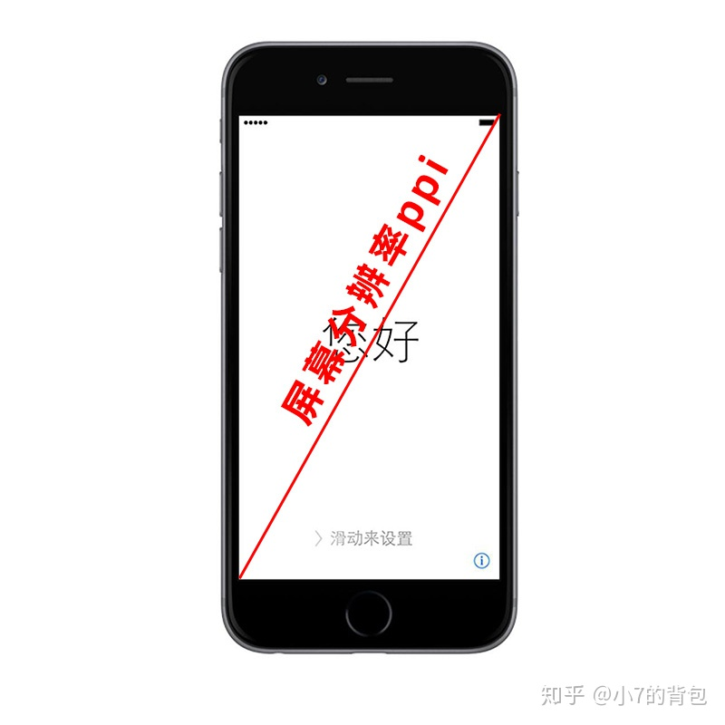

## 像素（pixel,缩写px）

### 数码图像像素

​		数码图像像素是一种虚拟化的数字，大小可以任意，或者说没有实际的物理尺寸大小（像素大小是去适配显示屏的像素大小，或适配打印的大小。如图2，左图表示显示屏的像素点很小，右图表是显示屏的像素点很大，当然是同一幅图），无固定形式，就单个像素来说，本身的形状是任意的，没有被明确定义的，或者是被捕获时的摄像机或相机、或扫描仪等定义的，本身不具备显示功能，数码像素要显示必须依赖显示设备，包括显卡，显示屏。通常我们理解的一个像素是1：1的正方形块，这只是它最常见的一种形式，有的摄像机捕获的像素并不是1：1的正方向，比如：1：1.21，1：1.09，1：1.46等等，但摄像机或相机的光感器形状都是矩形（正方形或长方形，其实也可以是圆形，不规则图形，但没人会用圆形或不规则图形）如下图

图1：像素点比列与形状

图2：数码图像像素点无固定大小，可以任意缩放去适配显示屏的像素点大小

### 屏幕像素（设备像素）

​		屏幕像素是指显示屏的像素，包括电视机，电脑显示屏，手机显示屏等等，这些像素不是虚拟的，是实实在在存在的，具有物理尺寸大小，通常是英寸-inch, 这些像素通常来说只有一种比列1：1的正方形，并且像素点之间是紧挨着的。但是我们经常会看到户外显示屏的像素点，通常人们叫LED屏幕，这些屏幕的像素点就有不同比例的，还有圆形的，因为人们观看广告的距离不是近距离，而是几十米上百米远，所以他们的像素点并不是一颗紧挨着另一颗，像素点之间有空隙和距离。如下图，黑色缝隙挺大的屏幕从工厂出来那天起，它上面的物理像素点就固定不变了，比如iPhone 6的屏幕在宽度方向有750个物理像素点，高度方向有1334个物理像素点，所以iPhone 6 总共有`750*1334`个物理像素点。

LED大屏的像素点缝隙

### 设备独立像素（逻辑像素）

​		想象一下如果有两个手机尺寸相同，但是存在的设备像素数量不同，比如高清屏就比普通屏的设备像素多，如果我们使用设备像素显示一个100px的宽度，那么在不同屏幕上显示效果会是不同的，高清屏上面的图像会小很多。相同尺寸的手机设置了100px显示的最终效果却不同，这样很难进行较好的适配，编写程序必须了解用户的分辨率来进行开发。如何实现相同屏幕尺寸但分辨率不同的设备上显示的图片一样大呢？

​		所以在设备像素之上，操作系统为开发者进行抽象，提供了逻辑像素的概念； 比如你购买了一台显示器，在操作系统上是以1920x1080设置的显示分辨率，那么无论你购买的是2k、4k的显示器，对于开发者来说，都是 1920x1080的大小。同样设置192px，这样在不同显示屏上，都是占据宽度的十分之一。

​		手机端也同理，比如iPhone 6 的设备独立像素是`375*667`,虽然它的设备像素是`750*1334`个，但是我们可以理解成手机厂商给它设置了一个固定的分辨率就是`375*667`,`750*1334`个真实存在的设备像素铺满了整个屏幕，同理逻辑存在的`375*667`个设备独立像素也是默认铺满整个屏幕。设备独立像素在手机端是固定的，如下图列举的几个手机：

​		在电脑端可以直接理解成是你设置的分辨率，比如我的电脑是4k屏幕，物理像素是`3840*2160`，然后设置的分辨率也是`3840*2160`，所以设备独立像素按理应该也是这个值，但是我的默认屏幕放大了150%,所以只需要`2560*1440`个逻辑像素就能显示整个屏幕，所以逻辑像素就是`2560*1440`。但是浏览器其实提供了获取设备独立像素的API， 在浏览器中可以通过 `screen.width` ,`screen.height` 获取浏览器的逻辑像素。

​		设备像素和设备独立像素的比值被定义为一个新的概念叫做 `设备像素比(devicePixelRatio)`，简称 `dpr` ，运算公式为 `DPR = 设备像素 / 设备独立像素`。		在一般的电脑上，设备像素是等于逻辑像素的，也就是 `dpr = 1.0` ，但是在高分辨率的电脑上，二者不一定相等，浏览器提供了一个接口可以查看二者的关系。可用 `window.devicePixelRatio` 属性查看，如在我的电脑上获取的结果如下是1.5，跟我上面推算的相同。

​		好了逻辑像素的个数已经确定就不会更改了，但是单个逻辑像素的大小会根据网页的缩放进行缩放。如下是我将网页放大后得到的 `dpr` ：

​		现在一个1个设备独立像素在横向上就是2.25个设备像素了。但逻辑像素尺寸还是不变的，还是`2560*1440`。 

> 很多资料会说在页面缩放比为1，1个CSS像素等于 1个设备独立像素。当页面缩放比不为1时，CSS像素和设备独立像素不再对应。比如当页面放大200%，则横向上1个CSS像素等于2个设备独立像素。

​		但我觉得其实CSS像素就可以理解成设备独立像素。页面缩放比为1的时候他们相等，比如当页面放大200%，则横向上设备独立像素是原来的两倍，css像素同理也占据了初始设备独立像素的两倍空间。

​		移动端开发时， 设计师以iPhone6(750px\*1344) 为模板进行设计的，这是是物理像素。但是前端开发者以逻辑像素为准，所以开发时需要将 单位除以2。**所以我们开发最关心的还是设备的设备独立像素，这是一个中间层，比方说一个图片的resolution是`100*100`在电脑屏幕上显示是占用了`100*100`个设备独立像素， 所以不管在哪个设备上开发，都先想想这个设备的设备独立像素是多少！！！**

## 分辨率

​		首先明确一点`Resolution`, `PPI`, `DPI`中文都叫分辨率。

1. 图像分辨率`Resolution`，

2. 图像打印分辨率或屏幕分辨率`PPI`，`PPI=pixels per inch`

3. 打印机分辨率`DPI`, `DPI=dots per inch`

​		首先指出一个误解：通常我们会看到分辨率`1920*1080`，此处分辨率=Resolution,是数码图像的分辨率，与图像打印分辨率、屏幕分辨率PPI和打印机分辨率DPI无关，它表示的是**像素数量**不要理解为面积，跟面积无任何关系。数码图像打印或屏幕分辨率或打印机的分辨率只与长度相关，`PPI=pixels per inch`表示每英寸有多少个像素点（通常指屏幕像素点，也是数码图像的打印分辨率，但对数码图像的显示不起作用,对打印起作用），DPI=dots per inch表示每英寸有多少个点（通常指打印点，与屏幕像素点无关）

总结是：PPI作为屏幕分辨率时与DPI打印机分辨率无任何关系；PPI作为数码图像打印分辨率时与DPI关系是输入和输出。

### 数码图像分辨率Resolution

​		数码图像的分辨率就是指这幅图的像素多少，究竟有多少个像素。数码图像的物理尺寸可以是任意的（参考前面：数码像素）比如3PPI,100PPI,表示打印的时候一英寸打3个和100个像素点。如果我的图像分辨率是5000x4000px，打印分辨率是100PPI,那么这幅图打印出来的实际尺寸是宽=5000/100=50inch，和高=4000/100=40inch

### 数码图像打印分辨率PPI

> 数码图像宽高像素(Resolution)，与数码图像打印分辨率（PPI）的关系?

1. ​		显示角度来说：无关。数码图像在屏幕显示上起作用的是宽高像素Resolution，图像打印分辨率可以设置为任何值，所以无关，图像打印分辨率在图像显示上来说无任何意义。看下图PS中步骤：**注意：设置数码图像打印分辨率PPI的时候不能勾选重新采样，否者图像原始像素会改变。没法做到定量定性分析。当设置了图像打印分辨率PPI后，其实图像能打印多大的物理尺寸，PS已经自动计算出来了，也在下图的宽和高中查看。**

   

   2. ​		打印来说。数码图像宽高像素Resolution起决定性作用，打印分辨率PPI起二次作用。什么意思：Resolution=父级，打印分辨率PPI=子级，父级起总控作用，父级的宽高像素直接决定了打印图像的清晰度和大小，如果父级宽高像素很低，即便子级-打印分辨率设置再高，打印也不会清晰，或者打印图像很小。父级和子级，其中任何一个设置过低=打印不清晰或打印图像很小，父级和子级同时设置高值=打印清晰（这有个前提是：观看打印图的距离不变，如果很远的观看距离，当然需要降低打印分辨率PPI,让图像打印尺寸变大。）数码图像打印PPI设置的意义有两点：一是让你的原始数码图像应该打印多大的物理尺寸。二是高PPI可以让打印更精细，但是画面元素在物理尺寸上会缩小，反之，画面元素会放大。接上面图的步骤左图300PPI近距离观看就这么精细，右图1PPI近距离观看就是硕大的像素点，但是你站到500米外观看右图时就和左图效果差不多了。你站到500米外看左图时，就看不清了，甚至根本看不见，因为打印图太小了。

### 屏幕分辨率PPI

​		屏幕分辨率为PPI,因为屏幕上的一个点代表一个像素。不过与打印机不同的是，屏幕分辨率不是指横向和竖向1个单位长度有多少个像素点，而是指方形屏幕对角线长度有多少个像素点，然后得到1个单位长度有多少个点。计算公式，屏幕PPI=√（长的像素数量²+宽的像素数量²）/对角线长度(inch)

> 数码图像与屏幕分辨率PPI的关系

​		同一幅图像，屏幕分辨率越高，图像显示越小，图像看起来越精细，锐利，清晰，但可能会降低识别度，什么意思，图片太小了看不清楚图上的文字和一些细节，所以屏幕分辨率并不是越高越好。反之亦然。

> 数码图像打印分辨率PPI与屏幕分辨率PPI的关系

​		前面说了，用来显示起决定作用的是Resolution，所以他们除了名字一样，没有其他关系。

> 数码图像分辨率Resolution与屏幕分辨率PPI的关系

​		严格来说是无关的，但是由于屏幕分辨率的公式涉及到长的像素和宽的像素，所以间接关系还是有的，也就是与屏幕的长宽像素数量有一定关系的。屏幕的长宽像素数量限制了数码图像的显示。无论数码图像的宽高像素有多大，显示的时候是无法超过屏幕像素数量的。比如一张数码图5000x4000px,但是屏幕像素为1920x1080px,所以这张数码图最多显示1920x1080个像素。特别是要放到户外LED大屏广告的图像，直接将数码图像的像素高宽设置为LED大屏的像素就行了。过多的数码图像像素只会增加图像文件的内存大小（kb.mb），加载或显示起来还会很慢，还会卡顿，过多的数码图像像素并不会增加LED大屏显示的清晰度。

​		像素密度PPI与DPI可通用。像素密度指的是现实物理世界中的显示器，电视机，相机感光器，扫描仪等在宽或高方向上或显示器对角线方向上，一个单位长度的像素数量或点的数量。前面我们说数码图像打印分辨率PPI与打印机分辨率DPI无任何关系，那是因为两者的世界不同，PPI数码世界（PPI感觉是联通数码和物理世界的桥梁），DPI物理世界。但在此处像素密度都是指物理世界，所以物理世界中一个实实在在的像素就是一个点，所以当表示像素密度的时候PPI=DPI,通常像素密度也还表示为ppcm, cm=centimetre=厘米，所以可以简写成PPI=ppcm=DPI

### 打印机分辨率DPI

​		打印机分辨率指打印的精细度，dots指的是油墨点。打印机分辨率越高表示打印点越小，1单位长度就会有更多的点来表示，那么打印就精细和锐利清晰。反之亦然。打印机分辨率DPI不能决定打印图像的物理尺寸大小，**物理尺寸大小inch是由图像打印分辨率PPI决定**。

> 打印机分辨率DPI与数码图像打印分辨率PPI

​		在整个打印流程里，PPI是指打印输入的精度，DPI是指打印输出的精度。举个例子：打印分辨率是100PPI，当打印机分辨率为100DPI时，我们可以理解为100PPI由100DPI来打印 ，但不能说100DPI由100PPI来表示，因为DPI的服务对象是PPI,肯定先有输入再有输出，一个像素可以由很多打印点来打印， 100PPI≠100DPI,像素是方形的，但是打印点就不一定了，可能是圆形，椭圆形，或其它形状，油墨点还有流动性，当然由于打印技术的不同，也可能不是油墨打印，如热敏打印等等（本人不是很了解打印技术）。当然了，输入的精度直接决定了输出的精度，PPI都不高，DPI设置再高，图像打印出来都是硕大的方块。所以这三者的控制关系：**数码图像分辨率（Resolution,总控）>数码图像打印分辨率（PPI，二级控制）＞打印机分辨率（DPI，最后控制），**经过这个流程后就会得到我们打印出来的图像精细度。打印机分辨率DPI,与数码图像打印分辨率PPI来自两个完全不同的世界，除了上述关系，DPI不能进入数字领域来表示像素，PPI也不能进入物理世界来表示打印点。

> 打印的物理尺寸大小与观看距离的关系

​		需要远距离观看打印图的时候=高Resolution+较低PPI+较低DPI（如大尺寸广告图）

​		需要近距离观看打印图的时候=高Resolution+较高PPI+较高DPI（如相片等小尺寸）

​		如果你的图像Resolution并不高，可能你需要重新采样来放大图像，也就是增加图像的宽高像素。当然了，重新采样并不能完全得到理想的效果，你应该在拍摄的时候，或者渲染的时候就应该选择较高的Resolution来满足你的打印。当你想把当前的高Resolution图打印成小的物理尺寸图的时候，你可以设置物理尺寸的宽高inch或厘米，打印分辨率PPI会自动调整，如果不想改变打印分辨率PPI,在PS里勾选重新采样。

## 问题

### LightRoom打印时，为什么PPI越高越清晰,并且打印输出的尺寸不变？

​		原因：LR打印时，首先设置了打印输出的固定尺寸（即设置了纸张大小），然后定义PPI,最后的原始图像像素根据这两个参数自动适配。具体原因如下公式：**打印输出尺寸（inch）=图像的Resolution/数码图像打印PPI**所以当我们定义了"打印输出尺寸（inch）"和"数码图像打印PPI"时，打印时的"图像的Resolution"会自动适配，PPI越高意味着图像的Resolution越高，打印纸张大小不变时，打印更清晰，反之亦然。

### 关于某些网站所说的图像DPI是什么？

答案是：**数码图像的打印分辨率PPI**比如：某虫图片网站，这个网站显示的图片分辨率是DPI，如图所示。下图中的300DPI,72DPI其实就是数码图像的打印分辨率300PPI,72PPI。

​		某虫网，自己也标明了，DPI与图像实际大小`Resolution`无关，下图中最后那句话。图虫网说的**DPI概念**是**打印机的打印分辨率**，但是，请注意下图中最后一句话，"可以通过PS软件修改，与原图属性无关"，**这句话就肯定了此网站图片的DPI指的是**"数码图像的打印分辨率PPI",也就是说，它标一个300DPI和72DPI其实没有实际作用，给你看看的。起作用的是`5000*3333`这个`Resolution`。而且在此表明了网站开发者并没有理清楚：打印机分辨率DPI和数码图像打印分辨率PPI的关系，所以就混用了，应该叫误用。我见过很多网站都是用DPI来表示PPI，就是开发者的锅，开发者没有与专业的平面设计师对接，想当然的用了这个概念，说明在网站开发者的圈子里，这个DPI已经流行开了，所以此时你要明白他们所说的DPI就是"数码图像打印分辨率PPI"，叫你上传一张300DPI的头像用于报考某个证书，也是指的300PPI。

​		某虫网对"DPI的概念解释"和"最后一句话"是自相矛盾的，概念解释指的是打印机的打印分辨率，最后一句话指的是数码图像的打印分辨率PPI（每英寸打印多少个像素点）。PS只能修改数码图像打印分辨率PPI,而不能修改打印机的打印分辨率DPI,打印机的打印分辨率DPI是通过打印机的属性去修改的，其他软件修改不了，不过目前来说打印机的打印分辨率通常是固定的，没法修改；不知道有没有可以修改打印机打印分辨率DPI的机子。

​		想要改变图片的打印分辨率你只需要在PS中按如下操作就行了如果你想保持图片是`1000*667`像素的大小（如下图，仅作举例），那就不要勾选"重新采样"，直接将图片分辨率改成300即可。如果勾选了重新采样，图片会根据分辨率的改变进行缩放，也就是`1000*667`的像素会改变。

