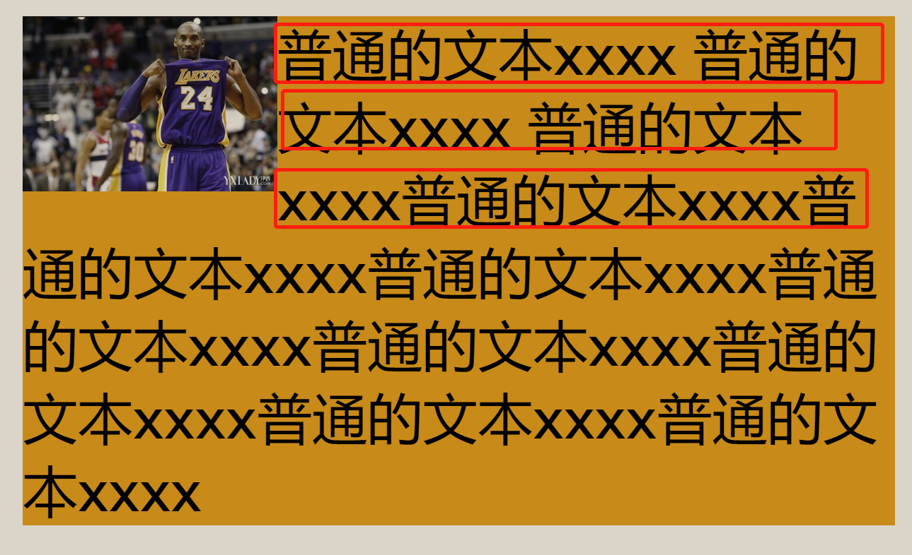

## 定位方式 ( Positioning schemes )

在 CSS 2.2 中，一个盒子根据三种定位方式进行布局：

1. **常规流** ( Normal flow ) 。常规流包含块级盒的块格式化和行内级盒的行内格式化，以及块级盒和行内级盒的相对定位。
2. **浮动** ( Floats ) 。在浮动模型中，一个盒首先根据常规流进行布局，然后从流中取出并尽可能的向左或向右移动。内容流可能会在浮动元素周围。
3. **绝对定位** ( Absolute positioning )。 在绝对定位模型中，一个盒完全从常规流中取出 ( 它对后续兄弟节点无影响 ) 然后相对于其包含块赋予一个位置。

如果一个元素是浮动的、绝对定位的或者根元素，那我们称这个元素在流外 ( **out-of-flow** )，如果一个元素不是 out of flow 则称它 in-flow。一个元素 A 的流 ( **flow of an element** A ) 是一个包含 A 和所有在流内的并且最近的流外祖先为 A 的元素

> **注意。**CSS 2.2 的定位方式可帮助作者避免用于布局效果的标记技巧（例如，不可见的图像），从而使文档更易于访问。

### 选择一个定位方式：`position` 属性

`position` 和 `float` 属性决定了 CSS 2.2 中那种定位算法被用来计算一个盒子的位置。

表格参见[文档](https://www.w3.org/TR/CSS22/visuren.html#propdef-position)。属性取值的含义如下：

**static**
一个盒为常规盒，根据常规流布局，`top`，`right`，`bottom`，`left` 不生效。

**relative**
盒子的位置根据常规流进行计算 ( 这被称为常规流中的位置 ) 。接着盒子相对于自己的常规位置进行相对偏移。如果一个盒 B 是相对定位的，其后续的盒子计算位置时当做 B 没有偏移。`position:relative` 在 table-row-group, table-header-group, table-footer-group, table-row, table-column-group, table-column, table-cell, and table-caption 元素上未定义。

**absolute**
盒子的位置 ( 也可能有尺寸 ) 由 `top`，`right`，`bottom`，`left` 属性确定。这些属性确定盒子相对于其包含块的偏移。绝对地定位的盒子会从常规流中取出。这意味着它不影响后续兄弟节点的布局。同时，尽管绝对地定位的盒子有外边距，但他们不和任何其他外边距折叠 ( collapse ) 。
包含块是由它的**最近的**

- `position`的值不是`static`（`fixed, absolute, relative, or sticky`）
- `transform`或`perspective`的值不是`none`
- `will-change`的值是`transform`或 `perspective`
- `filter`的值不是`none`或`will-change`的值是`filter`(只在 Firefox 下生效).
- `contain`的值是`paint`
  的**祖先元素的内边距区**(`padding范围`)的组成的。**找不到包含块就是初始包含块。**

**fixed**
和 absolute 一样是根据包含块定位。包含块是由它的**最近的**

- `transform`或`perspective`的值不是`none`
- `will-change`的值是`transform`或 `perspective`
- `filter`的值不是`none`或`will-change`的值是`filter`(只在 Firefox 下生效).
- `contain`的值是`paint`
  的**祖先元素的内边距区**(`padding范围`)的组成的。\*\*找不到包含块就是视口(`viewport`),如果页面滚动，视口也会变。

## 常规流 ( Normal flow )

常规流中的盒子都属于一个格式化上下文，在 CSS 2.2 中这个上下文可能是 表格上下文，块上下文和行内上下文。在之后的 CSS 中，其他的格式化上下文会被介绍。块级盒参与一个块格式化上下文。行内级盒参与一个行格式化上下文。表格上下文在[表格章节](https://www.w3.org/TR/CSS22/tables.html)进行描述。

### 块格式化上下文（Block Formatting Contexts）

浮动元素、绝对地定位元素(absolute 和 fixed)、块容器盒但不是块盒 ( 比如 `inline-block`、`table-cells` 和 `table-caption`)，以及 `overflow` 属性 不为`visible` 的块盒会为他们的内容建立一个新的块格式化上下文。可以把 `BFC` 理解为一个封闭的大箱子，箱子内部的元素无论如何翻江倒海，都不会影响到外部。
**注意**：一个`BFC`的范围包含创建该上下文元素的所有子元素，但不包括创建了新`BFC`的子元素的内部元素。这从另一方角度说明，一个元素不能同时存在于两个`BFC`中。因为如果一个元素能够同时处于两个`BFC`中，那么就意味着这个元素能与两个`BFC`中的元素发生作用，就违反了`BFC`的隔离作用。
浏览器对`BFC`区域的约束规则：

1.  内部的`Box`会在垂直方向上一个接一个的放置(**块级元素独占一行**)，两个兄弟盒子之间的垂直距离取决于他们的 `margin` 属性。
2.  属于同一个`BFC`的两个相邻`Box`的`margin`会发生折叠，不同`BFC`不会发生折叠。所以不让`margin`重叠可以让盒子处在不同`BFC`中(比如说父子元素 margin 重叠，可以让父元素开启`BFC`，这样父元素归它外面开启`BFC`的元素管，而子元素处于父元素的`BFC`中)或者让它们不相邻或者设置盒子为 `inline-block `这样就不受`BFC` 规则约束
3.  `BFC`的区域不会与**同级**float 的元素区域重叠（**开启`BFC`的元素不会被浮动元素覆盖，所以常用两列布局**）
4.  计算`BFC`的高度时，浮动子元素也参与计算(**可以包含浮动的子元素，所以常用闭合浮动**)

### 行内格式化上下文（Inline Formatting Contexts）

行内格式化上下文由一个不包含块级盒的块容器盒建立。在一个行内格式化上下文中，盒子们水平的进行布局，从包含块的开始处一个接一个布局。盒子之间有水平方向的外边距、边框和内边距(**垂直方向上能展示，但是不占据空间**)。盒子们在垂直方向上以不同的方式对齐：他们的底部或顶部可能会被对齐，或者他们内部的文本的 baseline 会被对齐。每一行的整个矩形区域称为**行盒** ( line box )。

行盒的宽度由包含块和浮动的参与决定。行盒的高度由[行高的计算](https://www.w3.org/TR/CSS22/visudet.html#line-height)一节中的规则决定。

行盒的高度总是足够包含其中的盒子们。但是，它有可能会比其包含的盒子中最高的盒子还要高，如下图片是行盒内最高的元素，但是行盒比图片还要高。

当一个盒子 B 的高度小于包含它的行盒的高度，B 垂直方向上的对齐由 `vertical-align` 决定。当多个行级盒不能水平的放进一个行盒时，它们会分布在两个或更多的垂直方向以栈的方式堆叠的 ( vertically-stacked ) 行盒中。如下一个行盒已经不能放下所有的行内级盒子了，就会放到下一个行盒中。


通常，行盒的左边缘接触其包含块的左边缘。然而浮动盒可能会出现在它们之间。因此，尽管通常在同一个行内格式化上下文中的行盒都有相同的宽度 ( 包含块宽度 )，但它们的宽度也可能由于浮动元素变得更少。如下图前三个行盒宽度比起下面的都比较窄。



在同一个行内格式化上下文中的行盒通常高度不同 ( 例如，一行可能有一张很高的图片，另一行只包含文本 )。

当一行中的行内级盒的整体的宽度比包含它们的行盒的宽度小时，他们在行盒中的水平分布取决于 `text-align` 属性。

如果一个行内盒的宽度超过了行盒的宽度，他们会分为多个盒子然后这些盒子会分布在多个行盒中。如果一个行盒不能被分割 ( 例如：如果行内盒包含一个字符，或者特定语言的分割规则不允许行内盒的分割，又或者行内盒受到 `white-space` 值为 `nowarp` 或者 `pre` 的影响 )，那么行内盒会溢出行盒。

如果一个行内盒被分割，外边距、边框和内边距不会在分割处有视觉效果 。如下 span 设置了 border，可以看到分割处并没有视觉效果


行盒在需要控制行内格式化上下文中的行内级内容时被创建。一个行盒如果没有文本，没有保留的空白符，没有外边距、内边距或边框不为零的行内元素，没有其他在流中的内容 ( 比如图像、行内块或行内表 )，并且没有以一个保留的新行结束，那么这个行盒要被看作是一个用于确定其内部元素位置的高度为零的行盒，对于其他情况，要看做它不存在。

下面是一个构造行内盒的例子。下面段落 ( 由 HTML 块级元素 P 创建 ) 包含匿名文本和 EM 元素 STRONG 元素。

```
<P>Several <EM>emphasized words</EM> appear
<STRONG>in this</STRONG> sentence, dear.</P>
```

这个 P 元素创造了一个块盒包含五个行内盒，有三个是匿名的：

- 匿名盒: “Several”
- EM: “emphasized words”
- 匿名盒: “appear”
- STRONG: “in this”
- 匿名盒: “sentence, dear.”

为了格式化这个段落，用户代理把这五个元素放入行盒中。在这个例子中，P 元素的盒子建立了行盒的包含块。如果包含块够宽，所有的行盒会放进一个行盒中:

Several _emphasized words_ appear **in this** sentence, dear.

如果不是，行内盒会被分割然后分布在几个行盒中。之前的段落可能像这样分割：

Several _emphasized words_ appear
**in this** sentence, dear.

或这样：

Several _emphasized
words_ appear
**in this** sentence, dear.

上面例子中，EM 盒被分成了两个 EM 盒 ( 称为 split1 和 split2 )。外边距，边框，内边距或者文本装饰不会在 split1 后和 split2 前有视觉影响。

考虑下面例子：

```
<!DOCTYPE HTML PUBLIC "-//W3C//DTD HTML 4.01//EN">
<HTML>
  <HEAD>
    <TITLE>Example of inline flow on several lines</TITLE>
    <STYLE type="text/css">
      EM {
        padding: 2px;
        margin: 1em;
        border-width: medium;
        border-style: dashed;
        line-height: 2.4em;
      }
    </STYLE>
  </HEAD>
  <BODY>
    <P>Several <EM>emphasized words</EM> appear here.</P>
  </BODY>
</HTML>
```

取决于 P 的宽度，盒子们可能会像下面这样分布：


- 外边距在 “emphasized” 的前面和 “words” 的后面插入。
- 内边距在 “emphasized” 的上下、前面和 “words” 的上下、后面插入。一个点划线的边框在每个部分的三面渲染。

### 相对定位

一旦一个盒子根据常规流或浮动布局后，它可能会相对于这个位置进行移动。这称为**相对定位** ( relative positioning ) 。以这样的方式偏移一个盒子 ( B1 )，不会对后续的盒子 ( B2 ) 产生影响：B2 的位置假设 B1 没有偏移给出并且在 B1 偏移后 B2 也不会重新定位。这暗示了相对定位可能会使盒子重叠。然而，如果相对定位导致了一个 `overflow: auto` 或者 `overflow: scroll` 的盒子溢出，用户代理必需使用户可以访问到这些内容，尽管这样会导致滚动条的创建，进而影响布局。

一个相对定位的盒子保持它在常规流中的尺寸，包括断行和原来为其保留的空白。相对定位元素会为其所有子元素建立一个新的包含块。这个包含块对应于该元素原本所在的位置。非常奇怪的是，虽然相对定位的数值型偏移属性是相对于自身的，但其百分比却是相对于包含块的。top 和 bottom 百分比相对于包含块的 content-box 区域高度，left 和 right 百分比相对于包含块的 content-box 区域的宽度。

对于相对布局的元素，`left` 和 `right` 水平地移动盒子，不会改变其尺寸。`left` 将盒子向右移动，`right` 将盒子向左移动。由于盒子不会由于 `left` 和 `right` 被分割或拉长，所以被使用的值一直是 `left = -right`。

如果 `left` 和 `right` 都是 `auto` ( 即初始值 )，使用值为 `0` ( 即，盒子保持在它原来的位置 )。

如果 `left` 为 `auto`，其使用值为 `right` 的负值 ( 即，盒子根据 `right` 值向左移动 )。

如果 `right` 值为 `auto`，其使用值为 `left` 的负值。

如果 `left` 和 `right` 都不是 `auto`，其位置被过度约束了 ( over-constrained )，因此其中一个会被忽略。如果包含块 `direction` 属性为 `ltr`，`left` 值胜出 `right` 值变为 -`left`。如果 `direction` 属性为 `rtl`，`right` 值胜出 `left` 值被忽略。

例子。下面三条规则是等价的：

```
div.a8 { position: relative; direction: ltr; left: -1em; right: auto }
div.a8 { position: relative; direction: ltr; left: auto; right: 1em }
div.a8 { position: relative; direction: ltr; left: -1em; right: 5em }
```

`top` 和 `bottom` 上下地移动盒子，不会改变其尺寸。`top` 将盒子向下移动，`bottom` 将盒子向上移动。由于盒子不会由于 `top` 和 `bottom` 被分割或拉长，所以被使用的值一直是 `top = -bottom`。如果两者都是 `auto`，他们的使用值都是 `0`。如果其中一个是 `auto`，它的值变为另一个的负值。如果都不是，`bottom` 会被忽略。

> 注释：动态的移动相对定位的元素可以在脚本环境下产生动画效果 ( 又见 `visibility` 属性 )。尽管相对定位可能会用来形成上标或下标，但其行高不会考虑相对定位自动的调整。更多信息见[行高的计算](https://www.w3.org/TR/CSS22/visudet.html#line-height)一节。

相对定位的例子在 [常规流、浮动盒绝对定位的比较](https://www.w3.org/TR/CSS22/visuren.html#comparison) 一节提供。

## 浮动 ( Floats )

浮动盒是被移动到当前行左边或右边的盒子。一个浮动盒 ( 或者 “浮动” ( floating ) 、“浮动的” ( floated ) 盒子 ) 最有趣的特征是内容 ( content ) 可能会在其两侧流动 ( flow ) ( 或者被“ clear”属性禁止这样做)。内容在一个向左浮动的盒子右侧出现，在一个向左浮动的盒子右侧出现。

一个浮动盒会向左或向右浮动直到其外边缘接触到其包含块的边缘或者另一个浮动元素的外边缘。如果此时有一个行盒，浮动盒的外上边缘会和当前**行盒的上边缘**对齐。

如果没有足够的水平空间用于浮动，它会向下移动直到其可以放下或没有更多的浮动出现。

由于一个浮动元素 is not in the flow，在浮动元素前后的没有被定位的行盒在垂直方向上正常排列（好像浮动元素不存在一样）。然而，紧挨着 (next to) 浮动元素的行盒为了给浮动盒的外边距盒腾出空间会变短。

一个行盒是否和一个浮动元素并排显示需要存在一个垂直位置同时满足下面四个条件：(a) 在行盒的顶部或顶部的下面，(b) 在行盒的底部或底部的上面，(c) 在浮动盒子上外边距的下面 (d) 在浮动盒下外边距的上面。

> 注释：这意味着零高度或者负高度的浮动盒不会使行盒缩短。

如果一个变短的行盒太小了以致于不能容纳任何内容，那么这个行盒会向下移动 ( 同时它的宽度也会重新计算 ) 直到有内容可以放入或没有其他浮动出现。在当前行的任何在浮动盒前面的内容都会重新流动到浮动盒的另一侧。换句话说，如果一个行内级盒放置在和浮动盒同一行中的在浮动盒之前，且可以放进行盒剩余的空间，那么这个左浮动盒就放置在这一行，和行盒的顶部对齐，然后本来在这一行的行内级盒因此会移动到浮动盒的右边 ( 左浮动盒的另一侧就是右侧 )，对于 rtl 和右浮动亦然。

table、块级替换元素或者常规流中建立块格式化上下文的元素 ( 例如一个 `overflow` 不是 `visible` 的元素 ) 的边框盒不能和同一个块上下文中的任何浮动元素的外边框盒重叠（可以实现两列布局）。

例子。在下面的文档片段中，包含块太窄所以不能容纳紧挨着浮动盒的内容，所以内容移到了浮动盒的下方同时根据 `text-align` 属性在行盒中对齐。

```
p { width: 10em; border: solid aqua; }
span { float: left; width: 5em; height: 5em; border: solid blue; }

...

<p>
  <span> </span>
  Supercalifragilisticexpialidocious
</p>
```

看起来会像下面这样：


多个浮动盒可能会相接，此时这个模型也会对同一行的浮动盒应用。

下面的例子使所有 `class=icon` 的 IMG 盒向左浮动 ( 同时左边距为 ‘0’ )

```
img.icon {
  float: left;
  margin-left: 0;
}
```

考虑下面的 HTML 源文件和样式表：

```
<!DOCTYPE HTML PUBLIC "-//W3C//DTD HTML 4.01//EN">
<HTML>
  <HEAD>
    <TITLE>Float example</TITLE>
    <STYLE type="text/css">
      IMG { float: left }
      BODY, P, IMG { margin: 2em }
    </STYLE>
  </HEAD>
  <BODY>
    <P>
       Some sample text that has no other...
  </BODY>
</HTML>
```

IMG 向左浮动。随后的内容被格式化到了浮动的右边，和浮动盒一样的行开始。浮动盒右边的行盒由于浮动的出现变短，在浮动盒之后又还原为正常宽度 ( 由 P 元素建立的包含块 的宽度)。这个文档可能会格式化为下面：


浮动盒的外边距不会和相接的盒子的外边距折叠（因为浮动元素开启了新的 BFC）。因此，在之前的例子中，P 和 IMG 的垂直外边距没有发生折叠。

浮动盒的内容会被堆叠 ( stacked ) 起来好像浮动盒生成了新的层叠上下文 ( stacking contexts )，除了任何定位元素和实际创建新堆叠上下文的元素都参与了 float 的父级堆叠上下文。一个浮动盒可以和其他常规流中的盒子重叠 ( 例如，当一个紧挨着浮动盒的常规流盒子有负外边距 )。此时，浮动元素在非定位流内块 ( non-positioned in-flow blocks ) 上面渲染，在流内行内块 ( in-flow inlines ) 后面渲染。

这是另一个例子，展示了浮动盒和常规流中的元素边框的重叠。


下面例子说明使用 `clear` 元素阻止内容紧挨着浮动盒。

假设有下面规则：

```
p { clear: left }
```

格式化如下：


这两个段落都设置了` clear: left`，这使得第二个段落被“推下”到浮动下方的位置，为了达到这个目的，在其顶部空白处增加了间隔

### 定位浮动： `float` 属性

表格参见[文档](https://www.w3.org/TR/CSS22/visuren.html#propdef-float)。

该属性指明一个盒子时候向左浮动、向右浮动或者不浮动。该属性可以为任何元素设置，但只会应用在生成的盒子不是绝对地定位的元素上。属性取值的含义如下：

**left**
元素生成一个块盒向左浮动。内容在盒子的右边流动，从盒子的上部开始。

**right**
和 `left` 类似，除了元素生成一个块盒向右浮动。内容在盒子的左边流动，从盒子的上部开始。

**none**
盒子不浮动。

用户代理可能会认为根元素的 `float` 为 `none`。

下面是控制浮动行为的精确规则：

1. 左浮动盒的左外边缘不会到其包含块左边缘的左边。右浮动盒规则相似。
2. 如果当前盒子是左浮动的，如果有在源文档中生成更早的左浮动元素的盒子，那么对于每一个更早的盒子，当前盒的左外边缘必须在之前盒的右边缘的右边，或者其顶部必需比之前盒的顶部低。右浮动盒规则相似。
3. 左浮动盒的右外边距可能不会到紧挨着它的右浮动盒左外边距的右边。右浮动盒规则相似。(左浮动的右外边距和右浮动的做外边距不能重叠)
4. 浮动盒的顶外边距不会比包含块的顶部高。浮动盒的上外边缘不会比任何源文档中生成更早的块或浮动盒的上外边缘高。当浮动出现在两个折叠的外边距之间时，浮动盒子像有一个其他的空匿名父亲盒参与在流中一样定位。这个父亲的定位规则根据外边距折叠一节[规则](https://www.w3.org/TR/CSS22/box.html#collapsed-through)给出。
5. 一个向左浮动的盒子如果有另一个向左浮动的盒子在它的左边，那么它的右外边缘不会到达其包含块的右边缘的右边。( 简单来说：一个左浮动盒不会伸出 ( stick out ) 到包含块的右边缘，除非它已经足够靠左了 )。
6. 一个浮动盒子必须尽可能高的放置。
7. 一个左浮动盒必须尽可能向左放置，一个右浮动盒必须尽可能向右放置，相比于左右的位置，更偏向更高的位置。

但是在 CSS 2.2 中，如果在一个块格式化上下文中，有一个在流中的负垂直外边距导致浮动位置在其原位置 ( 假设其负外边距设置为 0 ) 之上，浮动的位置是未定义的。

本规则中引用的其他元素只会引用和浮动元素块格式化上下文相同的元素。

这是 b 向右浮动的结果。

```
<P>a<SPAN style="float: right">b</SPAN></P>
```

如果 P 的宽度足够大，a 和 b 会一人一边。看起来像这样：


### 控制 紧挨着 ( next to ) 浮动盒的流：`clear` 属性

表格参见[文档](https://www.w3.org/TR/CSS22/visuren.html#propdef-clear)。

该属性说明一个元素的盒子们哪一侧不会和之前的浮动盒相邻。`clear` 属性不考虑元素内部其他块格式化上下文中的元素。

当应用到非浮动块级盒时取值含义的含义如下：

**left**
需要盒子的上边框边缘在文档树中更早出现的元素产生的左浮动盒的下外边缘的下面。

**right**
需要盒子的上边框边缘在文档树中更早出现的元素产生的右浮动盒的下外边缘的下面。

**both**
需要盒子的上边框边缘在文档树中更早出现的元素产生的浮动盒的下外边缘的下面。

**none**
关于浮动，不限制盒子的位置。

## 绝对定位 ( Absolute positioning )

在绝对定位模型中，一个盒子相对于其包含块偏移。它完全从常规流中移除 ( 对之后的兄弟节点没有影响 )。一个绝对定位的盒子为其常规流的子节点和绝对定位的后代建立一个新的包含块。然而，绝对定位的元素的内容不会在其他盒子周围流动。他们可能会遮挡其他盒子的内容 ( 或者自己被遮挡 )，取决于重叠盒子的栈级别 [stack levels](https://www.w3.org/TR/CSS2/visuren.html#stack-level) 。

当说明一个元素是绝对定位元素 ( 或者其盒子 ) 时说明元素的 `position` 属性值为 `absoulte` 或 `fixed`。

### 固定定位 ( Fixed positioning )

固定定位是绝对定位的子类别。

## 常规流、浮动盒绝对定位的比较

为了说明常规流、相对定位、浮动和绝对定位的区别，我们提供了一系列例子，基于下面的 HTML：

```
<!DOCTYPE HTML PUBLIC "-//W3C//DTD HTML 4.01//EN">
<HTML>
  <HEAD>
    <TITLE>Comparison of positioning schemes</TITLE>
  </HEAD>
  <BODY>
    <P>Beginning of body contents.
      <SPAN id="outer"> Start of outer contents.
      <SPAN id="inner"> Inner contents.</SPAN>
      End of outer contents.</SPAN>
      End of body contents.
    </P>
  </BODY>
</HTML>
```

我们假设这个文档有下面的规则：

```
body { display: block; font-size:12px; line-height: 200%;
       width: 400px; height: 400px }
p    { display: block }
span { display: inline }
```

由盒子内外元素生成的盒子的最终位置在每个例子中会发生变化。下面的插图中，左边的数字表示常规流中双倍空间 ( 为了更清晰 ) 的行。

> 注意。本节的插图是说明性的，他们用来说明不同的定位方式在 CSS2.2 中的区别，并不用来给出渲染效果图。

### 常规流

考虑下面的对 _outer_ 和 _inner_ 的 CSS 声明，它们不改变盒子的常规流：

```
#outer { color: red }
#inner { color: blue }
```

P 元素包含所有的行内内容：匿名行内文本和两个 SPAN 元素。因此，所有元素都在一个行内格式化上下文中进行布局，在一个由 P 建立的包含块中，产生的效果如下：


### 相对定位

为了观察相对定位的影响，我们指定：

```
#outer { position: relative; top: -12px; color: red }
#inner { position: relative; top: 12px; color: blue }
```

文本流正常的在 _outer_ 元素中流动。_outer_ 文本接着根据其在常规流的位置和尺寸在第一行结尾流动。接着，包含文本的行内盒 ( 分布在三行中 ) 统一移动 `-12px` ( 向上 )。

_inner_ 中的内容，由于是 _outer_ 的孩子，会在 “of outer contents” ( 在 1.5 行 ) 之后流动。然而，_inner_ 的内容自己相对于 _outer_ 内容偏移了 `12px` (向下)，于是在第二行回到了自己原来的位置。

注意 _outer_ 之后的内容不受 _outer_ 的相对定位影响。


同时注意如果 _outer_ 的偏移为 `-24px`，_outer_ 的文本会和 body 的文本发生重叠。

### 浮动盒

现在考虑浮动的影响，使用下面规则使 _inner_ 元素向右浮动：

```
#outer { color: red }
#inner { float: right; width: 130px; color: blue }
```

文本正常的出现在 _inner_ 中，_inner_ 本身被从流中取出并浮动到右边距 ( `width` 已经设置 )。浮动元素左边的行盒变短了，同时文档保持文本在其中流动。


为了展示 `clear` 属性，我们添加一个兄弟节点：

```
<!DOCTYPE HTML PUBLIC "-//W3C//DTD HTML 4.01//EN">
<HTML>
  <HEAD>
    <TITLE>Comparison of positioning schemes II</TITLE>
  </HEAD>
  <BODY>
    <P>Beginning of body contents.
      <SPAN id=outer> Start of outer contents.
      <SPAN id=inner> Inner contents.</SPAN>
      <SPAN id=sibling> Sibling contents.</SPAN>
      End of outer contents.</SPAN>
      End of body contents.
    </P>
  </BODY>
</HTML>
```

下面的规则：

```
#inner { float: right; width: 130px; color: blue }
#sibling { color: red }
```

使 _inner_ 像之前一样浮动到右边，同时文档保持在腾出的空间流动：


然而，如果 `clear` 被应用在了兄弟节点并设为 `right` ( 即，兄弟盒不接受它右边有浮动盒 )，兄弟盒的内容从浮动元素下面开始流动：


### 绝对定位

最后，我们考虑绝对定位的影响。考虑下面的 CSS 声明：

```
#outer {
    position: absolute;
    top: 200px; left: 200px;
    width: 200px;
    color: red;
}
#inner { color: blue }
```

这回导致 _outer_ 的顶部会根据其包含块定位。_outer_ 的顶部在包含块的顶部下 `200px`，左侧在包含块的左侧 `200px`。_outer_ 的子盒在其父节点中正常的流动。


下面的例子说明一个绝对定位的盒子是一个相对定位盒子的孩子节点的情况。尽管父节点 _outer_ 并没有偏移，但是设置 `position` 为 `relative` 意味着这个盒子可能被作为其子定位元素的包含块。由于 _outer_ 是一个有很多行的行内盒，第一个行内盒的顶部和左边缘用来设置 `top` 和 `left` 的偏移 ( 在图上用虚线表示 )。

```
#outer {
  position: relative;
  color: red
}
#inner {
  position: absolute;
  top: 200px; left: -100px;
  height: 130px; width: 130px;
  color: blue;
}
```

结果看起来像这样：


如果不对 _outer_ 定位：

```
#outer { color: red }
#inner {
  position: absolute;
  top: 200px; left: -100px;
  height: 130px; width: 130px;
  color: blue;
}
```

**inner** 的包含块变为初始包含块。下图说明了 _inner_ 最终的位置。


## 分层展示 ( Layered presentation )

### 指定栈级别 ( stack level )：`z-index` 属性

表格参见[文档](https://www.w3.org/TR/CSS22/visuren.html#propdef-z-index)。

对于定位的元素，`z-index` 属性指定了：

1. 一个盒子在当前栈上下文中的栈级别 ( stack level )。
2. 是否一个盒子建立一个栈上下文。

取值有如下含义：

**<integer>**
该整数表示生成盒在当前栈上下文中的的栈级别。同时代表盒子建立一个新的栈上下文。

**auto**
当前栈上下文中的生成盒的栈级别为 0。除非是根节点会生成一个新的栈上下文。

在 CSS2.2 中，每一个盒子都在三个维度定位。除了他们的水平和垂直定位，盒子们还在一个 z 轴上布局，并且一个在另一个上面的进行格式化。z 轴定位和盒子发生视觉上的重叠时有关。本节讨论盒子们怎么在 z 轴上定位。

渲染树渲染到画布上的顺序使用栈上下文描述。堆栈上下文可以包含进一步的堆栈上下文。从其父堆栈上下文的角度来看，堆栈上下文是原子的;。

每一个盒子都属于一个**栈上下文** (stack context) 。每一个在栈上下文中的定位盒子都有一个**栈级别** ( stack level )，用来决定其相对于其他同栈上下文中的栈级别元素在 z 轴上的位置。一个栈级别更高的盒子通常在一个低栈级别的前面。栈级别可以为负数。相同栈级别的元素根据其在文档树中的位置从后往前布局。

根元素形成根栈上下文。其他栈上下文由 `z-index` 的计算值不为 `auto` 的定位元素形成 ( 包括相对定位元素 )。栈上下文没有必要和其包含块相关。在以后的 CSS 中，其他属性可能会产生栈上下文，例如 `opacity`。

在每个栈上下文中，下面的层会从后往前绘制：

1. 形成栈上下文的元素的背景和边框（the background and borders of the element forming the stacking context.）。
2. 负栈级别的子栈上下文。(小值优先)（the child stacking contexts with negative stack levels (most negative first).）
3. 流内、非行内级、非定位子节点。（the in-flow, non-inline-level, non-positioned descendants.）
4. 非定位的浮动元素。（the non-positioned floats.）
5. 流内、行内级、非定位子节点，包括行内表 ( inline tables ) 和行内块 ( inline blocks )。（he in-flow, inline-level, non-positioned descendants, including inline tables and inline blocks.）
6. 栈级别为 0 的子栈上下文和栈级别为 0 的定位子节点。（the child stacking contexts with stack level 0 and the positioned descendants with stack level 0.）
7. 栈级别为正的子栈上下文。 (小值优先)（the child stacking contexts with positive stack levels (least positive first).）

绘制顺序归地应用在每个栈上下文上。对于栈上下文的绘制顺序形成了一个细节的规范定义的概览，参见 [Appendix E](https://www.w3.org/TR/CSS22/zindex.html)。

　

**z-index只在定位元素中起作用**，举栗子：

```
<style>
    #box1{
        background: blue;
        width: 200px;
        height: 200px;
    }
    #box2{
        background: yellow;
        width: 200px;
        height: 200px;
        margin-top:-100px;
    }
       
</style>
<div id="box1"></div>
<div id="box2"></div>    
```

我们希望box1要显示在box2上面，可能这时候有同学会说，给box1加一个z-index大于0的值就可以了，这样是不对的，如图:


box2遮挡了box1，即使box1设置z-index值再大也白搭，前面说了z-index只在定位元素（position=static除外，因为元素默认就是static，相当于没用position样式）中作用，也是就z-index要配合position一起使用**。**感兴趣的可以亲自验证一下，这里只抛砖引玉。

**层叠顺序对绝对元素的Z轴顺序**

层叠顺序其实不是z-index独有的，每个元素都有层叠顺序，元素渲染的先后顺序跟它有很大关系，总之当元素发生层叠时，元素的层级高的会优先显示在上面，层级一样的则会根据dom的先后顺序进行渲染，后面的会覆盖前面的。文字再多可能也没有一张图来的直接，下面这张图是“七阶层叠水平”（网上盗的，很经典的一张图）


 

再举个栗子，这里还是拿刚才那个栗子来说，在不用z-index的前提下，利用css层叠顺序解决遮挡问题，代码修改如下

```
<style>
    #box1{
        background: blue;
        width: 200px;
        height: 200px;
        display:inline-block;
    }
    #box2{
        background: yellow;
        width: 200px;
        height: 200px;
        margin-top:-100px;
    }
       
</style>
<div id="box1"></div>
<div id="box2"></div>   
```

这里只做了细微的修改，就是给box1加了一个display:inline-block;的样式，这里解释一下，首先box1和box2发生了层叠，然后box默认为块级元素，即display：block，从七阶图中看出，display：block的元素的层叠水平低于display：inline-block的元素，所以浏览器就将box2渲染到box1上面，如图：


灵活的运用七阶图可以让你的代码尽可能的减少z-index的使用。因为多个人开发同一个系统，如果过多的用z-index，很有可能会出现冲突，即遮挡问题，一般来说z-index使用10以内的数值就足够了。

**重点：层叠上下文**

　　先说一下如果创建层叠上下文，css创建层叠上下文的方法有很多，但是常用的也就够那么几种

　　1、定位元素中z-index不等于auto的会为该元素创建层叠上下文

　　2、html根元素默认会创建层叠上下文（这是一个特例，知道就行）

　　3、元素的opacity不等于1会创建层叠上下文

　　4、元素的transform不等于none会创建层叠上下文

还有其它方式创建层叠上下文，这里就不做介绍了，上面四中是开发中常用到的。

那么知道怎么创建层叠上下文之后，问题的关键来了，层叠上下文有什么用呢？

这里一定要结合前面那张**七阶图，**最下面那一层background便是是建立在层叠上下文的基础上的，也就是说**在层叠上下文中，所有的元素都会渲染在该元素的层叠上下文背景和边框上面；在block盒子、float盒子等不存在层级上下文的元素中，子元素设置z-index为负值的时候，****那么子元素会被父元素遮挡**。说了可能不太好理解，举个栗子消化一下：

```
<style>
    #box1{
        position: relative;
        width: 200px;
        height: 200px;
        background: blue;
    }
    #box2{
        position: relative;
        z-index:-1;
        width: 100px;
        height: 100px;
        background: yellow;
    }
</style>

<div id="box1">
      <div id="box2"></div>
</div>
```

这里，box1并没有创建层叠上下文，它的子元素box2所在的层叠上下文还是根元素。这里box2设置z-index:-1，box1的z-index:auto，因为box1和box2在同一个层叠上下文中，根据七阶图可以看出，box2的层叠水平小于box1，所以box1会绘制在box2上面。如图所示：


那么怎么解决这个问题呢？相信大家已经知道这里该怎么处理了吧，是的，为box1建立一个层叠上下文，那么box2中的元素无论z-index是负的多少，都会显示在box1的背景之上，如图：


　　这里我用了前面说的的第一种方式去创建层叠上下文，即**定位元素中z-index不为auto的元素会建立层叠上下文**，可能有的同学开始纳闷了，box1的z-index大于box2的z-index，为什么box2缺显示在box1的上面呢？呵呵，这正对应了**七阶图**的层叠水平的关系，不明白的再仔细揣摩一下**七阶图**。

**· 层叠水平仅在直接父级层叠上下文中进行比较，即层叠上下文A中的子元素的层叠水平不会和另一个层叠上下文中的子元素进行比较**。举个例子

```
<style>
    #box1{
        z-index: 10;
        position: relative;
        width: 200px;
        height: 200px;
        background: green;
    }
    #box1_1{
        position: relative;
        z-index: 100;
        width: 100px;
        height: 100px;
        background: blue;
    }
    #box2{
        position: relative;
        z-index: 11;
        width: 200px;
        height: 200px;
        background: red;
        margin-top: -150px;
    }
</style>

<div id="box1">
    <div id="box1_1">    
    </div>
</div>

<div id="box2">
 
</div>
```

层叠上下文box1中的子元素box1_1设置z-index为100，而层叠上下文box2的z-index只有11，而实际的渲染效果却是，box2在box1和box1_1的上面，这就应了上面那就话，**层叠水平仅在元素的第一个父级层叠上下文中进行，即层叠上下文A中的子元素的层叠水平不会和另一个层叠上下文中的子元素进行比较，**也就是活box1_1的z-index对于他的父级层叠上下文之外的元素没有任何影响。这里box2和box1在同一个层叠上下文中（html根元素会默认创建层叠上下文），所以它们两个会进行层叠水平的比较，box2的z-index大于box1的z-index，所以我们看到的也就是下面这样，box2遮挡了box1，不在乎box1中的子元素z-index是多少，如图：


这里我对z-index的理解也就讲述完毕了，大概就说了以下这几点内容：

　　1、z-index仅在定位元素（position不等于static）中有效

　　2、七阶层叠水平图

　　3、z-index层叠水平的比较仅限于父级层叠上下文中

其次需要注意以下几点：

　　1、在开发中尽量避免层叠上下文的多层嵌套，因为层叠上下文嵌套过多的话容易产生混乱，如果对层叠上下文理解不够的话是不好把控的。

　　2、非浮层元素（对话框等）尽量不要用z-index（通过层叠顺序或者dom顺序或者通过层叠上下文进行处理）

　　3、z-index设置数值时尽量用个位数

还可以查看https://juejin.cn/post/6844903667175260174

## position sticky 粘性定位

> **粘性定位可以简单理解为`relative`和`fixed`布局的混合。**

元素根据正常文档流进行定位，然后相对它的最近滚动祖先（nearest scrolling ancestor）和* [*containing block*](https://developer.mozilla.org/en-US/docs/Web/CSS/Containing_Block) *(最近块级祖先 nearest block-level ancestor)，包括table-related元素，基于`top`, `right`, `bottom`, 和 `left`的值进行偏移。偏移值不会影响任何其他元素的位置。*

MDN是这么解释的.专业性有点强,可能不太好理解.但如果说它的最长的用途,大家都知道,那就是吸顶固定.

就是下面这个效果


该值总是创建一个新的层叠上下文（stacking context）。注意，一个sticky元素会“固定”在离它最近的一个拥有“滚动机制”的祖先上（当该祖先的`overflow` 是 `hidden`, `scroll`, `auto`, 或 `overlay`时），即便这个祖先不是真的滚动祖先。这个阻止了所有“sticky”行为（详情见[Github issue on W3C CSSWG](https://github.com/w3c/csswg-drafts/issues/865)）。

简单说：sticky元素相对于它在 HTML 普通流中的初始位置定位（显示的效果与relative 一致），直到它跨越视口（最近“滚动机制”的祖先生成的）中的阈值(换句话说，用户滚动到某个点)。在这时，元素就“粘贴”住了，直到它到达其父元素的边界。这个偏移距离是通过在 CSS position 属性中指定 top、 right、 bottom 或 left 来定义的。

假设你的网站名字出现在主页的导航栏上方。当用户向下滚动足够多的页面，导航栏位于屏幕的最上方时，您希望导航栏从顶部保持固定的10像素。

下面是用来创建一个 div 的 CSS，它从屏幕顶部保持10个像素(加上一些边距和填充属性，使布局更漂亮)。

<iframe allowfullscreen="true" allowpaymentrequest="true" allowtransparency="true" class="cp_embed_iframe " frameborder="0" height="460.87030029296875" width="100%" name="cp_embed_2" scrolling="no" src="https://codepen.io/hubspot/embed/oNyJoNQ?height=460.87030029296875&amp;theme-id=39533&amp;default-tab=css%2Cresult&amp;slug-hash=oNyJoNQ&amp;editable=true&amp;user=hubspot&amp;name=cp_embed_2" title="CodePen Embed" loading="lazy" id="cp_embed_oNyJoNQ" style="box-sizing: border-box; margin: 0px; padding: 0px; border: 0px; font: inherit; vertical-align: baseline; width: 700px; overflow: hidden; display: block;"></iframe>


CSS position sticky 有两个主要部分，**sticky item** & **sticky container**

- **Sticky Item**

是我们用`position: sticky`样式定义的元素。当视口位置与位置定义匹配时，元素将浮动，例如：`top: 0px`。

例子:

```
.some-component{
    position: sticky;
    top: 0px;
}
```

- **sticky container**

是包裹`sticky item`的 HTML 元素（注意：sticky container不一定拥有“滚动机制”）。这是`sticky item`可以漂浮的最大区域。当你定义一个元素时`position: sticky`您自动将父元素定义为`sticky container`。记住这一点非常重要！容器是`sticky item`的范围，虽然超过阈值，会根据最近滚动机制的祖先产生的视口进行定位，但`sticky item`不能脱离其`sticky container`。

所以如果`sticky item`是`sticky container`中唯一的子元素，则` position: sticky`不会起作用,因为没有多余地方给他浮动粘贴。例如，如果将`sticky`元素单独放置在包裹它的元素中，它不会粘住。下面的结构是不对的，因为粘性导航栏单独包装在一个`div`元素中，因此导航栏不会粘住。

```html
    <div>
      <nav class="position-sticky">
      </nav>
    </div>
```

如下结构才是对的,因为它有一个包含多个子元素的父 div 元素，包括粘性导航栏以及标题和段落元素。

```html
    <div>
      <h1>Hello, world!</h1>
      <nav class="position-sticky">
      </nav>
      <p>
        Lorem ipsum dolor sit amet, consectetur adipiscing elit, sed do eiusmod
        tempor incididunt ut labore et dolore magna aliqua. Ut enim ad minim
        veniam, quis nostrud exercitation ullamco laboris nisi ut aliquip ex ea
        commodo consequat. Duis aute irure dolor in reprehenderit in voluptate
        velit esse cillum dolore eu fugiat nulla pariatur. Excepteur sint
        occaecat cupidatat non proident, sunt in culpa qui officia deserunt
        mollit anim id est laborum.
      </p>
       <p>
        Lorem ipsum dolor sit amet, consectetur adipiscing elit, sed do eiusmod
        tempor incididunt ut labore et dolore magna aliqua. Ut enim ad minim
        veniam, quis nostrud exercitation ullamco laboris nisi ut aliquip ex ea
        commodo consequat. Duis aute irure dolor in reprehenderit in voluptate
        velit esse cillum dolore eu fugiat nulla pariatur. Excepteur sint
        occaecat cupidatat non proident, sunt in culpa qui officia deserunt
        mollit anim id est laborum.
      </p>
    </div>
```


**CSS Position Sticky 的视觉示例**：


[代码笔示例](https://codepen.io/elad2412/pen/QYLEdK)：

<iframe src="https://cdn.embedly.com/widgets/media.html?src=https%3A%2F%2Fcodepen.io%2Felad2412%2Fembed%2Fpreview%2FQYLEdK%3Fheight%3D600%26slug-hash%3DQYLEdK%26default-tabs%3Dcss%2Cresult%26host%3Dhttps%3A%2F%2Fcodepen.io&amp;display_name=CodePen&amp;url=https%3A%2F%2Fcodepen.io%2Felad2412%2Fpen%2FQYLEdK&amp;key=d04bfffea46d4aeda930ec88cc64b87c&amp;type=text%2Fhtml&amp;schema=codepen" allowfullscreen="" frameborder="0" height="600" width="800" title="位置粘性" class="es n gl dh bf" scrolling="auto" style="box-sizing: inherit; top: 0px; width: 680px; height: 510px; position: absolute; left: 0px;"></iframe>


