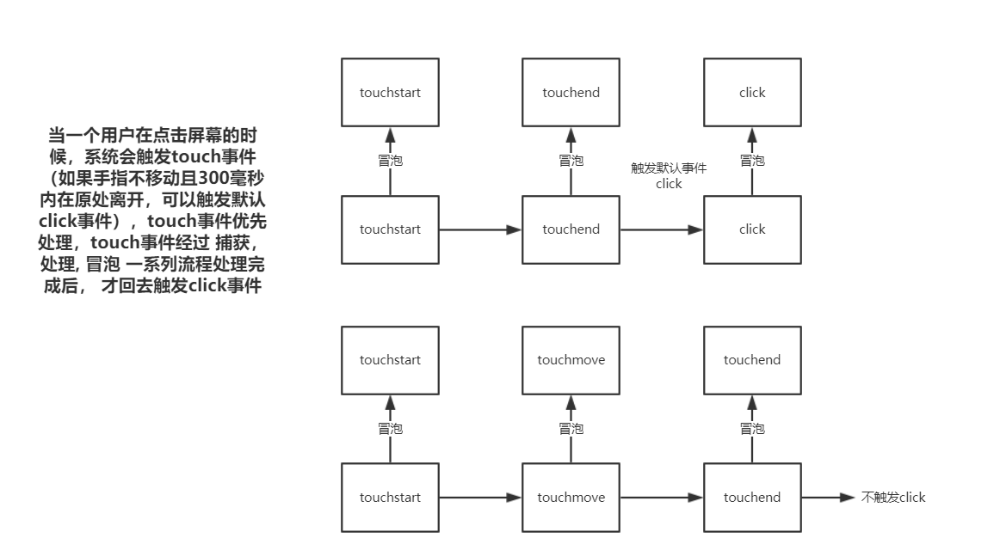
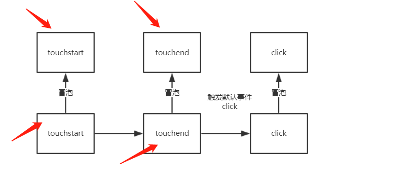

## touch 事件

移动端在 touch 上一共有 4 个事件
touchstart touchmove touchend touchcancel，一般来说，它们执行的顺序为 touchstart -> touchmove -> touchend -> touchcancel . 其中 touchcancel 一般情况下不会触发，也不是这里讨论的焦点。
这里会结合 click 对上面的事件进行讨论, touch 发生在 click 之前

```html
<!DOCTYPE html>
<html>
  <head>
    <meta name="viewport" content="width=device-width" />
    <style type="text/css">
      * {
        padding: 0;
        margin: 0;
      }
      #box {
        background: red;
        width: 375px;
        height: 375px;
      }
    </style>
  </head>

  <body>
    <div id="box"></div>
  </body>
  <script type="text/javascript">
    var box = document.getElementById("box");
    box.addEventListener("touchstart", function (e) {
      console.log("box->touchstart");
    });
    box.addEventListener("touchmove", function (e) {
      console.log("box->touchmove");
    });
    box.addEventListener("touchend", function (e) {
      console.log("box->touchend");
    });
    box.addEventListener("click", function (e) {
      console.log("box->click");
    });
    document.body.addEventListener("touchstart", function (e) {
      console.log("body->touchstart");
    });
    document.body.addEventListener("touchmove", function (e) {
      console.log("body->touchmove");
    });
    document.body.addEventListener("touchend", function (e) {
      console.log("body->touchend");
    });
    document.body.addEventListener("click", function (e) {
      console.log("body->click");
    });
  </script>
</html>
```

在红色区域点击会出现什么效果呢？ 出现的是

```
box->touchstart
body->touchstart
box->touchend
body->touchend
box->click
body->click
```

奇怪了 touchmove 为何不执行，因为我们并没有移动，也就是说，必须触碰到屏幕上面，而且发生了移动动作，touchmove 才执行，现在我们触碰到，而且手指稍微动一下，发现输出的效果是，

```
box->touchstart
body->touchstart
box->touchmove
body->touchmove
box->touchmove
body->touchmove
box->touchend
body->touchend
```

其中 touchmove 可能触发多次，又奇怪了， click 为何不执行， 因为 click 执行的条件是 点击， 而且不移动 所以一般情况下，我们可以理解成 touchmove 和 click 是相斥的。
我们知道，当一个用户在点击屏幕的时候，系统会触发 touch 事件和 click 事件，touch 事件优先处理，touch 事件经过 捕获，处理, 冒泡 一系列流程处理完成后， 才回去触发 click 事件


既然 touch 事件和 click 事件有了优先级别，那么能不能在 touch 阶段取消掉系统触发的 click 事件呢？当然是可以的，浏览器提供了这样的能力。在 touch 事件里面，调用 e.preventDefault() 就可以阻止本次点击系统触发的 click 事件，即本次相关的 click 都不会执行

```js
box.addEventListener("touchstart", function (e) {
  e.preventDefault();
});
```

然后点击之后的结果

```
box->touchstart
body->touchstart
box->touchend
body->touchend
```

发现没有 click 事件了， 说明 click 被阻止了，当然在 touchend 里面加效果也一样，所以 在 touch 事件里面加`e.preventDefault`可以取消系统默认产生的 click 事件， 当然了，这并不会阻止后面的 touch 事件。
注意在图中红箭头标注的任何一个节点上面取消默认事件，都可以达到取消 click 的效果


## 事件点透

```html
<!DOCTYPE html>
<html>
  <head>
    <meta name="viewport" content="width=device-width" />
    <style type="text/css">
      * {
        padding: 0;
        margin: 0;
      }
      #box {
        position: relative;
      }

      #box1 {
        position: absolute;
        z-index: 1;
        background: red;
        width: 500px;
        height: 500px;
      }

      #box2 {
        background: green;
        width: 500px;
        height: 500px;
      }
    </style>
  </head>
  <body>
    <div id="box">
      <div id="box1"></div>
      <div id="box2"></div>
    </div>
  </body>
  <script type="text/javascript">
    var box1 = document.getElementById("box1");
    var box2 = document.getElementById("box2");
    box1.addEventListener("touchstart", function (e) {
      box1.style.display = "none";
    });

    box2.onclick = function () {
      console.log("box2莫名被点击了");
    };
  </script>
</html>
```

本来是 box1 和 box2 是兄弟节点，即他们之间不会发生什么 事件传递， 目前 box1 相当于一个覆盖层，覆盖在 box2 上面， 按理说点击 box1 的时候，box1 会阻挡所有的事件，事件不会传递给 box2，当点击 box1 的时候，实际上 box2 也发生了点击事件，即上面的输出结果为 box1 消失， 输出 box2 莫名被点击了, 这就是点透

点透发生的条件

1.  A 和 B 不是后代继承关系(如果是后代继承关系的话，就直接是冒泡子类的话题了)
2.  A 发生 touch， A touch 后立即消失， B 事件绑定 click
3.  A z-index 大于 B，即 A 显示在 B 浮层之上

点透发生的理由: 当手指触摸到屏幕的时候，系统生成两个事件，一个是 touch 一个是 click，touch 先执行，touch 执行完成后，A 从文档树上面消失了，而且由于移动端 click 还有延迟 200-300ms 的关系，当系统要触发 click 的时候，发现在用户点击的位置上面，目前离用户最近的元素是 B，所以就直接把 click 事件作用在 B 元素上面了.
那如何才能解决点透问题呢？ 还记得我之前说过么，系统提供了先触发的 touch 事件去取消系统生成的 click 事件，所以只要在 touch 事件的某个处理函数中 执行 e.preverDefault 即可， 一般我们在 touchend 中执行

在上面代码中，加上这句就完美解决了，但是一些浏览器存在兼容性问题。

```js
box1.addEventListener("touchend", function (e) {
  e.preventDefault();
});
```

当然点透问题，还有其他的解决方法，关键是要么是当系统触发 click 的时候，当前的触发 touch 的那个 dom 节点还存在。比如将其一延迟 300ms 在关闭

```js
setTimeout(() => {
  box1.style.display = "none";
}, 300);
```

要么就在遮罩层上使用 click 事件，对于遮盖浮层，由于遮盖浮层的点击即使有小延迟也是没有关系的，反而会有疑似更好的用户体验，所以这种情况，可以针对遮盖浮层自己采用 click 事件而不要用 touchstart 事件，这样就不会出现点透问题。还可以使用第三方库 fastclick

```js
window.addEventListener(
  "load",
  function () {
    FastClick.attach(document.body);
  },
  false
);
```

## 参考

https://blog.flqin.com/360.html
https://www.cnblogs.com/zhuzhenwei918/p/7588553.html
