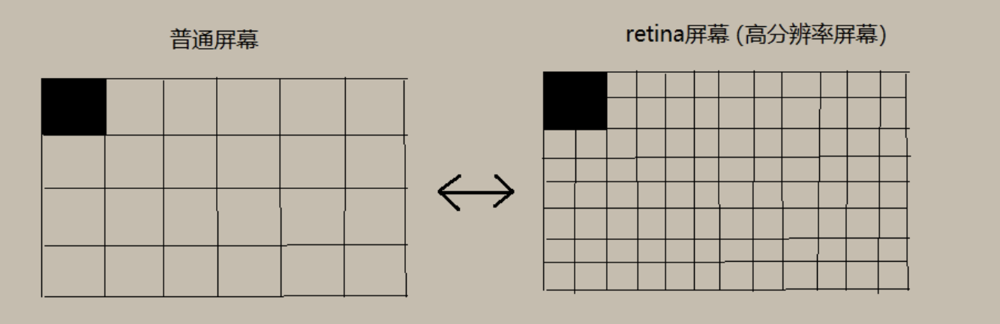
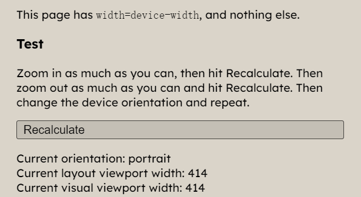

## 视口

​		视口(Viewport)是移动 Web 开发中一个非常重要的概念，最早是由苹果公司在推出 iPhone 手机时发明的，其目的是为了让 iPhone 的小屏幕尽可能完整显示整个网页。通过设置视口，不管网页原始的分辨率尺寸有多大，都能将其缩小显示在手机浏览器上，这样保证网页在手机上看起来更像在桌面浏览器中的样子。

###  布局视口

​		布局视口(layout viewport)：当我们以百分比来指定一个元素的大小时，它的计算值是由这个元素的包含块计算而来的。当这个元素是最顶级的元素时，它就是基于布局视口来计算的。
​		在移动端，一般移动端浏览器都默认设置了布局视口的宽度，根据设备的不同，布局视口的默认宽度大部分为 980px，这保证 PC 的网页可以在手机浏览器上呈现，但是非常小，用户可以手动对网页进行放大。这个宽度并不适合在手机屏幕中展示。移动端浏览器之所以采用这样的默认设置，是为了解决早期的 PC 端页面在手机上显示的问题。下面就是布局视口。


### 视觉视口

​		视觉视口(visual viewport )是指用户正在看到的网站的区域，这个区域的宽度等同于移动设备的浏览器窗口的宽度（包括滚动条宽度）。当用户对浏览器进行缩放时会改变视觉视口的大小。浏览器窗口中的 CSS 像素会随着视觉视口的放大而放大，这时一个 CSS 像素会跨越更多的物理像素。所以，布局视口会限制你的 CSS 布局而视觉视口决定用户具体能看到什么。当你知道一个视觉视口是`414*736`，你就可以想象整个屏幕被竖向有413条线，横向有735条线，页面上总共有`414*736`个格子。


### 理想视口

​		理想视口(ideal viewport )是指对设备来讲最理想的视口尺寸。采用理想视口的方式，可以使网页在移动端浏览器上获得最理想的浏览和阅读的宽度。在理想视口情况下，布局视口的大小和视觉视口宽度是一致的，这样就不需要左右滚动页面了。

​		在开发中，为了实现理想视口，需要给移动端页面添加标签配置视口，通知浏览器来进行处理。在进行移动设备 web 开发时，我们总会用到这样一条代码。首先这句话是对 PC 端是不起作用的

```html
<meta
  name="viewport"
  content="width=device-width; initial-scale=1; maximum-scale=1; minimum-scale=1; user-scalable=no;"
/>
```

## device-width

第一代 iphone 的分辨率为 320\*480，屏幕尺寸为 3.5 寸。当时把布局视口设置成与浏览器宽度一样时，不用每次打开网页放大了，而且显示的字体与桌面上差不多，可读性很好。因此就定义了一个 device-width，即是手机的屏幕分辨率（物理像素），此时 device 翻译为“设备”还合适。

但是第二代 iphone 发布时，屏幕的分辨率变成了 480\*960，而屏幕尺寸仍然为 3.5 寸（像素比为 2），如果 device-width 仍然为手机的屏幕分辨率宽度，那么字体将会比第一代小很多。所以，维持 device-width 的值不变将会是个很好得选择，能与前面兼容。也因此，iphone 上的 device-width 的值一直为 320，只不过 device 再表示“设备”已经不合适了，实际上代表的是一个中间层。在一代 iphone 中一个 css 像素占一个设备像素，而在二代中同样设置一个 css 像素，则占有四个设备像素。这样手机之前的显示效果就相差不大了。



## meta标签测试

​		每个名称/值对都是一个指令总共有六个：

- `width`. 设置布局视口的宽度。
- `initial-scale`. 设置页面的初始缩放和布局视口的宽度。
- `minimum-scale`. 设置最小缩放级别（即用户可以缩小多少）。
- `maximum-scale`. 设置最大缩放级别（即用户可以放大多少）。
- `height`. 应该设置布局视口的高度。
- `user-scalable`. 当设置为`no`阻止用户缩放时。

​		我们来通过不同的meta标签设置来看看布局视口和视觉视口的变化：

​		测试地址：https://www.quirksmode.org/mobile/metaviewport/initialscale/1-none.html

​		首先我们来测试一下

### initial-scale=0.5

```html
<meta name="viewport" content="initial-scale=0.5" />
```


​		可以看出布局视口和视觉视口宽度都是828

### initial-scale=1

```html
<meta name="viewport" content="initial-scale=1" />
```


​		可以看出布局视口和视觉视口宽度都是414

### initial-scale=2

```html
<meta name="viewport" content="initial-scale=2" />
```


​		可以看出布局视口和视觉视口宽度都是207

### width=300

```html
<meta name="viewport" content="width=300" />
```


​		可以看出布局视口和视觉视口宽度都是300

### width=1000

```html
<meta name="viewport" content="width=1000" />
```


​		可以看出布局视口和视觉视口宽度都是1000

### width=device-width

```html
<meta name="viewport" content="width=device-width" />
```



​		可以看出布局视口和视觉视口宽度都是device-width,不同设备device-width不同，比如iphone6 plus就是414，iphone6就是375

### width=device-width,initial-scale=2.0

```html
<meta name="viewport" content="width=device-width,initial-scale=2.0" />
```


​		单独设置`width=device-width`布局视口和视觉视口宽度都是`device-width`,当前设备也就是414，单独设置`initial-scale=2.0`布局视口和视觉视口宽度都是207,从结果看好像是initial-scale决定视觉视口，布局视口最终取值是取大的。我们再来测试一下

### width=device-width,initial-scale=0.5

```html
<meta name="viewport" content="width=device-width,initial-scale=0.5" />
```


​		单独设置`width=device-width`布局视口和视觉视口宽度都是`device-width`,当前设备也就是414，单独设置`initial-scale=0.5`布局视口和视觉视口宽度都是828,可以确认initial-scale决定视觉视口，如果在`width`和`initial-scale`冲突的时候布局视口最终取值是取大的。

​		总结：

- initial-scale 做了两件事。1.它将页面的初始缩放系数设置为相对于理想视口计算的定义值，因此生成视觉视口宽度；2.它将布局视口宽度设置为其刚刚计算的视觉视口宽度。所以我们设置 `initial-scale=1;`就相当于让视觉视口和布局视口等于理想视口；

  ​	

- 单独设置width 是用来控制布局视口的大小的，由于**视觉视口小于≤布局视口**的， 如果**视觉视口＜布局视口**那就有滚动条了，所以为了美观，单独设置width其实视觉视口进行了缩放和布局视口相等了，页面没有滚动条。比如说，在iphone上，我们不设置任何的viewport meta标签，此时layout viewport的宽度为980px，但我们可以看到浏览器并没有出现横向滚动条，浏览器默认的把页面缩小了，缩放值是根据当前情况自动算的。当前缩放值 = ideal viewport宽度 / visual viewport宽度，我们可以得出：**当前缩放值 = 320 / 980**，也就是当前的initial-scale默认值应该是 0.33这样子。当你指定了initial-scale的值后，这个默认值就不起作用了。

通过公式推导进行进一步的解释：

```
布局视口 = max{device-width, 理想视口 / initial-scale};
视觉视口 = 理想视口 / initial-scale;
```

​		从上面式子可以看出，布局视口大于等于视觉视口，若布局视口等于视觉视口页面下面不会出现滚动条。当页面放大的时候可以知道单个 css 像素的面积（单个 css 占据物理像素的个数）变大，所以视觉视口内对应的 css 像素的个数是变少，所以视觉视口变小，视觉视口大小取决于视觉视口内css数量多少。

##  1px 高度实现

当我们在移动端想要实现 1px css 像素的时候，如果像素比等于 2 会显示 2 个物理像素高度，像素比等于 3 会显示 3 个物理像素高度。如果想实现不同设备都是 1px 物理像素，可以通过媒体查询缩放或者图片来解决。

### 图片

```css
.border_1px {
  border-bottom: 1px solid #000;
}
@media only screen and (-webkit-min-device-pixel-ratio: 2) {
  .border_1px {
    background: url(../img/1pxline.png) repeat-x left bottom;
    background-size: 100% 1px;
  }
}
```

### transform

```css
.border_1px:before {
  content: "";
  position: absolute;
  top: 0;
  height: 1px;
  width: 100%;
  background-color: #000;
  transform-origin: 50% 0%;
}
@media only screen and (-webkit-min-device-pixel-ratio: 2) {
  .border_1px:before {
    transform: scaleY(0.5);
  }
}
@media only screen and (-webkit-min-device-pixel-ratio: 3) {
  .border_1px:before {
    transform: scaleY(0.33);
  }
}
```

## 移动端适配方案

尽管我们可以使用设备独立像素来保证各个设备在不同手机上显示的效果类似，但这并不能保证它们显示完全一致，我们需要一种方案来让设计稿得到更完美的适配。

### flexible 方案

flexible 方案是阿里早期开源的一个移动端适配解决方案，引用 flexible 后，我们在页面上统一使用 rem 来布局。
它的核心代码非常简单：

```js
// set 1rem = viewWidth / 10
function setRemUnit() {
  var rem = docEl.clientWidth / 10;
  docEl.style.fontSize = rem + "px";
}
setRemUnit();
```

rem 是相对于 html 节点的 font-size 来做计算的。我们通过设置 document.documentElement.style.fontSize 就可以统一整个页面的布局标准。
上面的代码中，将 html 节点的 font-size 设置为页面 clientWidth(布局视口)的 1/10，即 1rem 就等于页面布局视口的 1/10，这就意味着我们后面使用的 rem 都是按照页面比例来计算的。这时，我们只需要将 UI 出的图转换为 rem 即可。
以 iPhone6 为例：布局视口为 375px，则 1rem = 37.5px，这时 UI 给定一个元素的宽为 75px（设备独立像素），我们只需要将它设置为 75 / 37.5 = 2rem。
当然，每个布局都要计算非常繁琐，我们可以借助 PostCSS 的 px2rem 插件来帮助我们完成这个过程。下面的代码可以保证在页面大小变化时，布局可以自适应，当触发了 window 的 resize 和 pageShow 事件之后自动调整 html 的 fontSize 大小。

```js
  // reset rem unit on page resize
window.addEventListener('resize', setRemUnit)window.addEventListener('pageshow', function (e) {
    if (e.persisted) {
      setRemUnit()
    }
})
```

由于 viewport 单位得到众多浏览器的兼容，上面这种方案现在已经被官方弃用：

- lib-flexible 这个过渡方案已经可以放弃使用，不管是现在的版本还是以前的版本，都存有一定的问题。建议大家开始使用 viewport 来替代此方案。

下面我们来看看现在最流行的 vh、vw 方案。

###  vh、vw 方案

vh、vw 方案即将视觉视口宽度 window.innerWidth 和视觉视口高度 window.innerHeight 等分为 100 份。
上面的 flexible 方案就是模仿这种方案，因为早些时候 vw 还没有得到很好的兼容。

- vw(Viewport's width)：1vw 等于视觉视口的 1%
- vh(Viewport's height) : 1vh 为视觉视口高度的 1%（基本不用，因为垂直方向有滚动条很正常）
- vmin : vw 和 vh 中的较小值
- vmax : 选取 vw 和 vh 中的较大值

如果视觉视口为 375px，那么 1vw = 3.75px，这时 UI 给定一个元素的宽为 75px（设备独立像素），我们只需要将它设置为 75 / 3.75 = 20vw。
这里的比例关系我们也不用自己换算，我们可以使用 PostCSS 的 postcss-px-to-viewport 插件帮我们完成这个过程。写代码时，我们只需要根据 UI 给的设计图写 px 单位即可。当然，没有一种方案是十全十美的，vw 同样有一定的缺陷：

- px 转换成 vw 不一定能完全整除，因此有一定的像素差。
- 当容器使用 vw，margin 采用 px 时，很容易造成整体宽度超过 100vw，从而影响布局效果。当然我们也是可以避免的，例如使用 padding 代替 margin，结合 calc()函数使用等等...

##  参考

- <https://juejin.cn/post/6844903845617729549#heading-45>
