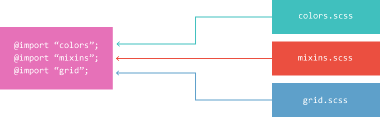

# SassScript

```
在 CSS 属性的基础上 Sass 提供了一些名为 SassScript 的新功能。 SassScript 可作用于任何属性，允许属性使用变量、算数运算等额外功能。

弱类型语言, 对语法要求没那么严格
```

## 一、注释

1. Sass 支持标准的 CSS 多行注释 `/* */`，以及单行注释 `//`，前者会被完整输出到编译后的 CSS 文件中，而后者则不会。

2. 将 `!` 作为多行注释的第一个字符表示在压缩输出模式下保留这条注释并输出到 CSS 文件中，通常用于添加版权信息。

3. 插值语句 (interpolation) 也可写进多行注释中输出变量值

例如：

```scss
/* 
	hello
	world!
*/

// compile scss files to css
// it's ready to do it.
$pink: #f3e1e1;
html {
  background-color: $pink;
}

$author: "gdream@126.com";
/*!
	Author: #{$author}.
*/
```

开发模式编译后:

```css
/* 
	hello
	world!
*/
html {
  background-color: #f3e1e1;
}
/*!
	Author: 'gdream@126.com'.
*/
```

压缩输出模式编译后：

```css
html {
  background-color: #f3e1e1;
}
/*!
	Author: 'gdream@126.com'.
*/
```

---

## 二、变量

### 1.定义

变量以美元符号开头，赋值方法与 CSS 属性的写法一样,scss 的变量名可以与 css 中的属性名和选择器名称相同，包括中划线和下划线。在使用中划线还是下划线来进行变量分隔完全根据个人喜好。scss 完全兼容这两种写法，也就是说 scss 认为中划线和下划线是完全等同的。个人更喜欢使用中划线(-)

```scss
$width: 1600px;
$pen-size: 3em;
```

### 2.使用

直接使用变量的名称即可调用变量

```scss
#app {
  height: $width;
  font-size: $pen-size;
}
```

### 3.作用域

变量支持块级作用域，嵌套规则内定义的变量只能在嵌套规则内使用（局部变量），不在嵌套规则内定义的变量则可在任何地方使用（全局变量）。将局部变量转换为全局变量可以添加 `!global` 声明

```scss
#foo {
  $width: 5em !global;
  width: $width;
}

#bar {
  width: $width;
}
```

编译后：

```css
#foo {
  width: 5em;
}

#bar {
  width: 5em;
}
```

---

## 三、数据类型

SassScript 支持 7 种主要的数据类型：

- 数字，`1, 2, 13, 10px`
- 字符串，有引号字符串与无引号字符串，`"foo", 'bar', baz`
- 颜色，`blue, #04a3f9, rgba(255,0,0,0.5)`
- 布尔型，`true, false`
- 空值，`null`
- 数组 (list)，用空格或逗号作分隔符，`1.5em 1em 0 2em, Helvetica, Arial, sans-serif`
- maps, 相当于 JavaScript 的 object，`(key1: value1, key2: value2)`

SassScript 也支持其他 CSS 属性值，比如 Unicode 字符集，或 `!important` 声明。然而 Sass 不会特殊对待这些属性值，一律视为无引号字符串。

判断数据类型的方式：`type-of($value)`

### 1.字符串 (Strings)

SassScript 支持 CSS 的两种字符串类型：`有引号字符串 (quoted strings)`，和`无引号字符串 (unquoted strings)`。

```scss
$name: "Tom Bob";
$container: "top bottom";
$what: heart;

// 注：在编译 CSS 文件时不会改变其类型。只有一种情况例外，使用 `#{}` (interpolation) 时，有引号字符串将被编译为无引号字符串，这样便于在 mixin 中引用选择器名
```

### 2.数字(Numbers)

SassScript 支持两种数字类型：`带单位数字`和`不带单位数字`。（可正可负可为零，可正可浮点）

```scss
$my-age: 19;
$your-age: 19.5;
$height: 120px;

// 注：单位会和数字当做一个整体，进行算数运算
```

### 3.空值(Null)

只有一个取值`null`

```scss
$value: null;

// 注：由于它代表空，所以不能够使用它与任何类型进行算数运算
```

### 4.布尔型(Booleans)

只有两个取值：`true`和`false`

```scss
$a: true;
$b: false;

// 注：只有自身是false和null才会返回false，其他一切都将返回true
```

### 5.数组 (Lists)

通过空格或者逗号分隔的一系列的值。事实上，独立的值也被视为数组 —— 只包含一个值的数组。索引从`1`开始

```scss
$list0: 1px 2px 5px 6px;
$list1: 1px 2px, 5px 6px;
$list2: (1px 2px) (5px 6px);
```

数组中可以包含子数组，比如 `1px 2px, 5px 6px` 是包含 `1px 2px` 与 `5px 6px` 两个数组的数组。如果内外两层数组使用相同的分隔方式，需要用圆括号包裹内层，所以也可以写成 `(1px 2px) (5px 6px)`。变化是，之前的 `1px 2px, 5px 6px` 使用逗号分割了两个子数组 (comma-separated)，而 `(1px 2px) (5px 6px)` 则使用空格分割(space-separated)。

当数组被编译为 CSS 时，Sass 不会添加任何圆括号（CSS 中没有这种写法），所以 `(1px 2px) (5px 6px)` 与 `1px 2px, 5px 6px` 在编译后的 CSS 文件中是完全一样的，但是它们在 Sass 文件中却有不同的意义，前者是包含两个数组的数组，而后者是包含四个值的数组。

用 `()` 表示不包含任何值的空数组（在 Sass 3.3 版之后也视为空的 map）。空数组不可以直接编译成 CSS，比如编译 `font-family: ()` Sass 将会报错。如果数组中包含空数组或空值，编译时将被清除，比如 `1px 2px () 3px` 或 `1px 2px null 3px`。

基于逗号分隔的数组允许保留结尾的逗号，这样做的意义是强调数组的结构关系，尤其是需要声明只包含单个值的数组时。例如 `(1,)` 表示只包含 `1` 的数组，而 `(1 2 3,)` 表示包含 `1 2 3` 这个以空格分隔的数组的数组。

### 6.映射(Maps)

Maps 必须被圆括号包围，可以映射任何类型键值对（任何类型，包括内嵌 maps，不过不推荐这种内嵌方式）

```scss
$map: (
  $key1: value1,
  $key2: value2,
  $key3: value3,
);
```

### 7.颜色 (Colors)

CSS 原有颜色类型，十六进制、RGB、RGBA、HSL、HSLA 和色彩单词

SCSS 提供了内置 Colors 函数，从而更方便地使用颜色

```scss
$color0: green;
$color1: lighten($color, 15%);
$color2: darken($color, 15%);
$color3: saturate($color, 15%);
$color4: desaturate($color, 15%);
$color5: (green + red);
```

---

## 四、运算

### 1.数字运算符

SassScript 支持数字的加减乘除、取整等运算 (`+, -, *, /, %`)，如果必要会在不同单位间转换值

如果要保留运算符号，则应该使用插值语法

- `+`

  ```scss
  // 纯数字
  $add1: 1 + 2; // 3
  $add2: 1 + 2px; // 3px
  $add3: 1px + 2; // 3px
  $add4: 1px + 2px; //3px

  // 纯字符串
  $add5: "a" + "b"; // "ab"
  $add6: "a" + b; // "ab"
  $add7: a + "b"; // ab
  $add8: a + b; // ab

  // 数字和字符串
  $add9: 1 + a; // 1a
  $adda: a + 1; // a1
  $addb: "1" + a; // "1a"
  $addc: 1 + "a"; // "1a"
  $addd: "a" + 1; // "a1"
  $adde: a + "1"; // a1
  $addf: 1 + "1"; // "11"
  ```

  ```scss
  // 总结：
  a.纯数字：只要有单位，结果必有单位
  b.纯字符串：第一个字符串有无引号决定结果是否有引号
  c数字和字符串：第一位有引号，结果必为引号；第一位对应数字非数字且最后一位带有引号，则结果必为引号
  ```

- `-`

  ```scss
  $add1: 1 - 2; // -1
  $add2: 1 - 2px; // -1px
  $add3: 1px - 2; // -1px
  $add4: 1px - 2px; //-1px

  $sub1: a - 1; // a-1
  $sub2: 1 - a; // 1-a
  $sub3: "a" - 1; // "a"-1
  $sub4: a - "1"; // a-"1"
  ```

  ```scss
  // 总结：
  每个字段必须前部分为数字，且两个字段只能一个后部分是字符(因为此时后缀被当被单位看待了)。
  只要其中一个值首位不为数字的，结果就按顺序去除空格后拼接起来
  ```

- `*`

  ```scss
  $num1: 1 * 2; // 2
  $mul2: 1 * 2px; // 2px
  $num3: 1px * 2; // 2px
  $num4: 2px * 2px; // 编译不通过

  $num5: 1 * 2abc; // 2abc
  ```

  ```scss
  // 总结：
  每个字段必须前部分为数字，且两个字段只能一个后部分是字符(因为此时后缀被当被单位看待了)。其余编译不通过
  ```

- `/`

  ```scss
  // 总结：
  a.不会四舍五入，精确到小数点后5位
  b.每个字段必须前部分为数字，且当前者只是单纯数字无单位时，后者(除数)后部分不能有字符。其余结果就按顺序去除空格后拼接起来。
  (因为此时后缀被当被单位看待了)
  ```

- `%`

  ```scss
  // 总结：
  a.值与"%"之间必须要有空格，否则会被看做字符串
  ```

### 2.关系运算符

大前提：两端必须为`数字` 或 `前部分数字后部分字符`

返回值：`true` or `false`

- `>`

  ```scss
  $a: 1 > 2; // false
  ```

- `<`

  ```scss
  $a: 1 > 2; // true
  ```

- `>=`

  ```scss
  $a: 1 >= 2; // false
  ```

- `<=`

  ```scss
  $a: 1 <= 2; // true
  ```

### 3.相等运算符

作用范围：相等运算 `==, !=` 可用于所有数据类型

返回值：`true` or `false`

```scss
$a: 1 == 1px; // true
$b: "a" == a; // true
```

```scss
// 总结：
前部分为不带引号数字时，对比的仅仅是数字部分；反之，忽略引号，要求字符一一对应
```

### 4.布尔运算符

SassScript 支持布尔型的 `and` `or` 以及 `not` 运算。

```scss
$a: 1>0 and 0>=5; // fasle
```

```scss
// 总结：
值与"and"、"or"和"not"之间必须要有空格，否则会被看做字符串
```

### 5.颜色值运算

颜色值的运算是分段计算进行的，也就是分别计算红色，绿色，以及蓝色的值

- `颜色值与颜色值`

  ```scss
  p {
    color: #010203 + #040506;
  }

  // 计算 01 + 04 = 05 02 + 05 = 07 03 + 06 = 09，然后编译为
  // p {
    color: #050709; }
  ```

- `颜色值与数字`

  ```scss
  p {
    color: #010203 * 2;
  }

  // 计算 01 * 2 = 02 02 * 2 = 04 03 * 2 = 06，然后编译为
  // p {
    color: #020406; }
  ```

- `RGB和HSL`

  ```scss
  // 如果颜色值包含 alpha channel（rgba 或 hsla 两种颜色值），必须拥有相等的 alpha 值才能进行运算，因为算术运算不会作用于 alpha 值。
  
  p {
    color: rgba(255, 0, 0, 0.75) + rgba(0, 255, 0, 0.75);
  }
  
  // p {
    color: rgba(255, 255, 0, 0.75); }
  ```

### 6.运算优先级

0. `()`

1. `*`、`/`、`%`
2. `+`、`-`
3. `>` 、`<`、`>=`、`<=`

---

## 五、嵌套语法

**属性嵌套**

常规嵌套就不用说了，很容易理解，但是使用 scss 不但可以实现选择器的嵌套，属性也可以进行嵌套。

首先看一段代码实例:

```scss
nav {
  border-style: solid;
  border-width: 1px;
  border-color: #ccc;
}
```

在 scss 看来，上面的代码也是可以进行简化的，代码如下:

```scss
nav {
  border: {
    style: solid;
    width: 1px;
    color: #ccc;
  }
}
```

规则如下:

（1）把属性名从中划线-的地方断开。

（2）在根属性后边添加一个冒号:紧跟一个块，把子属性部分写在这个{ }块中。

再来看一段代码实例:

```scss
nav {
  border: 1px solid #ccc;
  border-left: 0px;
  border-right: 0px;
}
```

上面的 css 代码可以使用 scss 改造如下:

```scss
nav {
  border: 1px solid #ccc {
    left: 0px;
    right: 0px;
  }
}
```

**&父选择器标识符**

在使用选择器嵌套的时候有一种情况需要特别注意，先看一段 scss 代码实例:

```scss
.text a {
  color: blue;
  :hover {
    color: red;
  }
}
```

也许写此段代码目的是为了将其编译成如下 css 代码:

```scss
.text a {
  color: blue;
}
.text a:hover {
  color: red;
}
```

但是现实并非如此，它会按照选择器嵌套原则将其编译成如下 css 代码:

```scss
.text a {
  color: blue;
}
.text a :hover {
  color: red;
}
```

上面的代码实现的效果是: class 为 text 的所有后代 a 标签的所有后代元素，当鼠标悬浮时，字体颜色都会变为红色。

这个时候就可以使用&父选择器标识符，它的作用就相当于一个父选择器的占位符。可以实现 class 为 text 的所有后代 a 标签的元素，当鼠标悬浮时，字体颜色都会变为红色。

```scss
.text a {
  color: blue;
  &:hover {
    color: red;
  }
}
```

上面的代码编译的时候，会将&替换为父选择器 a，编译后的 css 代码如下:

```scss
.text a {
  color: blue;
}
.text a:hover {
  color: red;
}
```

当然，&父选择器标识符并不仅仅用于链接伪类选择器，看如下 scss 代码实例:

```scss
#content aside {
  color: red;
  body.ie & {
    color: green;
  }
}
```

编译为 css 代码如下:

```scss
#content aside {
  color: red;
}
body.ie #content aside {
  color: green;
}
```

---

## 六、杂货语法

### 1.`插值语法`

通过 `#{}` 插值语句可以在选择器、属性名和属性值中使用变量。

但大多数情况下，这样使用属性值可能还不如直接使用变量方便，但是使用 `#{}` 可以避免 Sass 运行运算表达式，直接编译 CSS。

```scss
$name: foo;
$attr: border;
p.#{$name} {
  #{$attr}-color: $name;
}

// 编译后：
p.foo {
  border-color: foo;
}
```

### 2.`& in SassScript`

`&`为父选择器

```scss
a {
  color: yellow;
  &:hover {
    color: green;
  }
  &:active {
    color: blank;
  }
}
```

### 3.`!default`

可以在变量的结尾添加 `!default` 表示变量之前有定义，就不会被覆盖。可以理解为降低优先级。

```scss
$content: "First content";
$content: "Second content?" !default;
$new_content: "First time reference" !default;

#main {
  content: $content;
  new-content: $new_content;
}

// 编译为：
#main {
  content: "First content";
  new-content: "First time reference";
}
```

 `!default`一个重要的作用就是，如果我们引入的他人 scss 文件中的变量有默认值的设置，那么我们就可以很灵活的来修改这些默认值，只要在这些导入文件之前引入就一个配置 scss 文件即可,而无需修改他人的 scss 文件，例如:

```
@import "config";
@import "variables";
@import "mixins";
```

只要将重新配置的变量值写入`config.scss`文件，即可实现修改`variables.scss`和`mixins.scss`中默认变量值。

### 3.`!global`

将局部变量提升为全局变量

### 4.`!optional`

optional 翻译成汉语具有"可选的"的意思。顾名思义，!optional 标记前面的扩展不必须生成一个新的选择器。看一段 SCSS 代码片段：

```
p{
   color:red;
   @extend .notice
 }
```

由于并不存在一个名为 notice 的样式类，所以上述代码会报错。代码修改如下：

```
p{
  color:red;
  @extend .notice !optional
}
```

由于是可选的，即便 notice 样式类不存在也不会报错。编译结果如下：

```
p {
  color: red;
}
```

---

## 七、@-Rules 与指令

### 1.`@import`

 css 有一个特别不常用的特性，即@import 规则，它允许在一个 css 文件中导入其他 css 文件。然而，后果是只有执行到@import 时，浏览器才会去下载其他 css 文件，这导致页面加载起来特别慢。

 scss 也有一个`@import`规则，但不同的是，scss 的`@import`规则在生成 css 文件时就把相关文件导入进来。这意味着所有相关的样式被归纳到了同一个 css 文件中，而无需发起额外的下载请求。另外，所有在被导入文件中定义的变量和混合器均可在导入文件中使用。

 使用 scss 的@`import`规则并不需要指明被导入文件的全名。你可以省略.sass 或.scss 文件后缀（见下图）。这样，在不修改样式表的前提下，你完全可以随意修改你或别人写的被导入的 scss 样式文件语法，在 sass 和 scss 语法之间随意切换。举例来说，`@import"sidebar";`这条命令将把 sidebar.scss 文件中所有样式添加到当前样式表中。



####　使用 SCSS 部分文件(partial)

 当通过`@import`把`scss`样式分散到多个文件时，你通常只想生成少数几个`css`文件。那些专门为`@import`命令而编写的`scss`文件，并不需要生成对应的独立`css`文件，这样的`scss`文件称为局部文件。对此，`sass`有一个特殊的约定来命名这些文件。

 此约定即，`scss`局部文件的文件名以下划线开头。这样，`scss`就不会在编译时单独编译这个文件输出`css`，而只把这个文件用作导入。当你`@import`一个局部文件时，还可以不写文件的全名，即省略文件名开头的下划线。举例来说，你想导入`themes/_night-sky.scss`这个局部文件里的变量，你只需在样式表中写`@import` `"themes/night-sky";`。

局部文件可以被多个不同的文件引用。当一些样式需要在多个页面甚至多个项目中使用时，这非常有用。在这种情况下，有时需要在你的样式表中对导入的样式稍作修改，`scss`有一个功能刚好可以解决这个问题，即默认变量值。

#### 默认变量值

一般情况下，你反复声明一个变量，只有最后一处声明有效且它会覆盖前边的值。举例说明：

```scss
$link-color: blue;
$link-color: red;
a {
  　　color: $link-color;
}
```

在上边的例子中，超链接的`color`会被设置为`red`。这可能并不是你想要的结果，假如你写了一个可被他人通过`@import`导入的`sass`库文件，你可能希望导入者可以定制修改`sass`库文件中的某些值。使用`sass`的`!default`标签可以实现这个目的。它很像`css`属性中`!important`标签的对立面，不同的是`!default`用于变量，含义是：如果这个变量被声明赋值了，那就用它声明的值，否则就用这个默认值。

```scss
$fancybox-width: 400px !default;
.fancybox {
  width: $fancybox-width;
}
```

在上例中，如果用户在导入你的`sass`局部文件之前声明了一个`$fancybox-width`变量，那么你的局部文件中对`$fancybox-width`赋值`400px`的操作就无效。如果用户没有做这样的声明，则`$fancybox-width`将默认为`400px`。

#### 嵌套导入

跟原生的`css`不同，`scss`允许`@import`命令写在`css`规则内。这种导入方式下，生成对应的`css`文件时，局部文件会被直接插入到`css`规则内导入它的地方。举例说明，有一个名为`_blue-theme.scss`的局部文件，内容如下**：**

```css
.aside {
  background: blue;
  color: white;
}
```

然后把它导入到一个 CSS 规则内，如下所示：

```css
.blue-theme {
  @import "blue-theme";
}
//生成的结果跟你直接在.blue-theme选择器内写_blue-theme.scss文件的内容完全一样。
.blue-theme {
  .aside {
    background: blue;
    color: #fff;
  }
}
```

被导入的局部文件中定义的所有变量和混合器，也会在这个规则范围内生效。这些变量和混合器不会全局有效，这样我们就可以通过嵌套导入只对站点中某一特定区域运用某种颜色主题或其他通过变量配置的样式。

有时，可用`css`原生的`@import`机制，在浏览器中下载必需的`css`文件。`scss`也提供了几种方法来达成这种需求。

#### 原生的 CSS 导入

由于`scss`兼容原生的`css`，所以它也支持原生的`CSS@import`。尽管通常在`scss`中使用`@import`时，`sass`会尝试找到对应的`scss`文件并导入进来，但在下列三种情况下会生成原生的 CSS`@import`，尽管这会造成浏览器解析 css 时的额外下载：

- 被导入文件的名字以`.css`结尾；
- 被导入文件的名字是一个 URL 地址（比如http://www.sass.hk/css/css.css），由此可用谷歌字体API提供的相应服务；
- 被导入文件的名字是`CSS`的 url()值。

这就是说，你不能用`scss`的`@import`直接导入一个原始的`css`文件，因为`scss`会认为你想用`css`原生的`@import`。但是，因为`scss`的语法完全兼容`css`，所以你可以把原始的`css`文件改名为`.scss`后缀，即可直接导入了。

### 2.`@media`

Sass 中 `@media` 指令与 CSS 中用法一样，只是增加了一点额外的功能：允许其在 CSS 规则中嵌套。如果 `@media` 嵌套在 CSS 规则内，编译时，`@media` 将被编译到文件的最外层，包含嵌套的父选择器。这个功能让 `@media` 用起来更方便，不需要重复使用选择器，也不会打乱 CSS 的书写流程。

```scss
.sidebar {
  width: 300px;
  @media screen and (orientation: landscape) {
    width: 500px;
  }
}
// 编译为
.sidebar {
  width: 300px;
  @media screen and (orientation: landscape) {
    width: 500px;
  }
}
```

`@media`的 queries 允许互相嵌套使用，编译时，Sass 自动添加 `and`

```scss
@media screen {
  .sidebar {
    @media (orientation: landscape) {
      width: 500px;
    }
  }
}
// 编译为：
@media screen and (orientation: landscape) {
  .sidebar {
    width: 500px;
  }
}
```

`@media` 甚至可以使用 SassScript（比如变量，函数，以及运算符）代替条件的名称或者值

```scss
$media: screen;
$feature: -webkit-min-device-pixel-ratio;
$value: 1.5;

@media #{$media} and ($feature: $value) {
  .sidebar {
    width: 500px;
  }
}
// 编译为：
@media screen and (-webkit-min-device-pixel-ratio: 1.5) {
  .sidebar {
    width: 500px;
  }
}
```

### 3.`@extend`

`@extend`即`继承`。在设计网页的时候常常遇到这种情况：一个元素使用的样式与另一个元素完全相同，但又添加了额外的样式。

总的来看：支持层叠继承、多继承、允许延伸任何定义给单个元素的选择器（但是允许不一定好用）

a. `基本延伸`

```scss
.error {
  border: 1px #f00;
  background-color: #fdd;
}
.seriousError {
  @extend .error;
  border-width: 3px;
}
// 上面代码的意思是将 .error 下的所有样式继承给 .seriousError，border-width: 3px; 是单独给 .seriousError 设定特殊样式，这样，使用 .seriousError 的地方可以不再使用 .error。
```

`@extend` 的作用是将重复使用的样式 (`.error`) 延伸 (extend) 给需要包含这个样式的特殊样式（`.seriousError`）

注意理解以下情况：

```scss
.error {
  border: 1px #f00;
  background-color: #fdd;
}
.error.intrusion {
  background-image: url("/image/hacked.png");
}
.seriousError {
  @extend .error;
  border-width: 3px;
}
//compile
.error,
.seriousError {
  border: 1px #f00;
  background-color: #fdd;
}

.error.intrusion,
.seriousError.intrusion {
  background-image: url("/image/hacked.png");
}

.seriousError {
  border-width: 3px;
}
```

当合并选择器时，`@extend` 会很聪明地避免无谓的重复，`.seriousError.seriousError` 将编译为 `.seriousError`，不能匹配任何元素的选择器也会删除。

b. `延伸复杂的选择器`：Class 选择器并不是唯一可以被延伸 (extend) 的，Sass 允许延伸任何定义给单个元素的选择器，比如 `.special.cool`，`a:hover` 或者 `a.user[href^="http://"]` 等

c. ` 多重延伸`：同一个选择器可以延伸给多个选择器，它所包含的属性将继承给所有被延伸的选择器

d. `继续延伸`：当一个选择器延伸给第二个后，可以继续将第二个选择器延伸给第三个

e.`*选择器列`：暂时不可以将选择器列 (Selector Sequences)，比如 `.foo .bar` 或 `.foo + .bar`，延伸给其他元素，但是，却可以将其他元素延伸给选择器列。

尽量不使用`合并选择器列`，因为如果凭个人推理的话，会出现排列组合的情况，所以 SASS 编译器只会保留有用的组合形式，但依旧会存在排列组合的情况，有可能会留下隐患。

1. 当两个列合并时，如果没有包含相同的选择器，将生成两个新选择器：第一列出现在第二列之前，或者第二列出现在第一列之前

   ```scss
   #admin .tabbar a {
     font-weight: bold;
   }
   #demo .overview .fakelink {
     @extend a;
   }
   // 编译为：
   #admin .tabbar a,
   #admin .tabbar #demo .overview .fakelink,
   #demo .overview #admin .tabbar .fakelink {
     font-weight: bold;
   }
   ```

2. 如果两个列包含了相同的选择器，相同部分将会合并在一起，其他部分交替输出

   ```scss
   #admin .tabbar a {
     font-weight: bold;
   }
   #admin .overview .fakelink {
     @extend a;
   }
   // 编译为
   #admin .tabbar a,
   #admin .tabbar .overview .fakelink,
   #admin .overview .tabbar .fakelink {
     font-weight: bold;
   }
   ```

f. `在指令中延伸`

在指令中使用 `@extend` 时（比如在 `@media` 中）有一些限制：Sass 不可以将 `@media` 层外的 CSS 规则延伸给指令层内的 CSS.

g. `%placeholder`为选择器占位符，配合`@extend-Only选择器`使用。

效果：只定义了样式，但不会对原有选择器匹配的元素生效

```scss
// example1:
%img {
  color: red;
}
.path {
  @extend %img;
}
// 编译后：
.path {
  color: red;
}
```

```scss
// example2:
#context a%extreme {
  color: blue;
  font-weight: bold;
  font-size: 2em;
}
// 编译后：
.notice {
  @extend %extreme;
}

// 注：必须是"."和"#"选择器
```

### 4.`@at-root`

> The @at-root directive causes one or more rules to be emitted at the root of the document, rather than being nested beneath their parent selectors. It can either be used with a single inline selector

译文：@at root 指令使一个或多个规则在文档的根发出，而不是嵌套在其父选择器下。它可以与单个内联选择器一起使用

且@at-root 使多个规则跳出嵌套

@at-root 默认情况下并不能使规则或者选择器跳出指令，通过使用 without 和 with 可以解决该问题

了解即可

### 5.`@debug`

用于调试，按标准错误输出流输出

```scss
$size: 9px;

.file {
  @debug $size;
}
```

### 6.`@warn`

用于警告，按标准错误输出流输出

### 7.`@error`

用于报错，按标准错误输出流输出

| 序列 | @-rules  | 作用                               |
| ---- | -------- | ---------------------------------- |
| 1    | @import  | 导入 sass 或 scss 文件             |
| 2    | @media   | 用于将样式规则设置为不同的媒体类型 |
| 3    | @extend  | 以继承的方式共享选择器             |
| 4    | @at-root | 转到根节点                         |
| 5    | @debug   | 用于调试，按标准错误输出流输出     |
| 6    | @warn    | 用于警告，按标准错误输出流输出     |
| 7    | @error   | 用于报错，按标准错误输出流输出     |

---

## 九、混合指令

> 混合指令（Mixin）用于定义可重复使用的样式，避免了使用无语意的 class，比如 `.float-left`。混合指令可以包含所有的 CSS 规则，绝大部分 Sass 规则，甚至通过参数功能引入变量，输出多样化的样式。

注意：这不是函数！没有返回值！！

### 1.定义混合指令

混合指令的用法是在 `@mixin` 后添加名称与样式，以及需要的参数（可选）。

```scss
// 格式：
@mixin name {
  // 样式....
}
```

```scss
// example：
@mixin large-text {
  font: {
    family: Arial;
    size: 20px;
    weight: bold;
  }
  color: #ff0000;
}
```

### 2.引用混合样式

使用 `@include` 指令引用混合样式，格式是在其后添加混合名称，以及需要的参数（可选）。

```scss
// 格式：
@include name;

// 注：无参数或参数都有默认值时，带不带括号都可以
```

```scss
// example：
p {
  @include large-text;
}

// compile:
p {
  font-family: Arial;
  font-size: 20px;
  font-weight: bold;
  color: #ff0000;
}
```

### 3.参数

格式：按照变量的格式，通过逗号分隔，将参数写进 Mixin 名称后的圆括号里

支持默认值；支持多参数；支持不定参数；支持位置传参和关键词传参

#### a. 位置传参

```scss
@mixin mp($width) {
  margin: $width;
}

body {
  @include mp(300px);
}
```

#### b.关键词传参

```scss
@mixin mp($width) {
  margin: $width;
}

body {
  @include mp($width: 300px);
}
```

#### c.参数默认值

```scss
@mixin mp($width: 500px) {
  margin: $width;
}

body {
  @include mp($width: 300px);
  // or
  @include mp(300px);
}
```

#### d.不定参数

> 官方：Variable Arguments
>
> 译文：参数变量
>
> 有时，不能确定混合指令需要使用多少个参数。这时，可以使用参数变量 `…` 声明（写在参数的最后方）告诉 Sass 将这些参数视为值列表处理

```scss
@mixin mar($value...) {
  margin: $value;
}
```

### 4.向混合样式中导入内容

在引用混合样式的时候，可以先将一段代码导入到混合指令中，然后再输出混合样式，额外导入的部分将出现在 `@content` 标志的地方

可以看作参数的升级版

```scss
@mixin example {
  html {
    @content;
  }
}
@include example {
  background-color: red;
  .logo {
    width: 600px;
  }
}

// compile:
html {
  background-color: red;
}

html .logo {
  width: 600px;
}
```

---

## 十、函数指令

### 1.内置函数

#### a. 字符串函数

> 索引第一个为 1，最后一个为-1；切片两边均为闭区间

| 函数名和参数类型                        |                   函数作用                    |
| :-------------------------------------- | :-------------------------------------------: |
| quote($string)                          |                   添加引号                    |
| unquote($string)                        |                   除去引号                    |
| to-lower-case($string)                  |                   变为小写                    |
| to-upper-case($string)                  |                   变为大写                    |
| str-length($string)                     |        返回$string 的长度(汉字算一个)         |
| str-index($string，$substring)          |        返回$substring在$string 的位置         |
| str-insert($string, $insert, $index)    |        在$string的$index 处插入$insert        |
| str-slice($string, $start-at, $end-at） | 截取$string的$start-at 和$end-at 之间的字符串 |

#### b. 数字函数

| 函数名和参数类型        |                                  函数作用                                  |
| ----------------------- | :------------------------------------------------------------------------: |
| percentage($number)     |                              转换为百分比形式                              |
| round($number)          |                               四舍五入为整数                               |
| ceil($number)           |                                数值向上取整                                |
| floor($number)          |                                数值向下取整                                |
| abs($number)            |                                 获取绝对值                                 |
| min($number...)         |                                 获取最小值                                 |
| max($number...)         |                                 获取最大值                                 |
| random($number?:number) | 不传入值：获得 0-1 的随机数；传入正整数 n：获得 0-n 的随机整数（左开右闭） |

#### c. 数组函数

| 函数名和参数类型                 |                                        函数作用                                        |
| -------------------------------- | :------------------------------------------------------------------------------------: |
| length($list)                    |                                      获取数组长度                                      |
| nth($list, n)                    |                                   获取指定下标的元素                                   |
| set-nth($list, $n, $value)       |                                向$list的$n 处插入$value                                |
| join($list1, $list2, $separator) |   拼接$list1和list2；$separator 为新 list 的分隔符，默认为 auto，可选择 comma、space   |
| append($list, $val, $separator)  | 向$list的末尾添加$val；$separator 为新 list 的分隔符，默认为 auto，可选择 comma、space |
| index($list, $value)             |                             返回$value值在$list 中的索引值                             |
| zip($lists…)                     |            将几个列表结合成一个多维的列表；要求每个的列表个数值必须是相同的            |

#### d. 映射函数

| 函数名和参数类型        |                 函数作用                 |
| ----------------------- | :--------------------------------------: |
| map-get($map, $key)     |       获取$map中$key 对应的$value        |
| map-merge($map1, $map2) |     合并$map1和$map2，返回一个新$map     |
| map-remove($map, $key)  |     从$map中删除$key，返回一个新$map     |
| map-keys($map)          |            返回$map所有的$key            |
| map-values($map)        |           返回$map所有的$value           |
| map-has-key($map, $key) | 判断$map中是否存在$key，返回对应的布尔值 |
| keywords($args)         |  返回一个函数的参数，并可以动态修改其值  |

#### e. 颜色函数

- **RGB 函数**

  | 函数名和参数类型               |                                          函数作用                                          |
  | ------------------------------ | :----------------------------------------------------------------------------------------: |
  | rgb($red, $green, $blue)       |                                   返回一个 16 进制颜色值                                   |
  | rgba($red,$green,$blue,$alpha) | 返回一个 rgba；$red,$green 和$blue 可被当作一个整体以颜色单词、hsl、rgb 或 16 进制形式传入 |
  | red($color)                    |                                 从$color 中获取其中红色值                                  |
  | green($color)                  |                                 从$color 中获取其中绿色值                                  |
  | blue($color)                   |                                 从$color 中获取其中蓝色值                                  |
  | mix($color1,$color2,$weight?)  |                   按照$weight比例，将$color1 和$color2 混合为一个新颜色                    |

- **HSL 函数**

  | 函数名和参数类型                         | 函数作用                                                                              |
  | ---------------------------------------- | ------------------------------------------------------------------------------------- |
  | hsl($hue,$saturation,$lightness)         | 通过色相（hue）、饱和度(saturation)和亮度（lightness）的值创建一个颜色                |
  | hsla($hue,$saturation,$lightness,$alpha) | 通过色相（hue）、饱和度(saturation)、亮度（lightness）和透明（alpha）的值创建一个颜色 |
  | saturation($color)                       | 从一个颜色中获取饱和度（saturation）值                                                |
  | lightness($color)                        | 从一个颜色中获取亮度（lightness）值                                                   |
  | adjust-hue($color,$degrees)              | 通过改变一个颜色的色相值，创建一个新的颜色                                            |
  | lighten($color,$amount)                  | 通过改变颜色的亮度值，让颜色变亮，创建一个新的颜色                                    |
  | darken($color,$amount)                   | 通过改变颜色的亮度值，让颜色变暗，创建一个新的颜色                                    |
  | hue($color)                              | 从一个颜色中获取亮度色相（hue）值                                                     |

- **Opacity 函数**

  |                                                             |                  |
  | ----------------------------------------------------------- | ---------------- |
  | alpha($color)/opacity($color)                               | 获取颜色透明度值 |
  | rgba($color,$alpha)                                         | 改变颜色的透明度 |
  | opacify($color, $amount) / fade-in($color, $amount)         | 使颜色更不透明   |
  | transparentize($color, $amount) / fade-out($color, $amount) | 使颜色更加透明   |

#### f. Introspection 函数

| 函数名和参数类型               |                            函数作用                             |
| ------------------------------ | :-------------------------------------------------------------: |
| type-of($value)                |                        返回$value 的类型                        |
| unit($number)                  |                       返回$number 的单位                        |
| unitless($number)              |            判断$number 是否带单位，返回对应的布尔值             |
| comparable($number1, $number2) | 判断$number1和$number2 是否可以做加、减和合并，返回对应的布尔值 |

### 2.自定义函数

> Sass 支持自定义函数，并能在任何属性值或 Sass script 中使用
>
> Params: 与 Mixin 一致
>
> 支持返回值

**基本格式：**

```scss
@function fn-name($params...) {
  @return $params;
}
```

```scss
// example:
@function fn-name($params...) {
  @return nth($params, 1);
}
p {
  height: fn-name(1px);
}

// compiled:
p {
  height: 1px;
}
```

---

## 十一、其他

### 导出`:export`

scss可以定义变量然后导出，这样js文件可以通过导入的方式获取到scss定义的变量

```scss
$menuText:#bfcbd9;
$menuActiveText:#409EFF;
$subMenuActiveText:#f4f4f5;

// $menuBg:#304156;
$menuBg:#304156;
$menuHover:#263445;

$subMenuBg:#1f2d3d;
$subMenuHover:#001528;

$backWhite:#ffffff;

$sideBarWidth: 210px;

:export {
  menuText: $menuText;
  menuActiveText: $menuActiveText;
  subMenuActiveText: $subMenuActiveText;
  menuBg: $menuBg;
  menuHover: $menuHover;
  subMenuBg: $subMenuBg;
  subMenuHover: $subMenuHover;
  sideBarWidth: $sideBarWidth;
  backWhite: $backWhite;
}

```
`js`通过`esm`的方式导入，这样`js`就可以获取到`scss`中定义到的变量了

```js
import style from 'indec.scss'
console.log(style.menuText)
```


## 十二、细节与展望

### 1.细节

a. @extend、@Mixin 和@function 的选择

[原文链接](https://csswizardry.com/2016/02/mixins-better-for-performance/)


> `minxins`在网络传输中比`@extend` 拥有更好的性能.尽管有些文件未压缩时更大，但使用`gzip`压缩后，依然可以保证我们拥有更好的性能。

**所以@extend 我们就尽量不要使用了，而@Mixin 和@function 的差别在定义和使用上**

> 定义方式不同： `@function` 需要调用`@return`输出结果。而 @mixin 则不需要。
>
> 使用方式不同：`@mixin` 使用`@include`引用，而 `@function` 使用小括号执行函数。

### 2.展望

> 以上内容算是"基础"部分，但是对于日常开发，我觉得是足够使用的了。
>
> 如果想要进一步了解，就必须先去学习下 Ruby，使用 Ruby 相关模块进行更丰富地学习

### Unfinished...
