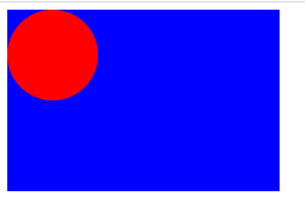

## 什么是SVG

`SVG`诞生于`1999`年，是一种[XML](https://link.juejin.cn?target=https%3A%2F%2Fdeveloper.mozilla.org%2Fen-US%2FXML)语言，类似`XHTML`，即`SVG`，可以用来绘制矢量图形，例如右面展示的图形。`SVG`可以通过定义必要的线和形状来创建一个图形，也可以修改已有的位图，或者将这两种方式结合起来创建图形。图形和其组成部分可以形变、合成、或者通过滤镜完全改变外观。

## 为什么学SVG？它有什么优势？

比起其他的图像格式（例如`jpg`，`gif`），`SVG`的优点是：

1. 可以使用任何文本编辑器来创建绘画`SVG`。
2. 可以搜索、索引、脚本化、压缩`SVG`图像。
3. `SVG`图像可以扩展，可以在任何分辨率上高质量显示。
4. `SVG`图像支持缩放，且不会失去任何质量。
5. `SVG`是开放标准，是纯`XML`文件。

### 绘画一个简单的SVG

```html
<svg width="300" height="200">
    <rect width="100%" height="100%" fill="blue" />
    <circle cx="50" cy="50" r="50" fill="red"></circle>
</svg>
```



- 以上绘制一个`SVG`基本流程
  - 绘制一个`svg`根标签
  - 绘制一个`rect`标签，它是一个绘制矩形的标签，宽高设置`100%`也就是把父级元素占满，`fill`属性为设置背景颜色
  - 绘制一个`circle`标签，它是一个绘制圆形的标签，`cx`和`cy`是偏移的属性（默认是`0`，即圆心在坐标`0`，`0`中绘画），`r`是半径大小

### 渲染规则

- `svg`里的元素渲染顺序、规则是后来居上，越后面渲染的元素越前。

### 嵌套到HTML文件中的几种方式

- `XHTML`需要将类型声明为`application/xhtml+xml`，才能将`SVG`嵌入到`XML`中。

- `HTML5`可以直接嵌入`SVG`。但需要做一些语法调整。

  - 可以通过 `object` 元素引用`SVG`文件：

   ```html
    <object data="image.svg" type="image/svg+xml" />
   ```

  - 类似的也可以使用 `iframe` 元素引用`SVG`文件：

   ```html
    <iframe src="image.svg"></iframe>
   ```

  - 使用`img`标签引用`SVG`文件：

   ```xml
    
   ```

  - 使用`embed`标签：

   ```xml
    <embed src="image.svg" style="display:block;width:200px;height:200px" />
   ```

  - 使用`div`标签：

   ```html
    <div style="display:block;width:200px;height:200px;background: url(./image.svg) no-repeat;background-size: 100%;" ></div>
   ```

  - 使用`picture`标签：

   ```html
    <picture>
        <source srcset="image.svg"  type="image/svg+xml">
        
    </picture>
   ```

## svg文件类型

- `svg` 文件分为两种形式
  - 普通`SVG`文件：包含`SVG`标准的文本文件，后缀名通常为`.svg`。
  - 压缩版`SVG`文件：某种场景下的`SVG`文件可能很大，SVG标准是允许`gzip`压缩的，后缀名通常为`.svgz`（注意的是在`FireFox`不能再本地上加载`svgz`文件，除非知道处理发布内容的`web`服务器可以正确的处理`gzip`，否则要避免使用`gzip`压缩的`SVG`）。

