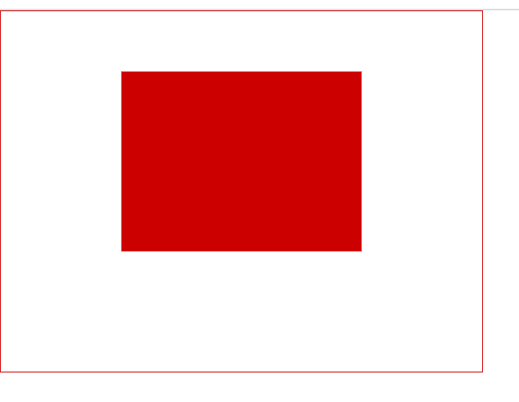
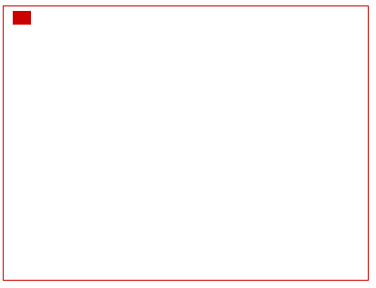

接下来我们继续看看`SVG`中的定位系统与`viewBox`的知识点。

## SVG定位

在`SVG`元素使用的是坐标系统（网络系统），和`Canvas`类似。以页面的左上角为起标点，以`px`为单位，x轴的正方形是向右边的，而y轴正方向是向下边。

看下面这个例子，绘画一个矩形，在`rect`标签中加入`x`和`y`属性，从左上角开始，向右边偏移`50px`的距离，再向下偏移`60px`的距离，开始绘画一个宽高各`100`的矩形。

```html
<svg width="200" height="200">
    <rect x="50" y="60" width="100" height="100" fill="#f06" />
    <!--x表示横坐标，y表示纵坐标，width表示宽，height表示高-->
</svg>
```

## viewBox属性

先看一个活蹦乱跳的例子，如下HTML代码：

```svg
<svg width="400" height="300" viewBox="0,0,40,30" style="border:1px solid #cd0000;">
    <rect x="10" y="5" width="20" height="15" fill="#cd0000"/>
</svg>
```

结果如下：



如果不看`viewBox`, 你一定会觉得诧异——SVG尺寸明明有400*300像素，而小小的`<rect>`宽高大小只有其`1/20`，但是显示出来的却占据了半壁江山！不科学啊！

OK, 之所以小小矩形大显神威就是这里的`viewBox`起了推波助澜的作用。

`viewBox`值有4个数字：

```svg
viewBox="x, y, width, height"  // x:左上角横坐标，y:左上角纵坐标，width:宽度，height:高度
```

`viewBox`顾名思意是“视区盒子”的意思，好比在说：“SVG啊，要不你就让我铺满你吧~”

更形象的解释就是：SVG就像是我们的显示器屏幕，viewBox就是截屏工具选中的那个框框，最终的呈现就是把框框中的截屏内容再次在显示器中全屏显示！

更直观的解释：

**1.** 如果没有`viewBox`, 应该是长这样的：



`<rect>`大小只有整个SVG舞台的`1/20`.

**2.** `viewBox="0,0,40,30"`相当于在SVG上圈了下图左上角所示的一个框框：


**3.** 然后把这个框框，连同框框里的小矩形一起放大到整个SVG大小（如下gif）:


## preserveAspectRatio属性

上面的例子，SVG的宽高比正好和viewBox的宽高比是一样的，都是`4:3`. 显然，实际应用`viewBox`不可能一直跟`viewport`穿同一条开裆裤。此时，就需要`preserveAspectRatio`出马了，此属性也是应用在`<svg>`元素上，且**作用的对象都是viewBox**。

先看下猪是怎么跑的：

```svg
preserveAspectRatio="xMidYMid meet"
```

下面我们来吃猪肉。

`preserveAspectRatio`属性的值为空格分隔的两个值组合而成。例如，上面的`xMidYMid`和`meet`.

第1个值表示，viewBox如何与SVG viewport对齐；第2个值表示，如何维持高宽比（如果有）。

其中，第1个值又是由两部分组成的。前半部分表示`x`方向对齐，后半部分表示`y`方向对齐。家族成员如下：

值含义

| xMin | viewport和viewBox左边对齐                      |
| ---- | ---------------------------------------------- |
| xMid | viewport和viewBox x轴中心对齐                  |
| xMax | viewport和viewBox右边对齐                      |
| YMin | viewport和viewBox上边缘对齐。注意Y是大写。     |
| YMid | viewport和viewBox y轴中心点对齐。注意Y是大写。 |
| YMax | viewport和viewBox下边缘对齐。注意Y是大写。     |

`x`, `y`自由合体就可以了，如：

```
xMaxYMax

xMidYMid
```

亲爱的小伙伴，看出啥意思没？

噔噔蹬蹬，没错，就是组合的意思：“右-下”和“中-中”对齐。恭喜你此处的知识点学习顺利毕业！

`preserveAspectRatio`属性第2部分的值支持下面3个：

值含义

| meet  | 保持纵横比缩放viewBox适应viewport，受          |
| ----- | ---------------------------------------------- |
| slice | 保持纵横比同时比例小的方向放大填满viewport，攻 |
| none  | 扭曲纵横比以充分适应viewport，变态             |

现在急需一个活生生的例子，让大家感受下这三个值的表现。

<iframe src="http://www.webhek.com/demos/codepens/30.html?height=450" scrolling="no" frameborder="0" height="450" allowtransparency="true" allowfullscreen="true" name="CodePen Embed" title="CodePen Embed" style="box-sizing: border-box; color: rgb(0, 0, 0); font-family: &quot;Microsoft YaHei&quot;, 微软雅黑, &quot;Hiragino Sans GB&quot;, STHeiti, &quot;WenQuanYi Micro Hei&quot;, Lucida, Verdana, SimSun, sans-serif, serif; font-size: 15px; font-style: normal; font-variant-ligatures: normal; font-variant-caps: normal; font-weight: 400; letter-spacing: normal; orphans: 2; text-align: start; text-indent: 0px; text-transform: none; white-space: normal; widows: 2; word-spacing: 0px; -webkit-text-stroke-width: 0px; background-color: rgb(255, 255, 255); text-decoration-thickness: initial; text-decoration-style: initial; text-decoration-color: initial; width: 1904.1px; overflow: hidden;"></iframe>


它使用的代码是这样的：

```svg
<svg width="400" height="200" viewBox="0 0 200 200" style="border:1px solid #cd0000;">
    <rect x="10" y="10" width="150" height="150" fill="#cd0000"/>
</svg>
```

截取SVG左边一半(200正好宽度400的一般)作为视区，里面有个`150*150`的红色矩形。

默认应该是`"xMidYmid meet"`效果。表现原理为：SVG宽`400`, 高`200`，viewBox宽`200`, 高`200`. `x`横轴比例是`2`, `y`纵轴比例是`1`. `meet`的作用是让viewBox等比例的同时，完全在SVG的viewport中显示。这里，最小比例是纵向的`1`，所以，实际上viewBox并没有任何的缩放。

我们只要对`viewBox`属性值做一点小小的修改（200→300），就可以感受到缩放了

改成`300`后，viewBox的高度就比viewport的`200`高，所以，viewBox要想完全适应viewport，就要进行缩放，所以，我们可以上到上面的矩形面积变小了，就是因为缩放的结果（缩放了`200/300`, 差不多原来的`66.7%`）。

`slice`也是要保持viewBox的纵横比的，不过，其作用是尽量填满viewport. 同样，这里viewBox宽度`200`，SVG的`width`是`400`. 显然，要想最大化充满，viewBox的宽度就需要扩大为原来的两倍。于是，就有了上图viewBox放大两倍后的效果。由于viewBox部分区域超出了viewport, 视区之外内容是不可见的，于是就出现了`slice`所表意的“剪切”效果。

`③` 如果是`none`, 则表示不关心比例，viewBox直接拉伸到最大填满viewport.原本好好的一个正方形，现在因为viewBox的拉伸，变成了一个宽高`2:1`的矩形了。

**viewBox的对齐**

千言万语不如一个可以自己动手体验的demo实在，：

<iframe src="http://www.webhek.com/demos/codepens/31.html?height=450" scrolling="no" frameborder="0" height="450" allowtransparency="true" allowfullscreen="true" name="CodePen Embed" title="CodePen Embed" style="box-sizing: border-box; color: rgb(0, 0, 0); font-family: &quot;Microsoft YaHei&quot;, 微软雅黑, &quot;Hiragino Sans GB&quot;, STHeiti, &quot;WenQuanYi Micro Hei&quot;, Lucida, Verdana, SimSun, sans-serif, serif; font-size: 15px; font-style: normal; font-variant-ligatures: normal; font-variant-caps: normal; font-weight: 400; letter-spacing: normal; orphans: 2; text-align: start; text-indent: 0px; text-transform: none; white-space: normal; widows: 2; word-spacing: 0px; -webkit-text-stroke-width: 0px; background-color: rgb(255, 255, 255); text-decoration-thickness: initial; text-decoration-style: initial; text-decoration-color: initial; width: 1904.1px; overflow: hidden;"></iframe>


无论是`meet`还是`slice`，你是不可能在一种状态下同时看到`x`, `y`方向上的位移的。因为总会有一个方向是充满viewport的。

## 总结

就是viewbox如果比盒子小要放大，如果比盒子大要缩小，而meet和slice的缩放都是等比例的，类比meet就是background-size的contain，缩放到一条边沾到盒子就行，而slice就是background-size的cover，必须要缩放到把盒子充满未知，而none类比background-size:100% 100%;缩放完成之后还需要考虑到对齐，一般就关注中心点对齐就好了，其他情况比较少见。

## 参考链接

[学SVG看这篇就够了](https://juejin.cn/post/6993607549576544270)

[[理解SVG中的 viewport，viewBox, preserveAspectRatio](https://www.cnblogs.com/tugenhua0707/p/11279989.html)](https://www.cnblogs.com/tugenhua0707/p/11291196.html)
