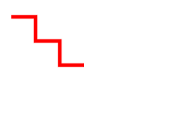
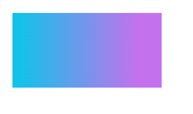

有了这些基础知识之后，我们现在来看看`SVG`中图形的基本绘画。

## 基本绘画

### 矩形

以下代码代表绘制一个矩形，`rect`标签中的`x`、y属性分别指定了矩形左上角端点的横坐标和纵坐标，`width`、`height`属性分别指定矩形的宽度和高度。

```html
<rect x="50" y="20" width="150" height="150"></rect>
```


### 圆形

以下代码代表绘制一个圆形，circle标签中的`cx`、`cy`、`r`属性分别为横坐标、纵坐标和半径。

```html
<circle cx="100" cy="100" r="100" fill="red"></circle>
```


### 椭圆

以下代码代表绘制一个椭圆，ellipse标签中的`cx`、`cy`、`rx`，`ry`属性分别为圆形横坐标、圆心纵坐标、横向半径、纵向半径。

```html
<ellipse cx="200" cy="120" rx="150" ry="100" fill='red'></ellipse>
```


### 直线

以下代码代表绘制一条直线，line标签中的`x1`，`y1`，`x2`，`y2`属性分别代表起点横坐标、起点纵坐标、终点横坐标、终点纵坐标。

```html
<line x1="10" y1="100" x2="100" y2="20" stroke="red" stroke-width="3px"></line>
```


### 多边形

以下代码代表绘制一个多边形，`points`属性指定了折线中每个点的坐标，横坐标和纵坐标之间使用逗号隔开，点与点之间使用空格隔开。

```html
<polygon fill="red" stroke="purple" points="5,5 160,5 160,100 5,100 5,5"></polygon>
```


### 折线

以下代码代表绘制一条折线，也上面多边形一样，`points`属性指定了折线中每个点的坐标，横坐标和纵坐标之间使用逗号隔开，点与点之间使用空格隔开。

```html
<polyline points="10,10 30,10 30,30 50,30 50,50 70,50" fill="none" stroke="red" stroke-width="3px"></polyline>
```
### path

路径，它是`SVG`中最强大的图形，它可以绘制出线条, 曲线, 弧形等其他图形，例如贝塞尔曲线、二次曲线等曲线。

我们先看一个简单例子。

```html
<svg width="300" hight="300">
    <path d="M100 0 L25 200" stroke="black"></path>
</svg>
```

`d`属性包含路径所有路径点，最后起点和终点连接起来形成图形，同样可以使用上面说到的扩展属性。

`M`即是`Move to`命令，它接收两个参数。分别是将横坐标和纵坐标。将点移动到指定的位置。上面的例子是将起点移动至x100，`y0`的点。

`L`即是`Line to`命令，它接收两个参数。分别是将横坐标和纵坐标。L命令将会在当前位置和新位置（`L`前面画笔所在的点）之间画一条线段。

另外L命令还有简写的方法，用来绘制水平线和垂直线。`H`，绘制水平线。`V`，绘制垂直线。这两个命令都只带一个参数，标明在x轴或y轴移动到的位置，因为它们都只在坐标轴的一个方向上移动。

更多命令

| 命令 | 说明                             |
| ---- | -------------------------------- |
| M    | move to                          |
| L    | line to                          |
| H    | horizontal line to               |
| V    | vertical line to                 |
| C    | curve to                         |
| S    | smooth curve to                  |
| Q    | quadratic Bézier curve           |
| T    | smooth quadratic Bézier curve to |
| A    | elliptical Arc                   |
| Z    | close path                       |

> **注意：**以上所有命令均允许小写字母。大写表示绝对定位，小写表示相对定位。



### text

在SVG中有两种截然不同的文本模式. 一种是写在图像中的文本，另一种是SVG字体。关于后者我们将在教程的后面进行讲解，现在我们主要集中前者：写在图像中的文本。

text标签用于在画布中，放置任何的文字。

```html
<text x="10" y="20">Hello</text>
```

文字的内容写在text标签体中，x和y分别代表文本在画布中显示的位置。


`text-anchor`该属性用于设置文本从坐标点中的文本流方向，值分别是start、end、middle、inherit。从下面图中可以看到四种值的不同。

```html
<text x="40" y="20" text-anchor="start">Hello</text>
<text x="40" y="50" text-anchor="end">Hello</text>
<text x="40" y="80" text-anchor="middle">Hello</text>
<text x="40" y="110" text-anchor="inherit">Hello</text>
```


和其他图形一样，text也可以使用fill属性对主题进行颜色填充。也用引用渐变、图案进行填充。

```html
<defs>
    <linearGradient id="fillTest">
        <stop offset="5%" stop-color="#fc5c7d" />
        <stop offset="85%" stop-color="#6a82fb" />
    </linearGradient>
</defs>
<text x="40" y="20" fill="red">Hello</text>
<text x="40" y="40" fill="green">Hello</text>
<text x="40" y="60" fill="#ee2">Hello</text>
<text x="40" y="80" fill="rgb(255,0,0)">Hello</text>
<text x="40" y="100" fill="url(#fillTest)">Hello</text>
```


同样，我们也可以给字体设置描边。

```html
<defs>
    <linearGradient id="strTest">
        <stop offset="5%" stop-color="#00f260" />
        <stop offset="85%" stop-color="#0575e6" />
    </linearGradient>
</defs>
<text x="40" y="20" stroke="red">Hello</text>
<text x="40" y="40" stroke="green">Hello</text>
<text x="40" y="60" stroke="#ee2">Hello</text>
<text x="40" y="80" stroke="rgb(255,0,0)">Hello</text>
<text x="40" y="100" stroke="url(#strTest)">Hello</text>
```


#### tspan

该元素用来标记大块文本的子部分，它必须是一个`text`元素或别的`tspan`元素的子元素。一个典型的用法是把句子中的一个词变成粗体，突出重点。

```html
<text x="10" y="20">
    坐标：
    <tspan font-weight="bold">
        广州
    </tspan>
</text>
```


其他字体相关属性

下面这些属性可以在`text`标签中直接设置成一个属性，或是在`CSS`中声明。

| 属性             | 说明                                         |
| ---------------- | -------------------------------------------- |
| font-family      | 设置文本的字体系列                           |
| font-style       | 设置斜体文字的字体样式属性                   |
| font-weight      | 设置字体的粗细                               |
| font-variant     | 在小型大写字母和普通文本选项之间切换         |
| font-stretch     | 在给定字体的可选拉伸版本中切换               |
| font-size        | 设置文本的大小                               |
| font-size-adjust | 独立于字体的实际大小尺寸，调整其可视大小尺寸 |
| kerning          | 开启或关闭字体间距选项                       |
| letter-spacing   | 设置你的文本中的字母与字母之间的间距         |
| word-spacing     | 设置你的文本中的单词与单词之间的间距         |
| text-decoration  | 设置/取消字体上的文本装饰                    |

### image

image标签用于在`SVG`画布中插入图像文件，下面是一个在画布中插入图片的实例。

```html
<!-- image -->
<svg width="200" height="200">
    <image xlink:href="./img/pic.jpg" x="0" y="0" height="50px" width="50px"></image>
</svg>
<!-- img -->

```


这个标签与`HTML`中的`img`标签一样，是引入图像文件，但是引入的方式不同，`img`是使用`src`属性来引入图像文件，而`image`标签需要通过`xlink:href`链接引入图像文件。在`image`你还需要指定一些属性，用于控制`image`标签。

| 属性                | 说明                           |
| ------------------- | ------------------------------ |
| x、y                | 设定图像标签在坐标系统的坐标点 |
| width、height       | 设定图像标签宽度 / 高度        |
| xlink:href          | 引用图像文件                   |
| preserveAspectRatio | 设置图像比例（                 |


## 基本属性

| 属性名称       | 备注                 |
| -------------- | -------------------- |
| stroke         | 设置描边             |
| stroke-width   | 设置描边的大小       |
| stroke-opacity | 设置描边透明度       |
| fill           | 设置填充的颜色       |
| fill-opacity   | 设置填充颜色的透明度 |

### fill

`fill`属性设置绘制图形中内部的颜色（默认为`black`），如果你不想填充色可以将`fill`值设置为`none`，例：

```html
<rect x="10" y="10" width="50" height="50"></rect>
<rect x="70" y="10" width="50" height="50" fill="red"></rect>
<rect x="130" y="10" width="50" height="50" fill="rgb(91,158,86)"></rect>
```


`fill-opacity`属性设置填充颜色的透明度范围`0-1`，例：

```html
<rect x="10" y="10" width="50" height="50"></rect>
<rect x="70" y="10" width="50" height="50" fill="red"></rect>
<rect x="130" y="10" width="50" height="50" fill="rgb(91,158,86)" fill-opacity="0.5"></rect>
```


### stroke

`stroke`属性设置绘制图形的线条元素，例：

```html
<rect x="10" y="10" width="50" height="50"></rect>
<rect x="70" y="10" width="50" height="50" fill="red" stroke="blue"></rect>
<rect x="130" y="10" width="50" height="50" fill="rgb(91,158,86)" stroke="rgb(165,101,43)"></rect>

```


`stroke-opacity`属性设置边框颜色的透明度范围`0-1`，例：

```html
<rect x="10" y="10" width="50" height="50"></rect>
<rect x="70" y="10" width="50" height="50" fill="none" stroke="blue" stroke-opacity="0.2"></rect>
<rect x="130" y="10" width="50" height="50" fill="rgb(91,158,86)" stroke="rgb(165,101,43)"></rect>

```


`stroke-linecap`属性，设置边框终点的形状，参数分为：

- `butt`用直边结束线段，它是常规做法，线段边界`90`度垂直于描边的方向、贯穿它的终点。
- `square`的效果差不多，但是会稍微超出`实际路径`的范围，超出的大小由`stroke-width`控制。
- `round`表示边框的终点是圆角，圆角的半径也是由`stroke-width`控制的。

`stroke-linejoin`属性，用来控制两条描边线段之间，用什么方式连接，参数分为：

- `miter`是默认值，表示用方形画笔在连接处形成尖角
- `round`表示用圆角连接，实现平滑效果
- `bevel`，连接处会形成一个斜接

```html
<polyline points="10 10 60 50 110 10" fill="none" stroke-width="7" stroke="red" stroke-linecap="butt"></polyline>
<polyline points="130 10 180 50 230 10" fill="none" stroke-width="7" stroke="red" stroke-linecap="square"></polyline>
<polyline points="250 10 300 50 350 10" fill="none" stroke-width="7" stroke="red" stroke-linecap="round"></polyline>
<polyline points="10 70 60 110 110 70" fill="none" stroke-width="7" stroke="red" stroke-linejoin="miter"></polyline>
<polyline points="130 70 180 110 230 70" fill="none" stroke-width="7" stroke="red" stroke-linejoin="round"></polyline>
<polyline points="250 70 300 110 350 70" fill="none" stroke-width="7" stroke="red" stroke-linejoin="bevel"></polyline>

```


除了在标签中定义属性之外，你也可以使用`CSS`来给绘制的图形进行填充和描边操作。

我们看下使用`CSS`的例子：

```css
.zrect{
    stroke: black;
     fill: red;
}

<rect x="10" y="10" width="50" height="50" class="zrect"></rect>

```


像这样子，我们将一些属性写入样式中，在元素中绑定类即可。如果你很多个元素的属性是相同的，那么这是一个很好的选择！

## 渐变

在`SVG`中，并非只能填充图形颜色和添加描边，你也可以像`CSS`一样，给绘制的图形应用添加渐变色。分为线性渐变、径向渐变，具体如何应用渐变色我们进行看下去：

> 在SVG中我们不能使用linear-gradient函数，这是无效代码！！！

### 线性渐变

线性渐变是沿着直线改变颜色，我们看一个线性渐变的例子：

```html
<svg width="300" height="500">
    <defs>
        <linearGradient id="test">
            <stop offset="5%" stop-color="#12c2e9" />
            <stop offset="85%" stop-color="#c471ed" />
        </linearGradient>
    </defs>
    <rect fill="url(#test)" x="10" y="10" width="200" height="100"></rect>
</svg>
```



我们在画布中创建一个`defs`元素（稍后会讲到），在内部创建一个`linearGradient`标签（该标签用于定义线性渐变，应用于图形元素的填充、描边）。内部放了两个stop标签，这两个标签通过指定的位置`offset`属性和`stop-color`属性来说明在渐变的特定位置上渲染指定的颜色。

这里要注意的是`offset`值是从`0`开始的，范围为`0%—100%`（或者是`0—1`），如果出现位置重合，将采用后面设置的值。

`stop`标签一共有三个属性，上面我们已经展示了`stop`标签的两个属性，还有一个`stop-opacity`属性，用于设置某个位置的透明度。

```html
<stop offset="85%" stop-color="gold" stop-opacity="0"/>
```


使用渐变需要在图形标签上使用`stroke` 、`fill`进行引用，使用`url`引用元素的方式将渐变的ID值传入即可。（`stroke`也是同样操作）

`linearGradient`标签中你还可以定义渐变的开始和结束位置。它们分别是`x1`、`x2`、`y1`、`y2`。默认是水平渐变的，可以通过修改这些属性来改变渐变的方向，下面看看垂直渐变的例子：

```html
<svg width="300" height="500">
    <defs>
        <linearGradient id="test" x1="0%" y1="0%" x2="0%" y2="100%">
            <stop offset="5%" stop-color="#12c2e9" />
            <stop offset="85%" stop-color="#c471ed" stop-opacity="0" />
        </linearGradient>
    </defs>
    <rect fill="url(#test)" x="10" y="10" width="200" height="100"></rect>
</svg>
```


- 当 `y1` 和 `y2` 相等，而 x1 和 `x2` 不同时，可创建水平渐变
- 当 `x1` 和`x2` 相等，而 y1 和 `y2` 不同时，可创建垂直渐变
- 当 `x1` 和 `x2` 不同，且 y1 和 `y2` 不同时，可创建角形渐变

### 径向渐变

与线性渐变的用法类似，只不过是它是从一个点开始发散绘制渐变。我们看看一个径向渐变的例子：

```html
<svg width="300" height="500">
    <defs>
        <radialGradient  id="test">
            <stop offset="5%" stop-color="#0f0c29" />
            <stop offset="55%" stop-color="#302b63" />
        </radialGradient >
    </defs>
    <rect fill="url(#test)" x="10" y="10" width="100" height="100"></rect>
</svg>
```


`stop`用法和线性渐变的用法是一样的，深蓝色现在正在向边缘的方向渐渐的变成灰白色。在线性渐变中我们可以控制渐变的方向。同样，径向渐变中也可以控制渐变的中心点位置。它的属性有`cx`、`cy`、r、`fx`、`fy`，分别代表的是圆形中心点位置，半径、渐变边缘的位置（范围`0—1`）。

```html
<svg width="300" height="500">
    <defs>
        <radialGradient  id="test" cx="0" cy="0" r="0.5" fy="0.25" fx="0.25">
            <stop offset="0%" stop-color="#0f0c29" />
            <stop offset="100%" stop-color="#302b63" />
        </radialGradient >
    </defs>
    <rect fill="url(#test)" x="10" y="10" width="100" height="100"></rect>
</svg>
```


## 结构元素

### defs

它用于预定义一个元素使其能够在`SVG`图像中重复使用。在`defs`元素中定义的图形不会直接呈现。 你可以在你的视口的任意地方利用use标签呈现这些标签。

```xml
<svg width="300" height="300">
    <defs>
        <circle r="10" id="copyme"/>
    </defs>
    <use x="10" y="10" xlink:href="#copyme" />
    <use x="50" y="10" xlink:href="#copyme" />
</svg>
```


### symbol

这个`<symbol>`标记的作用是定义一个图像模板，你可以使用`<use>`标记实例化它，然后在SVG文档中反复使用，这种用法非常的高效。`<symbol>`本身不会输出任何图像，只有使用`<use>`实例化后才会显示。和defs最大的区别是symbol能够创建自己的视窗，所以能够应用viewBox和preserveAspectRatio属性

```xml
<svg viewBox="0 0 150 150" height='300'>
<!-- symbol definition  NEVER draw -->
<symbol id="sym01" viewBox="0 0 150 110">
  <circle cx="50" cy="50" r="40" stroke-width="8" stroke="red" fill="red"/>
  <circle cx="90" cy="60" r="40" stroke-width="8" stroke="green" fill="white"/>
</symbol>

<!-- actual drawing by "use" element -->
<use xlink:href="#sym01"
     x="0" y="0" width="100" height="50"/>
<use xlink:href="#sym01"
     x="0" y="50" width="75" height="38"/>
<use xlink:href="#sym01"
     x="0" y="100" width="50" height="25"/>
```

### use

`<use>`标记的作用是能从SVG文档内部取出一个节点，克隆它，并把它输出到别处。使用定义的元素，包括`<g>, <defs>, <symbol>`。

```xml
<svg width="100%" height="300" xmlns="http://www.w3.org/2000/svg" xmlns:xlink="http://www.w3.org/1999/xlink" viewBox='0 0 50 100'>
  <style>
    .classA { fill:red }
  </style> 
  <defs>
    <g id="Port">
      <circle style="fill:inherit" r="10"/>
    </g>
  </defs>
 
  <text y="15">black</text>
  <use x="50" y="10" xlink:href="#Port" />
  <text y="35">red</text>
  <use x="50" y="30" xlink:href="#Port" class="classA"/>
  <text y="55">blue</text>
  <use x="50" y="50" xlink:href="#Port" style="fill:blue"/>
 </svg>
```

### g

`<g>`标记就是‘group’的简写，是用来分组用的，初始不可见,它能把多个元素放在一组里，对`<g>`标记实施的样式和渲染会作用到这个分组内的所有元素上。组内的所有元素都会继承`<g>`标记上的所有属性。用`<g>`定义的分组还可以使用`<use>`进行复制使用。

```
<svg viewBox="0 0 95 50"
     xmlns="http://www.w3.org/2000/svg">
   <g stroke="green" fill="white" stroke-width="5">
     <circle cx="25" cy="25" r="15"/>
     <circle cx="40" cy="25" r="15"/>
     <circle cx="55" cy="25" r="15"/>
     <circle cx="70" cy="25" r="15"/>
   </g>
</svg>
```


## SVG动画库

我们学过的很多种图形绘制都可以实现动画效果，`transform`、路径变化、描边等这些都是可以实现动画效果的。

一些SVG动画库

- GSAP
- Snap.svg
- SVG.js
- anime.js
- Velocity.js
- D3

在学习动画之前，我们先学习两个属性，这与后面我们要实现的动画有一定的关系。它们分别是`stroke-dasharray`和`stroke-dashoffset`，从属性名称来看，它们都是与`stroke`（描边）有关的。

### stroke-dasharray

该属性用于控制描边的点划线的长度，你需要传入一个参数，这个参数可以是一个数，也可以是一个数列，看下面这个例子。

```html
<line x1="0" x2="50" y1="10" y2="10" stroke-width=".5" stroke="red" stroke-dasharray="5"></line>
<line x1="0" x2="50" y1="20" y2="20" stroke-width=".5" stroke="red" stroke-dasharray="10"></line>
<line x1="0" x2="50" y1="30" y2="30" stroke-width=".5" stroke="red" stroke-dasharray="5,10"></line>
```


图中，每条竖线的间隔是`10px`，线长是`60px`。我们先看第一条线条，这个的`stroke-dasharray`值是`5`，指线条每`5px`的实线长度就会有`5px`的间隔距离。同理，第二条线条，则每`10px`的实线长度就会有`10px`的距离。

第三条线条，这里是`stroke-dasharray`传入的是两个参数，使用空格隔开（也可以使用逗号隔开参数），第一个参数指的是实线的长度，第二个参数是间隔的距离。如图我们看到红线每5px的长度就会有`10px`的间隔距离。

第四条线条传入的是三个参数，前两个参数和上面一样，第三个参数是实线的长度，可以理解成奇数为实线长度，而偶数为间隔距离。

第五条线条传入的是四个参数，但参数是相同的，等价于 `5 10`。

### stroke-dashoffset

该属性用于起点的偏移，正数为x值向左偏移，负数为x值向右偏移，传入一个参数，用于设置偏移值。

该属性需要搭配上面的`stroke-dasharray`属性使用，否则无法看出偏移效果。

我们看下面这个例子：

```html
<line x1="10" x2="90" y1="10" y2="10" stroke-width=".5" stroke="red" stroke-dasharray="20";></line>
<line x1="10" x2="90" y1="20" y2="20" stroke-width=".5" stroke="red" stroke-dasharray="20"; stroke-dashoffset="-10"></line>
<line x1="10" x2="90" y1="30" y2="30" stroke-width=".5" stroke="red" stroke-dasharray="20"; stroke-dashoffset="10"></line>
```


第一条线条没有设置`stroke-dashoffset`，默认为`0`。

第二条线条`stroke-dashoffset`值设置为`-10`，即线条起始点向右偏移`10px`。

第三条线条`stroke-dashoffset`值设置为`10`，即线条起始点向左偏移`10px`。

