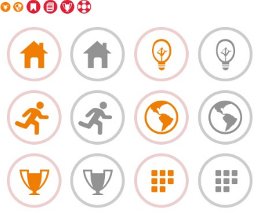
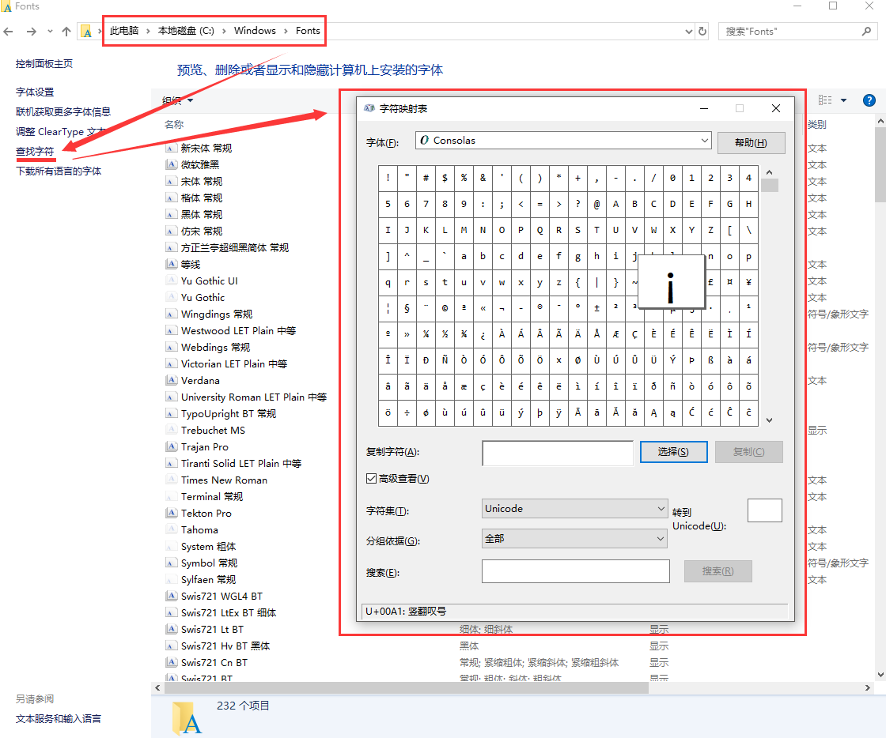
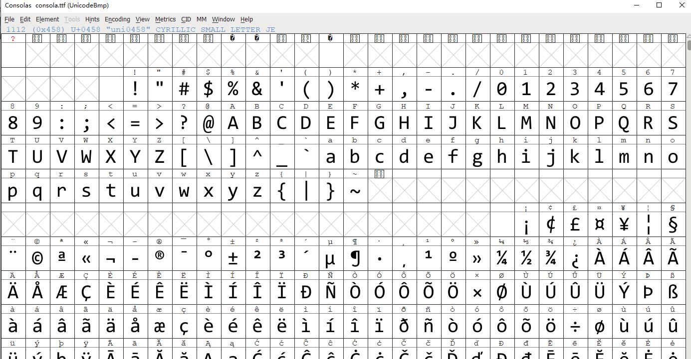
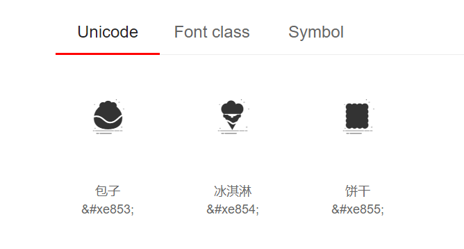
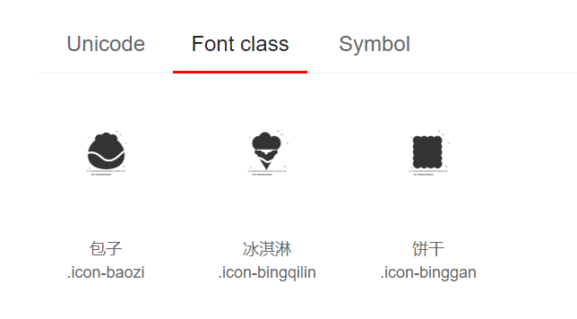
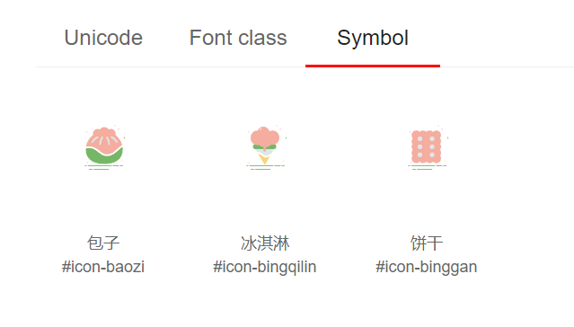
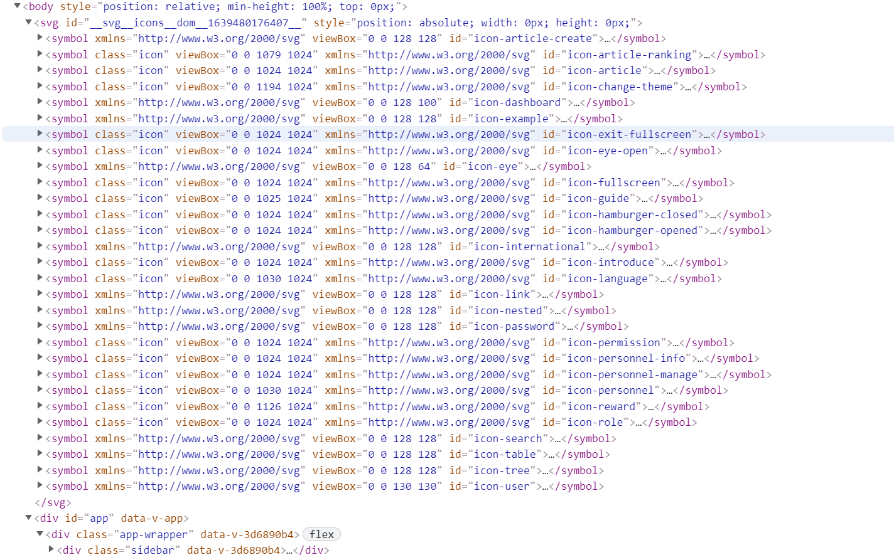

## Icon演进史

首先我们来说一下前端 icon 的发展史。

**远古时代** 在我刚开始实习时，大部分图标都是用 img 来实现的。渐渐发现一个页面的请求资源中图片 img 占了大部分，所以为了优化有了`image sprite` 就是所谓的雪碧图，就是将多个图片合成一个图片，然后利用 css 的 background-position 定位显示不同的 icon 图标。但这个也有一个很大的痛点，维护困难。每新增一个图标，都需要改动原始图片，还可能不小心出错影响到前面定位好的图片，而且一修改雪碧图，图片缓存就失效了，久而久之你不知道该怎么维护了。




**font 库** 后来渐渐地一个项目里几乎不会使用任何本地的图片了，而使用一些 font 库来实现页面图标。常见的如 [Font Awesome](https://link.juejin.cn?target=http%3A%2F%2Ffontawesome.io%2F) ，使用起来也非常的方便，但它有一个致命的缺点就是找起来真的很不方便，每次找一个图标特别的费眼睛，还有就是它的定制性也非常的不友善，它的图标库一共有675个图标，说少也不少，但还是会常常出现找不到你所需要图标的情况。当然对于没有啥特别 ui 追求的初创公司来说还是能忍一忍的。但随着公司的壮大，来了越来越多对前端指手画脚的人，丧心病狂的设计师，他们会说不！这icon这么丑，这简直是在侮辱他们高级设计师的称号啊！不过好在这时候有了[iconfont](https://link.juejin.cn?target=http%3A%2F%2Ficonfont.cn%2F) 。


## iconfont 三种使用姿势

### unicode

首先，我们来了解一下到底字体是如何在浏览器里被渲染出来的。光讲原理有些枯燥，网上也能找到一堆，我们先直观地来看看字体文件里面到底是啥玩意儿。首先，如果你是win10或win8用户，打开操作系统的字体文件目录：C:\Windows\Fonts\或C:\Winnt\Fonts，点击左侧的“查找字符”：



或者准备一个软件：[FontForge](http://fontforge.github.io/en-US/downloads/)，这是一个开源的字体编辑器，下面我就用这个软件来深入。先打开操作系统中的字体文件目录，随便找一个字体文件，如：consola.ttf，拷到其他目录（可能会变成四个文件，分别是consola.ttf、consolab.ttf、consolai.ttf、consolaz，对应的是常规、加粗、斜体、斜体加粗）。

用FontForge打开consola.ttf，无视警告，可以看到这样的一张表：



可以猜得出来，字体文件其实就是一个以unicode作为索引的字形表。双击里面的某个字形，你可以对它进行编辑，也能猜得出来每个字形其实就是一个矢量图，因此ttf文件所表示的字库也叫矢量字库。

使用浏览器打开页面时，浏览器会读取 HTML 文件进行解析渲染。当读到「饥」这个字时会转换成对应的 unicode码（可以认为是世界上任意一种文字的特定编号）。再根据HTML 里设置的 font-family （如果没设置则使用浏览器默认设置）去查找电脑里（如果有自定义字体@font-face ，则加载对应字体文件）对应字体的字体文件。找到文件后根据 unicode 码去查找绘制外形，找到后绘制到页面上。

最开始我们使用了`unicode`的格式，它主要的特点是 **优势**

- 兼容性最好，支持ie6+
- 支持按字体的方式去动态调整图标大小，颜色等等

**劣势**

- 不支持多色图标
- 在不同的设备浏览器字体的渲染会略有差别，在不同的浏览器或系统中对文字的渲染不同，其显示的位置和大小可能会受到font-size、line-height、word-spacing等CSS属性的影响，而且这种影响调整起来较为困难

**使用方法：** 第一步：引入自定义字体 `font-face

```
 @font-face {
   font-family: "iconfont";
   src: url('iconfont.eot'); /* IE9*/
   src: url('iconfont.eot#iefix') format('embedded-opentype'), /* IE6-IE8 */
   url('iconfont.woff') format('woff'), /* chrome, firefox */
   url('iconfont.ttf') format('truetype'), /* chrome, firefox, opera, Safari, Android, iOS 4.2+*/
   url('iconfont.svg#iconfont') format('svg'); /* iOS 4.1- */
 }

```

第二步：定义使用iconfont的样式

```
.iconfont {
  font-family:"iconfont" !important;
  font-size:16px;
  font-style:normal;
  -webkit-font-smoothing: antialiased;
  -webkit-text-stroke-width: 0.2px;
  -moz-osx-font-smoothing: grayscale;
}

```

第三步：挑选相应图标并获取字体编码，应用于页面

```
<i class="iconfont">&#xe604;</i>

```

效果图：





不过它的缺点也显而易见，`unicode`的书写不直观，语意不明确。光看`unicode`你完全不知道它代表的是什么意思。这时候就有了 `font-class`。

### font-class

与unicode使用方式相比，具有如下特点：

- 兼容性良好，支持ie8+
- 相比于unicode语意明确，书写更直观。可以很容易分辨这个icon是什么。

**使用方法：** 第一步：拷贝项目下面生成的fontclass代码：

```
../font_8d5l8fzk5b87iudi.css
```

第二步：挑选相应图标并获取类名，应用于页面：

```
<i class="iconfont icon-xxx"></i>
```

效果图：





它的主要原理其实是和 `unicode` 一样的，它只是多做了一步，将原先`&#xe604`这种写法换成了`.icon-QQ`，它在每个 class 的 before 属性中写了`unicode`,省去了人为写的麻烦。如 `.icon-QQ:before { content: "\e604"; }`

相对于`unicode` 它的修改更加的方便与直观。但也有一个大坑，之前楼主一个项目中用到了两组`font-class` 由于没有做好命名空间，所有的class都是放在`.iconfont` 命名空间下的，一上线引发了各种雪崩问题，修改了半天，所以使用`font-class`一定要注意命名空间的问题。

### symbol

随着万恶的某某浏览器逐渐淡出历史舞台，svg-icon 使用形式慢慢成为主流和推荐的方法。相关文章可以参考张鑫旭大大的文章[未来必热：SVG Sprite技术介绍](https://link.juejin.cn?target=http%3A%2F%2Fwww.zhangxinxu.com%2Fwordpress%2F2014%2F07%2Fintroduce-svg-sprite-technology%2F%3Fspm%3Da313x.7781069.1998910419.50)，有人问svg的大小不是不支持font-size修改的吗？如何实现的呢？其实用了一个比较hack的方式，就是把图标元素的宽高都写为1em，而em的大小是相对于该元素的字体大小的，这样就实现了svg宽高跟着svg的字体大小一起变了。

- 支持多色图标了，不再受单色限制。
- 支持像字体那样通过font-size,color来调整样式。
- 支持 ie9+
- 可利用CSS实现动画。
- 减少HTTP请求。
- 矢量，缩放不失真
- 可以很精细的控制SVG图标的每一部分

**使用方法：** 第一步：拷贝项目下面生成的symbol代码：

```
引入  ./iconfont.js

```

第二步：加入通用css代码（引入一次就行）：

```
<style type="text/css">
    .icon {
       width: 1em; height: 1em;
       vertical-align: -0.15em;
       fill: currentColor;
       overflow: hidden;
    }
</style>

```

第三步：挑选相应图标并获取类名，应用于页面：

```
<svg class="icon" aria-hidden="true">
    <use xlink:href="#icon-xxx"></use>
</svg>

```

效果图：



使用svg-icon的好处是我再也不用发送`woff|eot|ttf|` 这些很多个字体库请求了，我所有的svg都可以内联在html内。



还有一个就是 svg 是一个真正的矢量，不管你再怎么的放缩它都不会失真模糊，而且svg可以控制的属性也更加的丰富，也能做出更加生动和复杂的图标。现在ui设计师平时都喜欢使用 sketch 来工作，只要轻松一键就能导出 svg 了，所以 svg 也更受设计师的青睐。[Inline SVG vs Icon Fonts ](https://link.juejin.cn?target=https%3A%2F%2Fcss-tricks.com%2Ficon-fonts-vs-svg%2F) 这篇文章详细的比较了 `svg` 和 `icon-font`的优劣，大家可以去看看。PS：这里其实还用到了 `SVG Sprite` 技术。简单的理解就是类 svg 的似雪碧图，它在一个 svg 之中运用 symbol 标示了一个一个的 svg 图标，这样一个页面中我们遇到同样的 svg 就不用重复再画一个了，直接使用`<use xlink:href="#icon-QQ" x="50" y="50" />` 就能使用了，具体的细节可以看这篇文章开头的文章 [未来必热：SVG Sprite技术介绍](https://link.juejin.cn?target=http%3A%2F%2Fwww.zhangxinxu.com%2Fwordpress%2F2014%2F07%2Fintroduce-svg-sprite-technology%2F)，在之后的文章中也会手摸手叫你自己如何制作 `SVG Sprite`。


## Vite中Icon组件的实现

### 使用`iconfont.js`

我们有了图标，接下来就是如何在自己的项目中优雅的使用它了。 之后的代码都是基于 vue 的实例(ps: react 也很简单，原理都是类似的)

现在`main.js`中引入`iconfont.js`

首先看一下`iconfont.js`做了什么,首先是生成`symbol`，然后就是把它们组装成`svg`添加到`body`上，如上图，`svg`有个特点就是在同一个文档中，就可以`use`别处定义的`symbol`。

```js
!(function (c) {
  var l,
    t,
    h,
    M,
    a,
    z =
      '<svg><symbol id="icon-baozi" viewBox="0 0 1024 1024"><path d="M200.2 823h-27.3c-3.8 0-7.3 2.7-7.8 6.5-0.6 4.5 3 8.5 7.4 8.5h27.7c4.1 0 7.5-3.4 7.5-7.5s-3.4-7.5-7.5-7.5zM780.2 823H674.5c-4.1 0-7.5 3.4-7.5 7.5s3.4 7.5 7.5 7.5h105.7c4.1 0 7.5-3.4 7.5-7.5s-3.4-7.5-7.5-7.5zM797.7 830.5c0 4.1 3.4 7.5 7.5 7.5h47c4.1 0 7.5-3.4 7.5-7.5s-3.4-7.5-7.5-7.5h-47c-4.2 0-7.5 3.4-7.5 7.5zM649.5 823H225.2c-4.1 0-7.5 3.4-7.5 7.5s3.4 7.5 7.5 7.5h424.3c4.1 0 7.5-3.4 7.5-7.5s-3.4-7.5-7.5-7.5zM599.8 885H330.7c-4.4 0-8 3.6-8 8s3.6 8 8 8H600c4.8 0 8.7-4.3 7.9-9.3-0.6-3.9-4.2-6.7-8.1-6.7zM304.7 885h-54.4c-4 0-7.5 2.8-8.1 6.7-0.8 5 3.1 9.3 7.9 9.3h54.7c4.4 0 8-3.6 8-8-0.1-4.4-3.7-8-8.1-8z" fill="#76B767" ></path><path d="M216.7 214.7h-8.5v-8.5c0-1.8-1.5-3.3-3.3-3.3s-3.3 1.5-3.3 3.3v8.5h-8.5c-1.8 0-3.3 1.5-3.3 3.3s1.5 3.3 3.3 3.3h8.5v8.5c0 1.8 1.5 3.3 3.3 3.3s3.3-1.5 3.3-3.3v-8.5h8.5c1.8 0 3.3-1.5 3.3-3.3s-1.5-3.3-3.3-3.3z" fill="#F4AD9F" ></path><path d="M897.7 321.7h-8.5v-8.5c0-1.8-1.5-3.3-3.3-3.3s-3.3 1.5-3.3 3.3v8.5h-8.5c-1.8 0-3.3 1.5-3.3 3.3s1.5 3.3 3.3 3.3h8.5v8.5c0 1.8 1.5 3.3 3.3 3.3s3.3-1.5 3.3-3.3v-8.5h8.5c1.8 0 3.3-1.5 3.3-3.3s-1.5-3.3-3.3-3.3z" fill="#76B767" >........</path></symbol></svg>',
    e = (e = document.getElementsByTagName('script'))[
      e.length - 1
    ].getAttribute('data-injectcss'),
    i = function (c, l) {
      l.parentNode.insertBefore(c, l);
    };
  if (e && !c.__iconfont__svg__cssinject__) {
    c.__iconfont__svg__cssinject__ = !0;
    try {
      document.write(
        '<style>.svgfont {display: inline-block;width: 1em;height: 1em;fill: currentColor;vertical-align: -0.1em;font-size:16px;}</style>'
      );
    } catch (c) {
      console && console.log(c);
    }
  }
  function s() {
    a || ((a = !0), h());
  }
  function d() {
    try {
      M.documentElement.doScroll('left');
    } catch (c) {
      return void setTimeout(d, 50);
    }
    s();
  }
  (l = function () {
    var c, l;
    ((l = document.createElement('div')).innerHTML = z),
      (z = null),
      (c = l.getElementsByTagName('svg')[0]) &&
        (c.setAttribute('aria-hidden', 'true'),
        (c.style.position = 'absolute'),
        (c.style.width = 0),
        (c.style.height = 0),
        (c.style.overflow = 'hidden'),
        (l = c),
        (c = document.body).firstChild ? i(l, c.firstChild) : c.appendChild(l));
  }),
    document.addEventListener
      ? ~['complete', 'loaded', 'interactive'].indexOf(document.readyState)
        ? setTimeout(l, 0)
        : ((t = function () {
            document.removeEventListener('DOMContentLoaded', t, !1), l();
          }),
          document.addEventListener('DOMContentLoaded', t, !1))
      : document.attachEvent &&
        ((h = l),
        (M = c.document),
        (a = !1),
        d(),
        (M.onreadystatechange = function () {
          'complete' == M.readyState && ((M.onreadystatechange = null), s());
        }));
})(window);

```

接下来就是已定义组件了

```vue
//components/SvgIcon 
<template>
 	<svg v-else class="svg-icon" :class="className">
        <use :xlink:href="iconName" />
    </svg>
</template>

<script setup>
const props = defineProps({
    icon: {
        type: String,
        required: true
    },
    className: {
        type: String,
        default: ""
    }
})
const iconName = computed(() => `#icon-${props.icon}`)

</script>

<style>
.svg-icon {
    width: 1em;
    height: 1em;
    fill: currentColor;
    overflow: hidden;
    vertical-align: -0.15em;
}
</style>

//引入svg组件
import IconSvg from '@/components/IconSvg'

//全局注册icon-svg
app.use('icon-svg', IconSvg)

//在代码中使用
<icon-svg icon-class="password" />
```

### 使用`vite-plugin-svg-icons`
但作为一个有逼格的前端开发，怎能就此满足呢!目前还是有一个致命的缺点的，就是现在所有的 `svg-sprite` 都是通过 iconfont 的 `iconfont.js` 生成的。

你完全不知道哪个图标名对应什么图标，一脸尼克扬问号??? 每次增删改图标只能整体js文件一起替换。

- 其次它也做不到**按需加载**，不能根据我们使用了那些 svg 动态的生成 `svg-sprite`。
- **自定义性差**，通常导出的svg包含大量的无用信息，例如编辑器源信息、注释等。通常包含其它一些不会影响渲染结果或可以移除的内容。
- **添加不友善**，如果我有一些自定义的svg图标，该如何和原有的 `iconfont` 整合到一起呢？目前只能将其也上传到 `iconfont` 和原有的图标放在一个项目库中，之后再重新下载，很繁琐。

通常在vue2的版本中都是使用 `svg-sprite-loader`来解决上述问题。它是一个 webpack loader ，可以将多个 svg 打包成 `svg-sprite` 。大概原理：创建一个专门放置图标 icon 的文件夹如：`@/src/icons`，将所有 icon 放在这个文件夹下。 之后我们就要使用到 webpack 的 [require.context](https://link.juejin.cn/?target=https%3A%2F%2Fwebpack.js.org%2Fguides%2Fdependency-management%2F%23require-context)来自动引入 `@/src/icons` 下面所有的图标了，之后我们增删改图标直接直接文件夹下对应的图标就好了，什么都不用管，就会自动生成 `svg symbol`了。详情可以看[手摸手，带你优雅的使用 icon](https://juejin.cn/post/6844903517564436493)

由于 vite 的 svg 无法兼容 vue2 的版本，官方文档是使用另一个插件实现的`vite-plugin-svg-icons`

具体实现：
```
npm i vite-plugin-svg-icons -D
```
配置插件 ·vite.config.js / vite.config.ts·

```js
import viteSvgIcons from 'vite-plugin-svg-icons';
import path from 'path'; // ts如果报错 npm i @types/node -D
export default () => {
  return {
    plugins: [
      viteSvgIcons({
        // 配置路径在你的src里的svg存放文件
        iconDirs: [path.resolve(process.cwd(), 'src/assets/svg')],
        symbolId: 'icon-[dir]-[name]', //这个[dir]占位符代表如果文件夹有嵌套，则会显示嵌套的文件夹名称
      }),
    ],
  };
};
```

src/icons目录如下：

 ```
  # src/assets/svg
  
  - article.svg    //插件处理后symbolId是icon-article
  - eye.svg        //插件处理后symbolId是icon-article
  - inner/password.svg //插件处理后symbolId是icon-inner-password
 ```

 然后就在 main.js / main.ts 加入否则报错

  ```js
  import 'vite-plugin-svg-icons/register';
  // 需要全局引入再添加
  import svgIcon from './components/SvgIcon/index.vue' // 全局svg图标组件
  app.component('svg-icon', svgIcon)
  
  ```

  SvgIcon 组件实现

  ```vue
  <template>
  	//外部icon
      <div v-if="isExteral" class="svg-icon" :style="styleExternalIcon" :class="className"></div>
  	//内部icon
      <svg v-else class="svg-icon" :class="className">
          <use :xlink:href="iconName" />
      </svg>
  </template>
  
  <script setup>
  import { computed } from '@vue/reactivity'
  import { isExteral as exteral } from 'utils/index.js'
  const props = defineProps({
      icon: {
          type: String,
          required: true
      },
      className: {
          type: String,
          default: ""
      }
  })
  
  //判断是项目内部的svg还是外部的链接形式的svg
  const isExteral = computed(() => exteral(props.icon))
  
  //外部图标svg需要的css属性
  const styleExternalIcon = computed(() => ({
      "mask": `url(${props.icon}) no-repeat 50% 50%`,
      "-webkit-mask": `url(${props.icon}) no-repeat 50% 50%`,
      display: "inline-block",
      "background-color": "currentColor",
      "-webkit-mask-size": "cover"
  }))
  
  
  const iconName = computed(() => `#icon-${props.icon}`)
  </script>
  
  <style lang="scss" scoped>
  .svg-icon {
      width: 1em;
      height: 1em;
      fill: currentColor;
      overflow: hidden;
      vertical-align: -0.15em;
  }
  </style>
  ```

  

  使用方法和以前一样

  ```vue
   <svg-icon icon="https://res.lgdsunday.club/user.svg"></svg-icon> //外部icon
   <svg-icon icon="article"></svg-icon>//内部部icon
  ```

  

[前端 icon 的发展史](https://juejin.cn/post/6844903517564436493)
